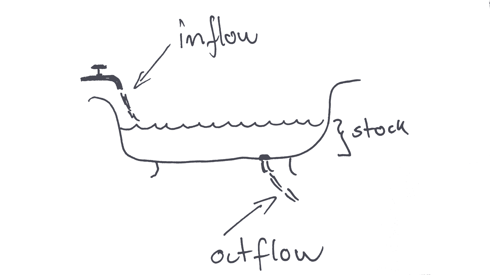

# Part I: Econ Concepts and Definitions {-}


# Data about people {#people}

## What this chapter is about

### Intended learning outcomes

This chapter is about showing data on people. For example the  the number of people living in the United Kingdom on January 1, 2019. Population data is a good point of departure. Firstly, because data about people is some of the most important data in social sciences. Secondly, because data about people is quite straightforward and yet it involves a good range of basic concepts. After reading this chapter you should be able to 

* Create data visualization on.
  * Population stocks.
  * Population flows.
  * Population age compositions.
* Explain the difference between a flow and stock variable.
* Quantify changes in stocks and levels.
  - This is  covered in more detail in chapter X.
* Create an index with one variable.
  - This is  covered in more detail in chapter X.
* Create charts and tables and Excel.
  - This is  covered in more detail in chapter X.

### Population data visualization examples
So let us look at some data on people. Figure   \@ref(fig:fig1) shows the population of the United Kingdom from 1960 to 2018 using a line chart. This chart is a bit dull. There are no bells and whistles such as 3D effects or colors. That is actually a good thing. Charts that should focus on the data and not distract the reader. We will discuss chart design in much more detail in later chapters. But for now, let us just focus on this boring chart. What can we use this chart for? We can clearly see that the population of the UK has been increasing over the last 50 years from less than 50 million in the 1960ies to more than 60 million around 2018. Can we say what the precise number of people in the UK is in 2018? Not really. A chart is rarely useful for looking up precise values. But a  chart is really good at showing patterns in the data. For example the pattern that the population is increasing. 

```{r results='asis', echo=FALSE, include=FALSE,}
# Economic Data Lecture 12  script for Figures 1-2
# Last edited by Hans, Mar 11 2019


###################################################################
# load packages
library(tidyverse)
library(zoo)
# Show overall level
# Clear workspace
rm(list=ls())
# load packages
#install.packages("tidyverse")
library("tidyverse")
# load eurostat dataset: "data1_population_source_eurostat.csv"
setwd("C:\\Users\\hs17922\\Dropbox\\Work\\Teaching\\Economic Data\\2019_2020\\reading\\economicdata_book\\economicdata\\_resources\\chapter_people\\rawdata")
url<-"data1_population_source_eurostat.csv"
pop_data<-read_csv(url)
head(pop_data)
# reload and change format of Value
pop_data<-read_csv(url,col_types = cols(Value="n"))
head(pop_data)
# remove last column (flags etc)
pop_data<-select(pop_data,-5)
# make tidy
pop_data<-spread(pop_data,key=INDIC_DE,value=Value)
head(pop_data)
# rename
pop_data<-rename(pop_data,country=GEO, year=TIME, deaths=3,births=4,nat_change=5,net_migration=6,pop=7)

# Select UK and keep obs and var that we need
pop_data_uk<-filter(pop_data,country=="United Kingdom")
changes_data<-pop_data_uk%>%select(year,nat_change,net_migration)%>%
  filter(!is.na(nat_change))%>%  mutate(total=nat_change+net_migration)%>%
  gather(group,change,total,nat_change,net_migration)


# Figure
figure_1<-ggplot(pop_data_uk)+geom_line(aes(x=year,y=pop/1000000),size=2)+
  theme( panel.background=element_blank(),
         axis.ticks.y=element_blank(),
         axis.ticks.x=element_blank(),
         axis.text.y=element_text(size=12), axis.text.x=element_text(size=12),
         axis.title.y=element_text(size=12),axis.title.x=element_text(size=12))+
  labs(y="Population (mio. people)",x="")+ylim(00,80)

# Figure

p_1<-ggplot(changes_data%>%filter(group %in% c("net_migration","nat_change")), aes(x=year, y=change/1000, fill=group)) +
  geom_bar(stat="identity")+
  theme( panel.background=element_blank(),
         axis.ticks.y=element_blank(),
         axis.ticks.x=element_blank(),
         axis.text.y=element_text(size=12,margin = margin(t = 0, r = -10, b = 0, l = 10)), axis.text.x=element_text(size=12),
         axis.text.y.right=element_text(size=12,margin = margin(t = 0, r = 10, b = 0, l = -10)),
         axis.title.y=element_text(size=12),axis.title.x=element_text(size=12),
         legend.key=element_blank(),legend.position="top")+
  scale_y_continuous(sec.axis = sec_axis(~(.+1700)*.03, name = "Total population in mio people"),
                     breaks=seq(0, 500, by=50),limit=c(-100,550))+
  scale_x_continuous(breaks=seq(1960, 2017, by=10))+
  labs(y="Change in 1000 people",x="",fill=" ")+
  scale_fill_manual(labels = c("Natural change", "Net migration","Total"),
                    values=c(rgb(1,0.2,0.2),rgb(.1,1,0.6),"black"))+
  geom_line(data=pop_data_uk,aes(x=year,y=pop/30000-1700,colour="black"),inherit.aes = FALSE, size=1.5)+
  scale_colour_manual(" ", labels = c("Total pop (right axis)"),
                      values=c("black"))


```
```{r fig1, echo=FALSE, fig.width=4,fig.align = 'center', fig.height=3,fig.cap="\\label{fig:figs}Population of the UK. Data Source: Eurostat"}
# Show the graph here
figure_1

```


While the  line chart above is a bit boring, Figure   \@ref(fig:fig2) is certainly not boring. It is very colourful  and shows lots of data. This chart type is called a population pyramid chart. The chart shows the age composition of the global population. The width at the bottom of the chart represents the number of people in the youngest age group and the top the number of people in the oldest age group. Why do you think it is called a pyramid chart? And why do you think this version of the chart looks more like a cake? And finally, why is this trend both good and worrying for policy makers?


```{r fig2, echo=FALSE, out.width = '80%',fig.align='center',fig.cap="Global Population Age Composition. Source: Our World in Data"}
knitr::include_graphics("_resources/chapter_people/poppyramid.jpg")
```


Data on the number of people are important in itself but are also important ingredients in many other economics statistics. We therefore need to know how population levels are defined, how me measure population levels and and how we visualize data on population levels. 


Let's get started. 

## Definitions on people

When we show and discuss data  it is important that we agree on how we define the concept. We therefore begin by going through some definitions. Some of these definitions are not only limited to economic data. For example the definition on flow and stock variables, which we can use for any data type. Most of the definitions are fairly simple. That is actually the case for most definitions in this book. It is not the understanding of the definition that is challenging. The challenging part of working with economic data is knowing that there are definitions and that using a different definition can lead to a different conclusion about patterns in economic data. 

### Flow and stock variables

Variables either capture flows or stocks. We can illustrate flow and stock variables using a bathtub as in Figure \@ref(fig:baththub). The water level in the bathtub at a given point in time is a stock variable. The amount of water that has flown into the tub over a period of time is a flow variable.
```{r baththub, echo=FALSE, out.width = '90%',fig.align='center',fig.cap="A bathtub with water illustrating flows and stocks"}

```

 The easiest way to distinguish between flow and stock variables is that a flow variable is measured over a *period* of time while stock variable is measured at a specific *point* of time. If some asked you: "How much water flowed into the bathtub on September 4 at 4:40pm and 10 seconds?" It would be very difficult to answer. However, if someone asked  "How much water was in the bathtub on September 4 at 4:40pm and 10 seconds?", it would be quite easy to answer (given that you had some tool to measure). This is because the water level is a stock variable. A stock variable is measured at a point in time and "September 4, at 4:40pm and 10 seconds" is a point in time. On the other hand if someone asked "How much water flowed into the bathtub on September 4 between 4:40pm and 4:50pm?", you would also be able to oanswer it, because you are now given a "period of time" (a period of 10 minutes) and flow variables are measured over a period.
 
 
<center>
```{block, type='myblock'}
<center>
**Flow variable and stock variables**
</center>
 
  
  * A *flow* variable measures a flow of quantity over a *period* of time.
      * For example the flow of migrants into the UK from January 1 2017 to December 31 2017. 
  * A *stock* variable measures the level of quantity at  a *point* of time.
    *  For example the number of people residing in the UK at January 1, 2018.  

```
</center>


Let's think about economic variables instead of water and bathtubs. What would be an example of stock and flow variables? An example of a stock variable would be wealth. We measure wealth at a "point in time". An example of a  flow variable would be income. We measure income over a period of time. 

Why is it important to know whether a variable is a flow or stock variable? First, because it is useful when we want to understand the changes in a variable. The change in the water level of the bathtub (a stock variable) can be described by the inflow and outflow of water. The change in wealth (stock) is a function of income and consumption flows. Second, because the best way to visualize the data depends on the type of variable.

We can often describe the change in a stock variable by underlying flows:

$$ \Delta Stock=Stock_{1}-Stock_{0}=Flow_{0-1} $$

For example the change in the population level of the UK from 1 January, 2002 to 1 January,  2003 equals the number of people who immigrated to the UK, minus the number of people who left the UK (emmigrated), plus the number of children born, plus the number pof people who died in the period from 1 January, 2002 to 1 January 2003. In this example the population level is a stock variable. It is measured at a point in time (January 1, 2002). The other variables are all flow variables that are measured over a period of time. For example the number of births from 1 January 2002 to 1 January, 2003.

In the limit we would not be able to measure a flow variable as a stock variable. We could measure the number of people living in the UK on January 1, 2002 at five seconds and 3 milliseconds after 10:00AM, but how many children are born in exactly  that millisecond? A child birth typically takes more than a second, so how do we allocate a birth a precise millisecond?

### The population level 
Let us now turn to a definition that we already discussed: The population. 

<center>
```{block, type='myblock'}
<center>
**The population level**
</center>
 
  * The number of people in an area at a specific point in time.

```
</center>


In most cases we are interested in the number of people of *living* in an area, but in some contexts it could be something else. For example the number of people *working* in an area. For example the number of people working in Bristol (I work in Bristol, but I do not reside in Bristol).

The area could be a planet, a continent a country, a region, a county, a municipality, a house or any other clearly defined space.

### The population flows

The population level of an area can change because of non-zero net migration flows and non-zero natural reproduction flows. These two concepts are defined below:

<center>
```{block, type='myblock'}
<center>
**Migration flows**
</center>
 
  * Immigration: the number of people entering an area over a period of time. 
  * Emigration: the number of people leaving an area over a period of time. 
  * Net migration: Immigration minus emigration

```
</center>


<center>
```{block, type='myblock'}
<center>
**Natural reproduction flows** 
</center>
 
  * Deaths: the number of people in an area who died within a period of time. 
  * Births: the number of people  in an area who are born within a period of time.
  * Natural reproduction: The number of minus births the number of deaths.

```
</center>

What do we mean with non-zero? If the net migration flow is zero it means that the number of people who left the area equals the number of people who entered the area. In that case the population is unchanged. Only if the number of people leaving the area is not equal to the number of people entering the area can population levels change because of migration flows. 

## Visualizing population data{#people:vis}
Having sorted out the basic definitions on population levels and the underlying flows in terms of net migration, births and deaths, we can now turn to the visualization of the population data. But how do we select the appropriate visualisation mode? We can generally split the data visualization process into three purposes:

1. Exploratory data visualization
2. Analytical data visualization
3. Data visualization for communication. 

Let us say that we want to explore the data on the UK population. The first thing we might do is to download the data from the UK office for National Statistics and simply open it using the appropriate software such as MS Excel or R. 

### Exploring data on population levels
Let us first get some data from the website of the UK Office for National Statistics:

```{r gettingdata, echo=FALSE, out.width = '70%',fig.align='center',fig.cap="Getting data from the ONS website"}
knitr::include_graphics("https://www.dropbox.com/s/p9vqan2nyyb7djc/gettingpopdata.gif?dl=1")
```


Now that we have the data, we are ready to look at the data. Figure  \@ref(fig:popdata) shows the sheet called "MYE4" of the downloaded file. This sheet contains "Population estimates: Summary for the UK, mid-1971 to mid-2018". That sounds about right. 

```{r popdata, echo=FALSE, out.width = '60%',fig.align='center',fig.cap="UK population data opened in MS Excel"}
knitr::include_graphics("_resources/chapter_people/table.png")
```

What do we learn from Figure  \@ref(fig:popdata)? First of all, that there are many numbers. Secondly, it looks a bit like the population is increasing in all regions. But overall it is really hard to tell. This is because a table is good for showing exact values, but with a lot of exact values we lose the overview. 

```{r firstchart, echo=FALSE, out.width = '60%',fig.align='center',fig.cap="Creating our first chart in MS Excel"}
knitr::include_graphics("https://www.dropbox.com/s/2smkgdlga2h27a1/visualisingdata1.gif?dl=1")
```
What can we learn from the chart created in \@ref(fig:firstchart)? Not much. First of all, the chart indicates a decreasing trend. We typically read charts from left to right and almost all lines were decreasing. Secondly, it was very difficult to say anything about the population data for Wales, Scotland and Northern Ireland based on that chart, because the level is so low compared to England and the UK. 

Let us solve the first problem first. Looking at the data again (see Figure  \@ref(fig:popdata) ), we observe that theONS puts the most recent value at the top. "Mid-2018" (i.e. the point in time the stock variable is measured) is the first value, followed by "Mid-2017" and so on. That is not how Excel works. When we create charts in Excel, Excel will assume that the first value is the oldest value and the last value the most recent value. This is even more important when the values don't reflect dates that Excel might recognize. Excel will treat "Mid-2018" as any other name (just like "Hans", "Julia" and "Jim"). And because we haven't told Excel anything else, it will just assume that we want to show the first value first (furthest to the left) and the last value last (furthest to the right). That sounds reasonable, or? So we first need to reorder the data. We can do this using the "sort" function in R as illustrated in Figure  \@ref(fig:sorted).

```{r sorted, echo=FALSE, out.width = '70%',fig.align='center',fig.cap="Resorting the data"}
knitr::include_graphics("https://www.dropbox.com/s/fkbfzz3dtcebwtm/sorted.gif?dl=1")
```

The new chart created in Figure \@ref(fig:sorted) now shows the data in the right way. However, there is still the issue of the trends for the Northern Ireland, Wales and Scotland. Let us for now just concentrate on the UK and try to create a nice looking chart. In Figure   \@ref(fig:nicelooking) we create a chart that looks like \@ref(fig:fig1). It is a bit dull, but it only shows what it should show. The population level of the UK and how it developed over time. As the animation in  \@ref(fig:nicelooking) shows, creating a nice looking chart requires a lot of small adjustments in Excel. We adjust text color, font size, font type, line color, line width, axis colors, axis labels, titles and many other things. Adjusting all these aspects can be a bit tiresome, but they are important.  Figure  \@ref(fig:fig1)  is created using the software R. When creating charts with R, we can write a "code" that instructs R on how to create the chart. This can save a lot of time. Especially because we can reuse the code. We will hear more about R, but let us first think about how we could include population data for England, Scotland, Northern Ireland and Wales in one chart. 

```{r nicelooking, echo=FALSE, out.width = '50%',fig.show='hold',fig.align='center',fig.cap="Creating our first nice looking chart using Excel. Data source: ONS."}
knitr::include_graphics(c("https://www.dropbox.com/s/anfar1ktmoa72fe/nicechart.gif?dl=1","_resources/chapter_people/nicechart.png"))
```

The key problem is that England's population is a different level and that the y axis scale would be different if we only included Northern Ireland, Wales and Scotland and not England. What we can do is to create a second y axis. Let's have a go in Figure  \@ref(fig:nicelookingc). 

```{r nicelookingc, echo=FALSE, out.width = '50%',,fig.show='hold',fig.align='center',fig.cap="Creating a chart of the population of the UK  using Excel. Data source: ONS."}
knitr::include_graphics(c("https://www.dropbox.com/s/b1ixqgwalhy7czb/nicechartcombined.gif?dl=1","_resources/chapter_people/nice1.png"))
```
In the chart we create in Figure \@ref(fig:nicelookingc) the population level of England is shown on the right axis, while the levels for the other countries are shown on the left axis. When using this strategy, it is very important to clearly state what axis each line belongs to. In the example above this could be improved. How would you improve that chart?

So far we just used the line chart. The line chart is one of the most popular chart types. How does it work?

* The chart shows the relationship between two variables.
* The value of the first variable is reflected by the horizontal position.
* The value of the second variable is reflected by the vertical position.
* The values are connected along the horizontal axis suggesting that the variable is continuous. 

Could we also use a different chart type to show the population of the UK? Yes, we could exploit that England, Nortern Ireland, Scotland and Wales are a part of a whole. Where the whole is the UK. We can use a stacked chart to show this. A stacked chart "stacks" the values on the vertical axis on top of each other. Stacking population levels for England, Wales, Northern Ireland and Scotland leads to the population of the UK. In Figure \@ref(fig:stacked) we create a stacked area chart of the UK population. Now we do not need two axes. However, it is now much more difficult to identify the trends for the individual countries. This is a valuable lesson in data visualizations. We often have to sacrifice. We cannot show everything. We have to decide what the most important aspect of the data is. 

```{r stacked, echo=FALSE, out.width = '50%',,fig.show='hold',fig.align='center',fig.cap="Creating a stacked area chart for the UK population  using Excel. Data source: ONS."}
knitr::include_graphics(c("https://www.dropbox.com/s/47qm7hi15sr86km/stacked.gif?dl=1","_resources/chapter_people/stacked.png"))
```

An area chart works very much likes a line chart, with one important difference:

* The value is not simply reflected by the vertical and horizontal position, but by the size of the area.
* We should therefore not truncate any of the axes (i.e. make the shorter), because that would remove parts of the area.


### Showing relative changes

What if the most important aspect of the population data is the relative change since 1971? We can see the  changes in Figure  \@ref(fig:nicelookingc), but it is not easy to compare the relative changes for the individual countries. To highlight the relative change in population levels since 1971 and allow us to compare across countries we can create an index. For all countries we readjust the values in such a way that the value in 1971 is 100 using the following formula:

$$ I_{year}=100\times \frac{Population_{year}}{Population_{1971}}$$

We use this formula on the data from the examples above in Figure  \@ref(fig:index). From that chart we see that the population has increased the most in Northern Ireland and the least in Scotland, in relative terms. That was hard to see from the previous charts. However, now we cannot say anything about the levels anymore. This is because the level is "canceled out" in the index and only the relative changes remain. 

```{r index, echo=FALSE, out.width = '50%',fig.show='hold',fig.align='center',fig.cap="Showing the relative population growth of the UK using an index in Excel. Data source: ONS."}
knitr::include_graphics(c("https://www.dropbox.com/s/aajcywdhujo56qb/index.gif?dl=1","_resources/chapter_people/index.png"))
```

### Creating a table on population changes
Now what if we are only interested in the population level in 1971 and 2018 and how it changed. Could we show that in a different way that gives us access to more information? Yes, we could use a table because now it is only a few variables that needs to be shown. But designing a table also requires quite a bit of adjustment in Excel (or Word).

In Figure \@ref(fig:tableb) we create a simple Table, but pay attention how we use black lines, borders, white space and text alignment to make the table as readable as possible. 

* Solid black lines separate titles from main data and data levels from changes.
* As numbers have the same width we can align the numbers and the text in the center.
* We can now confirm the pattern from the index above, Northern Ireland experienced the largest growth in relative terms and Scotland the lowest. 
* Compared to the charts above we have precise information about both the levels and the changes.


```{r tableb, echo=FALSE, out.width = '50%',fig.show='hold',fig.align='center',fig.cap="Showing the population of the UK using a Table. Data source: ONS."}
knitr::include_graphics(c("https://www.dropbox.com/s/9th51azdvsxmouv/table.gif?dl=1","_resources/chapter_people/tableb.png"))
```

### Describing the change in levels by the underlying flow variables

We can investigate the underlying population flows to get a better understanding of the dynamics that led to the change in the population levels we observed. Consider the change in the population of the UK from January 1 2015 to January 1 2016. We can decompose the change in the population level (a stock variable) by the following four flows:

* The population on January 1 2015
  * $+$  moved to the country during  2015.
  * $-$  moved out of the country during  2015.
  * =net migration
  * $+$ born  the during  2015.
  * $-$} died  the during  2015.
  * (=natural population change)
* $=$ The population on January 1 2016.


The Eurostat database  provides data on the underlying flows in the population levels. The question is: how to best visualize this change? In Figure \@ref(fig:popflows)  we show the flows by means of stacked bars and the stocks in terms of a line chart. We thereby exploit that the total change is equal to the natural population change plus the net migration. One challenge with the latter approach (stacking bars and areas) is that if a series can contain both negative and positive values, it might be hard to read or even slightly misleading, because the negative or positive value is hidden. However, the overall pattern is clearly visible. In recent years, the population of the UK ihas increased a lot, and this is both due to positive net migration flows and postive reproduction flows. 


```{r popflows, echo=FALSE, out.width = '80%',fig.show='hold',fig.align='center',fig.cap="Annual changes in the  population of the United Kingdom in terms of net migration (immigration minus emigration) and the natural population change (births minus deaths). Data source: Eurostat.  The R script for this Figure is available [here](https://www.hhsievertsen.net/economicdata/notes/lecture12/rmaterial/lecnote_12_script_for_fig3.)."}
knitr::include_graphics(c("_resources/chapter_people/fig7.png"))
```


### Creating a pyramid chart using Excel
We have now shown the basic levels and flows, can we also create more advanced charts in Excel? For example a chart like \@ref(fig:fig2)?. The population pyramid chart. Yes. We can create a lot of charts using Excel. And a pyramid chart can be created with some creativity. Let's first consider the various aspects of this chart

* The width of the chart shows the number of people in a specific age group.
* We split the chart by gender and show the number of men and women, respectively to the left and to the right.
* The vertical position reflects the age group.

We can  create this chart in Excel by creating a  a bar chart. A bar chart is very similar to an area chart, we show the value in terms of the size of an area. However, in contrast to both the area and line chart, the values are not connected. This is very useful when values are not continuous. This is not the case here, but it it is good to keep this in mind. Figure \@ref(fig:pyramid) shows how we can do it. Pay good attention to how we remove the minus.


```{r pyramid, echo=FALSE, out.width = '50%',fig.show='hold',fig.align='center',fig.cap="Showing the population of the UK using a Table. Data source: ONS."}
knitr::include_graphics(c("https://www.dropbox.com/s/9th51azdvsxmouv/table.gif?dl=1","_resources/chapter_people/pyramid.png"))
```


## Summary {#people:sum}
So what should you take away from this chapter?

* The difference between a stock and a flow variable
* Advantages of Tables vs. Charts
* How we measure the population level and migration and reproduction flows.
* Creating basic charts and tables in Excel
* Creating a pyramid chart in Excel
* Using and interpreting an Index with one variable.
