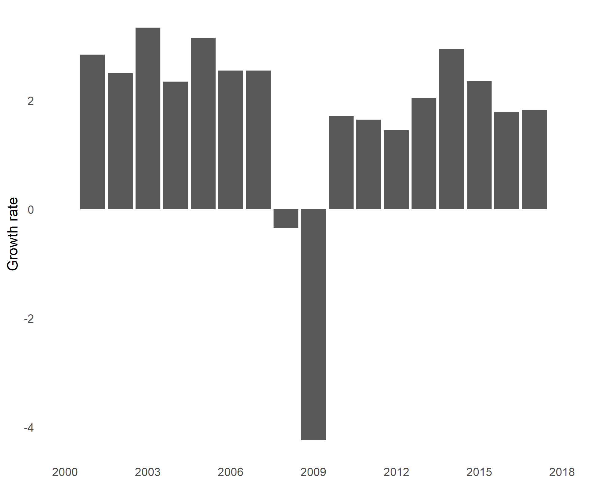
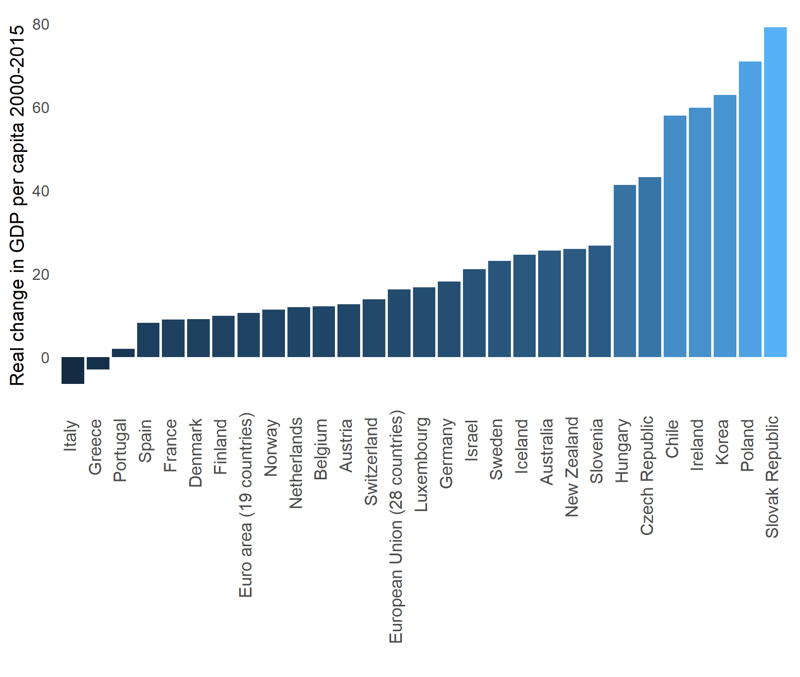

# Data about economic activity {#activity}


## About this chapter

This chapter is about visualizing and describing data on economic activity. Economic activity is measured in the System of National Accounts (SNA) and conceptualized by the Gross Domestic Product, (GDP). We will not cover the SNA in detail.^[For details on the SNA, please visit the following [website](https://unstats.un.org/unsd/nationalaccount/sna.asp)] It is basically a set of rules and instructions that have been agreed internationally to ensure that measures of economic activity are comparable across countries. However, we will go through some of the key *aggregegates* of the SNA (for example GDP, Gross National Income, the GDP inflator etc.). An aggregate is a measure that *aggregates* several underlying variables. This chapter is mainly about the GDP, but we will also briefly touch upon other aggregates of the SNA as well as what the GDP is used for.

### Intended learning outcomes

 After reading this chapter you should be able to:

* Explain what the  gross domestic product (GDP) is and calculate it.
* Explain the three ways to measure GDP
  1. The Income Approach
  2. The Expenditure Approach
  3. The Output approach.
* Explain what The gross national income (GNI) is and calculate it.
* Calculate GDP per person and productivity.
* Visualize data on economic activity.


### A brief history of GDP

Most texts about the history of GDP  start around the Great Depression in the 1930ies United States. The  U.S. Congress realized that the economy was not running as well as it could, but had a hard time quantifying it. To the rescue came the economist Simon Kusnets who presented a report on the "National Income, 1929-1935" for the Congress (see  \@ref(fig:gdp1)), where he presented the idea of capturing the entire production, income and expenditure of the economy. And so the GDP was born.  This story of how the GDP was created is probably the most well-known story of the GDP, but in reality the story of GDP is more complicated.


```{r gdp1, echo=FALSE, out.width = '65%',fig.align='center',fig.cap="Kusnets' report for the U.S. Congress, 1934. Source:  [Fraser St. Louis FED](fraser.stlouisfed.org/title/971)."}
knitr::include_graphics("_resources/chapter_gdp/kusnetz.png")
```

The idea of quantifying the size of the economy probably goes back to at least the 17th century. The exact definition of GDP has since then been redefined and adjusted. It is actually continuesly adjusted. More on that later. Giving Simon Kusnets a lot of credit for the GDP is not completely wrong. He refined the concept a lot and his report made it prominent. However, it wasn't until much later that it became the "statistic to rule them all". 

The GDP as a concept is critisized a lot. The most prominent critisism is probably the  "Report by the Commission on the Measurement of Economic Performance and Social Progress" published in Autumn 2009 by the economists Joseph Stiglitz, Amartya Sen and Jean-Poul Fitoussi. What is the key critisism of  GDP? The main problem with the GDP is not so much the GDP itself, but more the misuse of GDP as a measure of well-being or welfare. Simon Kusnets was actually already aware of some of these issues and the potential misue of GDP. Figure \@ref(fig:gdp1) shows a small section of the 273 page long report by Kusnetz. 

 Figure \@ref(fig:gdp2) shows extracts of pages 5-7 in Kusnets original report  [@kuznets1934national]. Kusnets made several points that are at the heat of the disucssion today, for example that "With quantitative measurements especially, the definiteness of the result suggests, often misleadingly, a precision and simplicity in the outlines of the object measured." and "Economic welfare cannot be adequately measured unless the personal distribution of income is known. And no income measurement undertakes to estimate the reverse side of income, that is, the intensity and unpleasantness of effort going into the earning of income."

```{r gdp2, echo=FALSE, out.width = '70%',fig.align='center',fig.cap="Page 5-7 in 'National Income, 1929–1932'. 73rd US Congress, 2d session, Senate document no. 124, 1934. Source:  [Fraser St. Louis FED](fraser.stlouisfed.org/title/971). "}

```

So why should we care about GDP if it is no good? Actually it is a quite good of economic activity. But it is simply a measure of economic activity. We will return to the criticism of GDP in later chapters, but here we will discuss what it actually captures. When we know what the GDP measures, we can say more about what it doesn't measure and how we should and should not use it. After reading this chapter, you should be able to


## The Economy of Microcountry

Let me introduce a very small country. It is not my home country, Denmark, but a country that is even smaller: Microcountry. Microcountry is just next to Neighbourcountry. Microcountry is so small that I can explain all economic activity in this country to you. 

 In this country we have one farm that produces flour. The farm sells the flour to a bakery for 10 £. To produce the flour, the farm has workers, and these workers earn a wage of 8 £. Finally, the farm pays a tax to the government of 2 £. 

The bakery produces bread based on labor inputs in terms workers and  the flour bought from the farm. The workers at the bakery receive 14 £ in wages, and the government receives  2 £ in taxes from the bakery. The bakery sells bread for 18 £ to the households in Microcountry. The households of Neighbourcountry buy bread from the bakery in Microcountry for 9 £, and the bakery in Microcountry is actually owned by residents of Neighbourcountry. 

The households in Microcountry work for the bakery, the farm and for the government. They pay 1 £ in taxes to the government, and buy bread for 18 £ at the bakery. The households also import goods from Neighbourcountry for a value of in total 8 £. The government  provides health service for the society of Microcountry and spends  5 £ in wages to be able to supply this service. 

Now the big questions are:

* The Gross Domestic Product (GDP) of Microcountry?
* The Gross National Income (GNI) of Microcountry?

To answer this we need to know what  GDP is and how we can measure it.

## What is  GDP and how do we measure it?

The Gross Domestic Product captures the economic activity of an economy. What is economic activity? Just think of when you are economically active:

1. When you go shopping and spend money. 
2. When you work and receive a wage income.
3. When you create a product and sell it to someone.

These three examples of how we as individuals are economically active actually capture the three ways we measure the Gross Domestic Product. The expenditure approach, the income approach and the output approach. Let us now discuss these approaches in detail.  The GDP captures how much is spend, how much is produced or how much is earned within a period. It is therefore a flow variable. 

Below is a short animation of what the GDP is, created by the UK Treasury. 

```{r whatisgdp, echo=FALSE, out.width = '70%',fig.align='center',fig.cap="What is GDP?. Source: HM Treasury. "}
knitr::include_url("https://www.youtube.com/embed/UOuzPLjwkMc")
```


### The Expenditure Approach

The *expenditure* approach (called the spending approach in [@core])  measures the GDP in terms of expenditures by households and the Government, as well investments and net exports of goods and services (i.e. exports minus imports). All these expenditures are summarized in the following equation:
\begin{align}
   \text{GDP}^{\text{E}} \text{=Y=C+G+I+X-M}
\end{align}
where: 
 
* **Y** is the Gross Domestic Product (GDP).
* **C** is final consumption of goods and services by households. It includes goods like food, cars, and clothing, as well as services such as hotel stays. 
* **G** is final consumption expenditure  of goods and services by the government. 
* **I** is investments (also called gross capital formation) are investments in fixed assets such as machinery, buildings etc. 
* **X** is  goods and services produced domestically but consumed abroad (Exports)
* **M** is  goods and services produced abroad and consumed domestically (Imports).
   

 Using data from the OECD, Figure  \@ref(fig:gdp3) shows the size of each element of the expenditure approach for the United Kingdom over the period 2000 to 2015. In Figure  \@ref(fig:gdp3) A, the development is shown in current prices. A change in the value from year to year is therefore a combination of a change in prices and a change in volume. We could have the extreme case, where we actually bought exactly the same quantity in all these years, but because the price increased, we would get the pattern shown in Figure  \@ref(fig:gdp3). However, this is clearly not the case in the United Kingdom over this period. As Figure  \@ref(fig:gdp3) B shows, the values also increased in *real* terms. In Figure  \@ref(fig:gdp3) B we used the GDP deflator to adjust the values in current prices (shown in A) to the 2017 price level. 
 
 
```{r gdp3, echo=FALSE, out.width = '90%',fig.align='center',fig.cap="The expenditure approach components of the Gross Domestic Product for the United Kingdom using a stacked area chart. **This is an example of an inappropriate chart type!** Imports enter negatively. Data source: OECD. Values are converted to the 2017 price level using the GDP deflator for each category."}
knitr::include_graphics("_resources/chapter_gdp/fig1.png")
```


The charts in Figure  \@ref(fig:gdp3) are stacked area charts. As you might recall from the chapter on measuring people,  area charts shows the size of the value by the size of the area and we are then putting each category on top of each other. This seems like a good solution with data on parts that constitute a "whole", such as the population of the Wales, Northern Ireland, Scotland and UK, that constitute the population of the UK. 

Is it also a good idea to use stacked area charts to show the expenditure parts of GDP like in Figure  \@ref(fig:gdp3)? **No! The stacked area chart is not appropriate in this case!**  Because the GDP by expenditure approach involves  both negative and positive values, the stacked area chart does not work well Moreover, we are tempted to conclude that all categories increased in real (absolute) terms (i.e. in volumes) over the period 2000 to 2018. But for all categories, except the first one, it is very difficult to see, because the all changes in the first category will map over in the following category. Government consumption (G) has for example been steadily increasing over the period. There was no drop over the financial crisis. But this is very hard to see from Figure  \@ref(fig:gdp3).

It is much easier to identify the changes in individual series by means of a simple line chart, as shown in Figure   \@ref(fig:gdp4). From Figure   \@ref(fig:gdp4) B we clearly see that Imports, Exports, Private Consumption and Investments suffered a drop in real values during the financial crisis, but Government Consumption did not. Both Figures  \@ref(fig:gdp3) and  \@ref(fig:gdp4) illustrate that Private Consumption (C) is the largest component of GDP in terms of the expenditure approach.


 
```{r gdp4, echo=FALSE, out.width = '90%',fig.align='center',fig.cap="The expenditure approach components of the Gross Domestic Product for the United Kingdom using line charts. Data source: OECD. Values are converted to the 2017 price level using the GDP deflator for each category"}
knitr::include_graphics("_resources/chapter_gdp/fig2.png")
```


Figure  \@ref(fig:gdp5) shows a line chart of the relative change in each component of the expenditure approach by means of an index, where the base value is the value in the year 2000. This figure also highlights the importance of adjusting for price changes. In terms of nominal values (in other words in current prices), the values increased by up to more than 200 percent over the period (as Figure \@ref(fig:gdp5) A shows), but in real terms the change is much more modest (as Figure \@ref(fig:gdp5) B shows). The Figure also shows that the relative drop over the financial was remarkable in terms of the Investments (I).
 
```{r gdp5, echo=FALSE, out.width = '80%',fig.align='center',fig.cap="The expenditure approach components of the Gross Domestic Product for the United Kingdom using line charts and an index with base year 2000. Data source: OECD. Values are converted to the 2017 price level using the GDP deflator for each category."}
knitr::include_graphics("_resources/chapter_gdp/fig3.png")
```

#### The expendture approach and economic activity in Microcountry

Let us return to Microcountry and use the expenditure approach to calculate the economic activity of Microcountry. 

* $C$ household consumption:
    - The households buy bread at the bakery for 18£ and import goods from Neighbourcountry for 8£, $C=8£+18£=26£$.
  
  
* $G$ Government consumption: 
    - The government spends 5£ on health services, $G=5£$.
  
* $I$ Investments:
    - There are no investments in this economy, $I=0£$.
  
* $X$ Exports:
    - The bakery exports bread to Neighbourcountry for 9£, $X=9£.
  
* $M$ Imports:
    - Microcountry imports goods for the value of 8£ from Neigbourcountry, $M=8£.
  
  The GDP of Microcountry is therefore $Y=26£+5£+9£-8£=32£.

### The income approach
A second approach to measuring GDP is the income approach. The income approach measures the GDP in terms of the generated income in the economy. The income generated in an economy consists of all compensation to workers (wages, pension contributions etc.), operating surplus (profits and rents)  and sales taxes minus subsidies.^[Note that while the notation for the expenditure approach is fairly standard, the notation for the production and income approaches are less standardized.]

\begin{align}
   \text{GDP}^{\text{I}} \text{=W+P+NT}
\end{align}
where 
 
* *W* is worker compensation.
* *P* is operating surplus.
* *NT* is sales taxes minus subsidies.
 
Sometimes  you'll see that the income approach also incldues "mixed income". This term captures the value of work to the owners of self-employed firms. It is "mixed", because it is hard to tell whether it is profits or worker compensation.  Figure \@ref(fig:gdp6)  shows the size of each of these three components for 2015 for the UK economy. Compensating of workers accounts for roughly half of the GDP, while operating surpluses account for about two-fifths. Note that the stacked area chart works better for the income approach compared to the expenditure approach, because all components are positive. The level of the top of the stacked area chart therefore corresponds to the actual GDP level. 

```{r gdp6, echo=FALSE, out.width = '90%',fig.align='center',fig.cap="The income approach components of the Gross Domestic Product for the United Kingdom using a stacked area chart. Data source: OECD. Values are converted to the 2017 price level using the overall GDP deflator."}

```


Figure \@ref(fig:gdp7)  shows the development of the wages (compensations of workers), profits (gross operation surplus) and taxes individually. The sharp decline in profits over the financial crisis is clearly visible. The growth in the wage component also flattened considerably over the financial crisis. 

```{r gdp7, echo=FALSE, out.width = '90%',fig.align='center',fig.cap="The income approach components of the Gross Domestic Product for the United Kingdom using line charts. Data source: OECD. Values are converted to the 2017 price level using the overall GDP deflator"}

```


Figure \@ref(fig:gdp8)  again illustrates the difference between real and nominal comparisons. In nominal terms, the incomes increased by between 80 and 100 percent. In real terms it was "only" about 30 to 40 percent. The sharp drop ion profits over the financial crisis is also clearly shown, but this category also increased sharply shortly after.

```{r gdp8, echo=FALSE, out.width = '90%',fig.align='center',fig.cap="The income approach components of the Gross Domestic Product for the United Kingdom using line charts and an index with base year 2000. Data source: OECD.  Values are converted to the 2017 price level using the overall GDP deflator."}
knitr::include_graphics("_resources/chapter_gdp/fig6.png")
```


It is possible to decompose the income approach in further detail. We can investigate both wages and profits by sector to identify the sectors that  contribute the most to GDP, and also to identify the sectors that were mostly affected by a recession. However, one challenge with the income approach is that these values are often not available in real terms. In Figures \@ref(fig:gdp6) to \@ref(fig:gdp8) we adjusted the current values to real values using the overall GDP. This is generally not recommended, because sub-categories might experience quite different price changes than overall GDP. In this case the deflator for each element of the income approach is not available. 

#### The income approach and economic activity in Microcountry

Let us return to Microcountry and use the income approach to calculate the economic activity of Microcountry. 

* $W$,worker compensation:

    - The farm workers receive a wage compensation of 8£, the bakery workers receive a wage compensation of 14£ and the health service workers receive a  compensation of 5£. The total wage comensation is therefore $W=8£+14£+5£=27$.
    
* $P$, operating surplus:

    - The farm has zero profits, but the bakery has a profit of 1£, $P=1£$.

* $NT$, taxes minus subsidies:

  - The farm pay 2£ in taxes and the bakery pays 2£. There are subsidies. The taxes minus subsidies is therefore, $NT=2£+2£=4£$.
  
The GDP of Microcountry is therefore $Y=27£+4£+1£=32£.


### The production approach
The third and last approach to measuring GDP is the production approach (also known as the output approach). So far we have considered how much we've spend (the expenditure approach), the income generated (the income approach) and now we finally look at how much we produce. The production approach measures the GDP in terms of production or *value added*. The value added is the value of the output minus the costs of the intermediate goods. If a bakery buys flour for 15 £ and sells bread for 50 £, the value added by the bakery is 50-15=35 £. Intermediate goods are all goods used in the production process, such as raw materials, fuel, rental costs, cleaning and marketing costs.

We typically distinguish between two types of outputs, market and non-market outputs. The market output are goods and services sold on the market, such as the bread sold by the bakery. In that case the value added is straightforward to calculate, as it is the sales price minus the price of the intermediate goods. However, not  not all goods are necessarily sold, so we also include the change in inventories.  For non-market output, such as health and defense, the output is the production costs, i.e. the cost of labor and intermediate goods (and depreciation in fixed assets).  Finally, there is a distinction between value added in basic prices and value added in market prices. To obtain the latter we have to add sales tax and subtract subsidies. 

\begin{align}
   \text{GDP}^{\text{P}} \text{=GVA+NT}
\end{align}
where 
 
* *GVA* gross value added.
* *NT* is taxes minus subsidies.
 
It should be noted that  NT in this case not necessarily equals NT in the income approach. This is because taxes and subsidies here only relate to the taxes and subsidies on goods produced domestically. In the income approach taxes and subsidies refer to the products produced domestically and the products that are imported. Figure \@ref(fig:gdp9) the development  of these  components by sectors of the UK economy. As all aspects contribute positively to the overall GDP, we can interpret the height of the stacked area chart as the overall GDP level.^[Note that this would not be the case if subsidies were larger than taxes.] 

```{r gdp9, echo=FALSE, out.width = '90%',fig.align='center',fig.cap="The production approach components of the Gross Domestic Product for the United Kingdom using a stacked area chart. Data source: OECD. Values are converted to the 2017 price level using the GDP deflator for each category."}
knitr::include_graphics("_resources/chapter_gdp/fig7.png")
```


The stacked area chart is appealing, but it is hard to get a sense of the individual values. Again, the line chart (shown in Figure \@ref(fig:gdp10)) is a lot more informative about the individual levels. 

```{r gdp10, echo=FALSE, out.width = '90%',fig.align='center',fig.cap="The production approach components of the Gross Domestic Product for the United Kingdom using line charts. Data source: OECD. Values are converted to the 2017 price level using the GDP deflator for each category."}
knitr::include_graphics("_resources/chapter_gdp/fig8.png")
```


The index line chart in Figure \@ref(fig:gdp11) shows that some sectors are still below their 2000 level in real value added terms (for example the sector "Industry, including energy"). 


```{r gdp11, echo=FALSE, out.width = '90%',fig.align='center',fig.cap="The production approach components of the Gross Domestic Product for the United Kingdom using line charts and an index with base year 2000. Data source: OECD. Values are converted to the 2017 price level using the GDP deflator for each category"}
knitr::include_graphics("_resources/chapter_gdp/fig9.png")
```

#### The production approach and economic activity in Microcountry

Let us return to Microcountry and use the expenditure approach to calculate the economic activity of Microcountry. 

* $GVA$, gross value added

    - The farm sells flour for 10£ and pays 2£ in taxes. The gross value added of the bakery is therefore 8£. The bakery sells bread for 27£, pays a sales tax of 2£ and pays 10£ for the flour from the bakery. The gross value added of the bakery is therefore 15£. Finally, the public sector provides  a health service. The value of public sector provision is typically estimated by means of the costs, which in this case is 5£. The total gross value added in Microcountry is therefore $GVA=8£+15£+5£=28£.
    

  - The farm pay 2£ in taxes and the bakery pays 2£. There are subsidies. The sales taxes minus subsidies is therefore, $NT=2£+2£=4£$.
  
The GDP of Microcountry is therefore $Y=28$+4£=32£.

    

### What is included in the GDP measure?
Measuring GDP  also requires us to understand which activities we should include, and which we should not include. Based on the general principles  described in the   [@esa2010], the Office for National Statistics  decides on an production boundary, which contains all economic activities that should be included in the GDP measurements. An activity is included in the boundaries if:


* The activity produces a meaningful output.
* The product or activity has a meaningful market value, or the market value can be imputed.
* The inclusion of the activity increases the meaningfulness of cross-country comparisons.


Several activities are less clear-cut that you might think, for example activities where "production is forbidden by law; as long as all units involved in the transaction enter into it voluntarily" are included. Breeding of fish in fish farms is included, but breeding of fish in open seas is not included. 

### GDP - Why 3 approaches?

Note how all three approaches shown result in the same GDP. For simplicity, one might therefore argue that we should just stick to one approach and ignore the two other approaches. However, each approach has its own advantage. First, expenditure approach is very useful if you want to assess whether changes in GDP are driven by for example domestic consumption or exports. Moreover, we can decompose  all approaches in more detail. We could for example identify which sector is contributing most to the value added using the production approach. 

As noted, the three approaches to measuring GDP should all lead to the same overall GDP. As an illustration, Table \@ref(fig:gdp12) shows the GDP components for each of the three approaches for the United Kingdom in 2017. While the three approaches in theory should lead to exactly the same number, we often observe small discrepancies in practice. These discrepancies are called "statistical discrepancy" and area as Table \@ref(fig:gdp12) shows relatively small. The table also illustrates why the three approaches are useful: they are informative about different perspectives. We could ask, was the recession mainly related to a drop in private consumption or exports (based on the expenditure approach)? Or, was the recession mainly related to a drop in profits or compensation of employees (the income approach). Or, which sector's production dropped most during the recession?

```{r gdp12, echo=FALSE, out.width = '80%',fig.align='center',fig.cap="Gross Domestic Product of the United Kingdom in 2017.Data source: OECD. All values are in 2017 prices."}

```

<center>
```{block, type='myblock'}
<center>
**Measuring GDP - an overview** 
</center>

*1. The expenditure approach*

* The expenditure approach (called the spending approach in [@core])  measures the GDP in terms of expenditures by households and the Government, as well investments and net exports of goods and services (i.e. exports minus imports). 

\begin{align}
  Y=C+G+I+X-M=C+G+I+NX
\end{align}

  * *Y* is the Gross Domestic Product (GDP).
  * *C* is final consumption of goods and services by households. It includes goods like food, cars, and clothing, as well as services such as hotel stays. 
  * *G* is final consumption expenditure  of goods and services by the government. 
  * *I* is investments (also called gross capital formation) are investments in fixed assets such as machinery, buildings etc. 
  * *X* is  goods and services produced domestically but consumed abroad (Exports)
  * *M* is  goods and services produced abroad and consumed domestically (Imports).

*2. The income approach*

* The income approach measures the GDP in terms of the generated income in the economy.

\begin{align}
   Y=W+P+NT
\end{align}

  * *W* is worker compensation.
  * *P* is operating surplus.
  * *NT* is sales taxes minus subsidies.

*3. The production approach* (also known as the output approach)

* The production approach measures the GDP in terms of production or *gross value added*.

\begin{align}
  Y=GVA+NT
\end{align}

  * *GVA* gross value added.
  * *NT* is sales taxes minus subsidies.
 

```
</center>


## Gross National Income (GNI)
Gross national income (GNI) is the income received by residents of the domestic economy. The GNI is thus defined as the GDP plus the net property income from abroad. Where property income consists of interests, rent on land and income from corporations. The GDP and GNI can be very different. If for example most firms in the economy have foreign owners, the profits of these firms will be subtracted from the GDP, and the GNI will thus be considerably lower. 

Let's look at Microcountry. We found a GDP of 32£ independent of how we measured GDP. However, because the bakery is owned by residents in Neighborcountry, the profits go abroad, and the Gross National Income is: $GNI=32£-1£=31£.

## What we use GDP  for
Now what do we need these measures for? The GDP is an important aspect in many policy makers evaluation of the condition of the economy. For example, during the Great Depression in the late 1920ies and early 1930ies the economy looked quite bad, but how bad was actually hard to describe. The United States congress therefore asked the economist Simon Kuznetz to quantify US economic activity. Kuznetz estimates gave the first insights in the magnitude of the Great Depression by showing the change in economic activity during the great depression.  Let us just consider a few general uses of GDP.

###  Growth rates
As it was the case of the great depression, we are in general typically more interested in changes than in levels of GDP. It is maybe the most popular statistic of policy makers: the growth rates. To get from the level of GDP to the growth rates is straightforward, given that the levels are measured in *real* terms, that is at a constant price level (we will return to the issue of real and nominal terms in later chapters). We can use the following formula to calculate the growth rate in percent:

\begin{align}
growth\text{}rate=100\times \left(\frac{GDP_t}{GDP_{t-1}}-1\right)
\end{align}

In this formula the letter $t$ refers to the time period. This could be a year, a quarter or a month. Figure  \@ref(fig:gdp13) shows the GDP of the UK using a fixed price level and the annual growth rates. The yearly growth rates roughly correspond to the first derivative of the level, as they show the changes. Therefore, we are actually able to identify the large dip in 2009 even in the levels  shown in the graphs above. However, identifying whether growth rates are 2 or 3 percent is difficult based on the levels, and bar charts of growth rates are therefore a very common way to visualize the economic conditions.


```{r gdp13, echo=FALSE, out.width = '80%',fig.align='center',fig.cap="Annual GDP growth rates for the UK, 2000-2018. Using a bar  chart. Source: OECD. The GDP level is measured in terms of the 2017 price level."}

```

#### Decompose growth 
We can use each of the GDP measurement approaches above to decompose the overall GDP growth. Using the expenditure approach, we could calculate the overall GDP growth as follows:

\begin{align}
growth\text{ }rate=&growth\text{ }in\text{ }I\times I's\text{ }share\text{ }of\text{ }GDP\\
                   &+growth\text{ }in\text{ }G\times G's\text{ }share\text{ }of\text{ }GDP\\
                   &+growth\text{ }in\text{ }C\times C's\text{ }share\text{ }of\text{ }GDP\\
                   &+growth\text{ }in\text{ }NX\times NX's\text{ }share\text{ }of\text{ }GDP
\end{align}
In words, the overall GDP growth is simply a weighted average of each components growth rates. The weights are the share of overall GDP in the initial period. 

Why is this useful? Say we wanted to know how household consumption $C$ contributed to GDP growth. $C's$ contribution is given by: $growth\text{ }in\text{ }C\times C's\text{ }share\text{ }of\text{ }GDP$, which we can relate to the overall growth:

\begin{align}
C's\text{ }contribution\text{ }to\text{ }growth=\frac{growth\text{ }in\text{ }C\times C's\text{ }share\text{ }of\text{ }GDP}{overall\text{ }GDP\text{ }growth}
\end{align}

### Business cycles

Once we know the changes in economic activity, we can start characterizing periods by terms such as business cycles, booms, overheating and recessions. The actual definitions of these concepts are considerably less clear. The US National Bureau of Economic Research has a  "Business Cycle Dating Committee" that specifies the chronology of the US business cycles. The committee does not have a fixed definition of recessions Instead the combine real GDP, with data on the labour market and data on income. However, their definitions of recessions often coincide with a definition based on two consecutive quarters of decline in real GDP. 

How exactly expansions and recessions are identified  varies from country to country, but in the European Union we typically define a recession as two successive quarters of negative economic growth. A business cycle is typically defined as the period from a boom to recession and back to boom, in other words, from peak to peak.  Figure  \@ref(fig:gdp12) shows annual levels, and we clearly see a drop in real output in 2008 and 2009. In terms of quarters, the growth rate was negative from the second quarter in 2008 to the second quarter in 2009. 

<center>
```{block, type='myblock'}
<center>
**GDP and business cycles** 
</center>

* An economic recession is the period from peak economic activity to the lowest level of economic activity.
* An economic expansion is the period from the lowest level of economic activity to the highest level of economic activity.
* The economic cycle of recessions and expansions is called business cycles.
* There is no general stringent definition of a recession, but two  consecutive quarters of decline in real GDP is often seen as a sign of of a recession.

```
</center>

### GDP per capita
While GDP growth rates are  used across time, we are sometimes also interested in comparing across regions or countries. First, we could be interested in identifying regional recessions and expansions. Second, we could be interested in comparing the level of economic activity per capita. To achieve the latter, we divide data on total GDP for each region or country and divide by the number of residents in the region or country. Figure \@ref(fig:gdp14) shows the economic activity per person in 2015. We have adjusted the price levels to be comparable across time and space. In this chart the values correspond to the price level of 2017 and we have adjusted all national values to the US price level and show the values in US dollars. To be clear, we do not simply use the exchange rate to translate the national currencies, but we also take differences in price levels across countries into account.  Luxembourg has, by far, the highest level of economic activity per person, followed by Ireland and Switzerland. Of the OECD data with available data, Chile has the lowest GDP per person. 

```{r gdp14, echo=FALSE, out.width = '80%',fig.align='center',fig.cap="GDP per capita for selected countries in 2015, measured in 2017 USD - PPP adjusted. Source: OECD.  The R script for the GDP per capita Figures is available [here](https://www.dropbox.com/s/p2u4epol8hqn6ab/GDP_per_capita.R?dl=0}{Link to script)."}
knitr::include_graphics("_resources/chapter_gdp/fig11.png")
```

Figure \@ref(fig:gdp15) shows the relative change in real economic activity per person from 2000 to 2015. Most countries increased the output per person, but not all. 


```{r gdp15, echo=FALSE, out.width = '80%',fig.align='center',fig.cap="Real change in GDP per capita for selected countries 2000-2015, real values measured  in 2017 USD - PPP adjusted. Source: OECD.  The R script for the GDP per capita Figures is available [here](https://www.dropbox.com/s/p2u4epol8hqn6ab/GDP_per_capita.R?dl=0}{Link to script)."}

```

### Productivity

Productivity is a measure of how much we can produce relative to the resources used in the production. A higher productivity means that we produce more given resources (or produce the same with less resources). 

A very common approach is to measure the Gross Value Added per worker or per hours worked. A higher value then suggests that we can produce a greater value added with less labor inputs. However, we could also consider other inputs such as capital. However, the most simple approach is probably GDP per worker. This is closely related to GDP capita, which we discussed above, but in this approach we only consider the individuals who are on the labor market. Using this approach we can provide a crude but straightforward indicator for the labor productivity of a country. Changes in productivity are often the first step in understanding changes in economic activity.

### The balance of trade 

The balance of trade is the difference between exports and imports, also called net exports and denoted $NX$:

\begin{align}
  NX=X-M
\end{align}

  * *NX* is the balance of trade or net exports.
  * *X* is  goods and services produced domestically but consumed abroad (Exports)
  * *M* is  goods and services produced abroad and consumed domestically (Imports).

If the balance of trade is positive it means that a country has a trade surplus, because it exports more than it imports. If a country imports more than it exports, in other words, when the trade balance is negative, the country has a trade deficit. 

### Balance of payments

The balance of payments (BoP) captures the overall transactions between a country and the rest of the world.  According to the BoP the the sum of the current account, financial account and capital account has to be zero. 

* The current account consists of the the balance of trade (as defined above) and the income balance (income earned abroad from domestic residents minus income earned by foreign residents).
* The capital account captures international capital transfers.
* The balancing item captures statistical inaccuracies. 

\begin{align}
  \text{current account}+\text{capital account}+\text{balancing item}=0 
\end{align}

Let's consider an example: If we go to Germany on holiday and spend 10£ in restaurants and hotels using our English credit card, we are causing a 10£ debit on the trade balance. Let's say that we also export some English Breakfast tea for the value of 100£ to Germany. This is noted as a 100£  credit on the trade balance. The balance of trade is then $100£-10£=+90£$. We don't earn anything abroad and no foreigner earned something in England. The current account would then be $+90£$.

Now let us look at the capital account. The 10£ spent abroad using our English credit card will be recorded as a credit in our capital account as an investments. If we also buy some German stocks for say 15£, then these stocks will appear in debit as "portfolio investment". However, because we use our English credit card to buy these stocks, the 15£ will also appear on our capital account as a credit (just like the hotel and restaurant shopping). Finally, the  trade credit payment from the German tea buyer is recorded in the financial accounts as a debit. The net capital account is then $25£-115£=-90£$. As expected, the sum of the current account plus the capital account is zero. This occurs by definition through the double entry accounting framework (each entry is entered both as a debit or a credit). 


It is common to separate out "financial account" from the capital account and use this extended definition:
\begin{align}
  \text{current account}+\text{capital account}+\text{financial account}+\text{balancing item}=0
\end{align}

## Summary

So what should you take away from this chapter?

* What GDP and GNI are.
* How GDP and GNI are measured.
* The difference between real and nominal GDP.
* How to calculate growth rates.
* Identifying business cycles.
* GDP per capita and productivity measures
* Balance of Trade and Payments.


