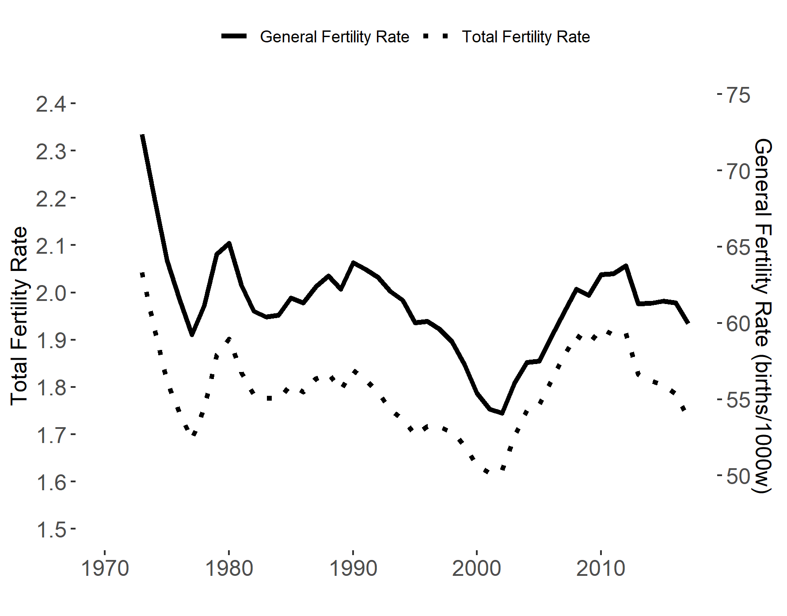

# Life and Death

## What this chapter is about

In earlier chapters we've discussed how Gross Domestic Product measures economic activity, and how other measures should be included to give a comprehensive measure of quality of life. Many of the available well-being measures use "life expectancy" as an (objective) indicator of health conditions. We should therefore be able to calculate life expectancy and explain the assumptions under which it is created. Moreover,  fertility behavior is clearly linked to well-being. Fertility measures are rarely used directly in indexes, but they are nevertheless important for social scientists. First of all, there might be a link between between economic conditions, social conditions and fertility behavior. Could you come up with an explanation why? (You will be asked to do this in the exercises). Secondly, fertility behavior (and life expectancy) affects the age composition of the population, which is directly relevant for public policies.  After reading this chapter you should be able to:

* Use standard measures of fertility
    * The Age-Specific Fertility Rate
    * The Total Fertility Rate
    * The General Fertility Rate
    * The Crude Birth Rate
* Create life tables
* Calculate life expectancy


## Describing fertility trends
Now we know that the population increase of the United Kingdom is both due to positive net migration flows and positive reproduction flows. We can go one step deeper and assess the changes in births in the United Kingdom. To investigate this we can make use of some of the standard definitions for describing fertility in a population:

* *Age Specific Fertility Rate (ASFR)*

    The number of live births per woman in a specific age group. 

    \begin{align}
        ASFR_a=\frac{\text{Number of births to women in age group} a}{\text{Number of  women in age     group} a}
    \end{align}
  
* *Total Fertility Rate (TFR)*: 

    The  number of children  born per woman if she were to pass through the childbearing years (typically set to: 15-44y or 15-49y) bearing children according to a current  age-specific fertility rates.
 
   \begin{align}
    TFR=\sum_{a=15}^{44}ASFR_a
  \end{align}
  
* *General Fertility Rate (GFR)*

  All live births per woman in the childbearing ages (also typically per 1000 women).
  
  \begin{align}
    GFR=\frac{\text{Number of births }}{\text{Number of  women in childbearing age} }
  \end{align}
  
* *Crude Birth Rate (CBR)*  

All live births per 1000 population of all  ages
  \begin{align}
    CBR=\frac{\text{Number of births }}{\text{Population size} }
  \end{align}


### Data requirements

In order to be able to calculate the fertility rates described above we need data on: (1) the number of live births by the age of the mother, (2) the number of women by age, (3) number of people in the population. Merging these data from Eurostat we can create Figure   \@ref(fig:death1)), which shows the development in the number of live and still births. Note that we again show two series with  different scales in the same Figure using two different vertical axes. Why did we combine these two graphs, and why do they have very different scales?

### Relating the fertility measures to each other

Why do we have different fertility measures and what do they say? When thinking about fertility in layman terms, we typically think about the number of children a woman will have in her life. It is an easily understandable hypothetical measure of completed fertility, which is captured by the Total Fertility Rate (TFR). It is hypothetical because we sum the  age-specific fertility measures across ages at a given point in time. Any woman in this sample will of course only be included in one of the age specific fertility rates and contribute to that value. We impute the total fertility rate by summing over a lot of different age groups, who will be at different ages in different points in time.

The General Fertility Rate  (GFR) on the other hand gives information about the number of new children relative to the number of women in childbearing ages. It is therefore an actual (and not a hypothetical) number. This is a refinement over the crude birth rate by taking into account the share of women in the population. To sum up, we should use the Total Fertility Rate to describe the fertility (behavior) and General Fertility Rate to describe the "number of individuals" added to the society.   How does the General Fertility Rate relate to the Total Fertility Rate? 

*From GFR to TFR:* A General Fertility Rate of about 60 (like at the end of the period in Figure  \@ref(fig:death1)) shows that 1000 women had 60 children in that year. Or that  1 woman on average had  0.06 children on average this year. But this of course only considers one year. In our calculations we used the age group 15 to 45 (although 15 to 49 is also common), which means that we considered 31 years of a woman's life. We can therefore multiply the 0.06 by 31 to get 1.83 which would be the average number of children a woman would have if all years were like this year. However, the TFR at the end of the period shown in Figure \@ref(fig:death1) was  1.73. Why do these number differ? There are two reasons: Firstly, the number of woman in each age group differs. Secondly, the fertility rates differ by age.  If one of these aspects is constant, the Total Fertility Rate will be the same as the General Fertility rate. 

*  TFR & GFR are the same when:
 * The number of women in each age group is constant.
 * The ASFRs are the same.
 

```{r death1, echo=FALSE, out.width = '70%',fig.align='center',fig.cap="Fertility rates for the United Kingdom. Data source: Eurostat. Note: Only births of women aged 15-45 are included. The R script for this Figure is available [here](https://www.hhsievertsen.net/economicdata/notes/lecture12/rmaterial/lecnote_12_script_for_fig5.Ra)."}

```


**What is the chart telling us?** So why did we combine the two line charts in Figure \@ref(fig:death1)? Firstly, the goal was to investigate the link between these two series. The graph is scaled in a way such that the Total Fertility Rate should perfectly overlay the General Fertility Rate if they are the same (that is the level on the right vertical axis is equal to 31 times the corresponding value on the left axis). This is clearly not the case, but we see that the gap narrowed in the early 2000s. This will be the case if the age groups with higher age specific fertility rates are larger. If every age group has the same fertility rate this year and next year, but the number of people in an age group with a relatively  high age specific fertility rate is larger next year compared to this year, the General Fertility Rate will increase, but the Total Fertility Rate will be unchanged. 

### Decomposing the development in life births
Life births are a good example for a situation where we can use the simple decomposition methods described in lecture note 4 (we already did that). We can use the General Fertility Rate and describe the development in the number of life births holding either the number of woman constant or the General Fertility Rate constant. 


## Life expectancy

Having discussed one element of natural population change, births, we now turn to the other aspect: deaths. We will here briefly summarize the construction of life tables and estimation of life expectancy. Life tables provide a list of period live expectancies for given age groups.  Given you are in a specific age group today and given the mortality rates of each age group, what is your expected life expectancy. The alternative measure, the cohort life expectancy, takes variation in mortality rates across cohorts into account. We will here only cover the period life expectancy and how to construct a life table. 


```{r deatht2, echo=FALSE, results='asis'}
cat('Table: (\\#tab:deatht) Data requirements for life tables

|Col  |Notation  |Content  |Source  |
| - |-----------| ---------------|-----|
|(1)| $x,x+n$ | The age interval              | Provided  |
|(2)| $m_x$   | The age-specific death rate.  | $\frac{\text{deaths  $x,x+n$ }}{\text{population $x,x+n$ }}$|
|(3) | $_nq_n$ | Prob. dying within interval.                | $\\frac{2\times n\times m_x}{2+n\times m_x}$|
|(4) | $I_x$   | Alive at age $x$                            | $I_0=100,000$|
|    |         |                                             | $I_{x+n}=I_x-_nd_x$|
|(5) | $_nd_x$ | Number of people who die within interval.   | $I_x\times _nq_x $|
|(6) | $L_x$   | Person-years of life in interval            | $\\frac{I_{x}+I_{x+n}}{2}$|
|(7) | $T_x$   | Cumulative person-years of life             | $\\sum_{end}^x{L_x}$|
|(8) | $e_x$   | Average  years of life remaining at age $x$ | $T_x/I_x$|')
```

Table \@ref(tab:deatht) shows the data requirements for creating life tables. For each age group we require data on the  number of people in that group and the number of people who died in that group. Once we have these two variables we can construct the other variables. The first variable we construct is the age specific death rate, following by the probability of dying within the age group interval. We then construct a synthetic population that has a size of 100,000 individuals at the beginning of the first period. In each period we calculate the number of people who survive to this period and who die within this period. We can then use these estimates to calculate the number of life years lived in this period, and sum over these live years. At the end, we divide the number of life years left in any given period by the number of people getting to this period to obtain the estimated life expectancy.

```{r deatht, echo=FALSE, results='asis'}
cat('Table: (\\#tab:deatht2) Life table for the United Kingdom. Data source: Eurostat.

|age  | mx | nqx | ndx | Ix | Lx | Tx | ex|
|--|--|--|--|--|--|--|--|
|0  | 0.004 | 0.004 | 385.000 | 100,000 | 99,808 | 8,081,572 | 80.816|
|1  | 0.000 | 0.000 | 25.376  | 99,615  | 99,602 | 7,981,765 | 80.126|
|2  | 0.000 | 0.000 | 14.013  | 99,589  | 99,582 | 7,882,163 | 79.147|
|3  | 0.000 | 0.000 | 11.453  | 99,574  | 99,568 | 7,782,581 | 78.159|
|$\vdots$||
|98 | 0.346 | 0.295 | 980.052 | 3326   | 2836  | 3128    | 0.941|
|99 | 0.386 | 0.324 | 758.769 | 2345 | 293 | 293 | 0.125|
')
```


 Table \@ref(tab:deatht2) shows a subset of a life table for the United Kingdom using data from Eurostat and the recipe outlined in Table \@ref(tab:deatht). Figure \@ref(fig:deatht2) shows a graph of the live expectancy (the last column of Table \@ref(tab:deatht))  and survival rate for the United Kingdom based on data from Eurostat. 
 
 
```{r death2, echo=FALSE, out.width = '50%',fig.show='hold',fig.align='center',fig.cap="Life expectancy by age (left) and survival probabilities (right). Data source: Eurostat. The R script for this Figure is available [here](https://www.hhsievertsen.net/economicdata/notes/lecture12/rmaterial/lecnote_12_script_for_fig6.R)"}
knitr::include_graphics(c("_resources/chapter_death/fig11.png","_resources/chapter_death/fig12.png"))
```


## Summary 
So what should you take away from this chapter?

* Measures of fertility
    * The Age-Specific Fertility Rate
    * The Total Fertility Rate
    * The General Fertility Rate
    * The Crude Birth Rate
* Creating life tables
* Calculating life expectancy


