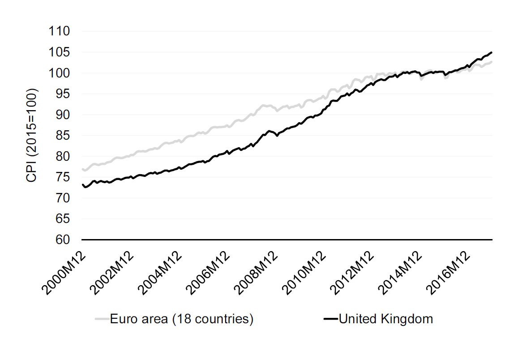
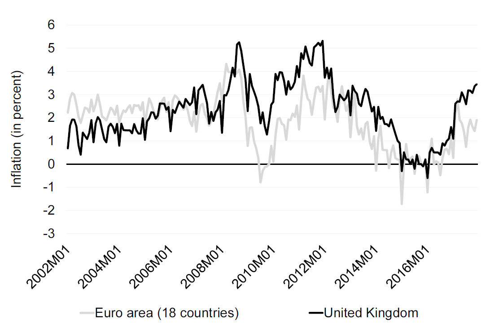

# Prices


```{r table2 , echo=FALSE, results='asis'}
  cat(' Table: \\label{tab:table2}Example

  | Sepal.Length| Sepal.Width| Petal.Length|
  |------------:|-----------:|------------:|
  |          5.1|         3.5|          1.4|
  |          4.9|         3.0|          1.4|
  |          4.7|         3.2|          1.3|
  |          4.6|         3.1|          1.5|')

```

Table \ref{tab:table2} shows...

Table \@ref(tab:mwe) shows...


## About this chapter

We've we discussed how the Policy Interest Rate is set by the Bank of England. The Bank of England has one objective in mind when deciding on the interest rate, the inflation in the UK should be 2 percent. So if you had spend 100 GBP to buy a basket of goods last year, you should spend 102 GBP to buy the basket of goods this year, that gives you the same utility. If the price of the basket is now  less than 101 or more than 103 the Bank of England is required to explain why. In other words, the Bank of England faces an inflation target of 2 percent, and deviations of more than one percentage point requires a public explanation. Now this all sounds simple and straightforward. However, the question is what baskets of goods should we compare?  Should the basket this year contain exactly the same goods as the basket last year, in the same quantity and quality? What if a new product arrives on the market? We will discuss these issues in this lecture along with the concept of the Purchasing Power Parity, which concerns the comparison of prices across countries. 

### Intended learning outcomes

After this lecture you should be able to 

* Explain the difference between the Laspeyre and Paasche price index.
* Explain how the consumer price index is constructed.
* Explain what inflation is and how it is measured.
* Explain what Purchasing Power Parity is, and how we can use it to compare prices across countries.


## Price indexes - in theory

### The objective

Before we discuss how we measure changes in prices, let's briefly discuss what our objective is. There are many different price indexes, such as the consumer price index, the producer price index, the house price index and the GDP deflator. They all track the development of prices, but they focus on the prices of slightly different goods. The consumer price index, which is the index central banks typically use in the inflation target, measures the development of prices over time. We would like to know, as a consumer, how much more expensive (in nominal terms) is it today compared to yesterday. But what comparison should we make? There are many goods and prices, and we need to combine their development  in one overall number. We therefore compare the price of a basket of good over time. And what determines the composition of this basket? A fair comparison would be to compare two baskets that gives us the same utility. Unfortunately we do not observe people's utility, and it is therefore not possible to make this comparison in practice. The price indexes discussed in the next section are therefore concerned in how we in practice can crate this basket of goods. 

### A simple index

Let us first revisit the index concept we used in the first week. We constructed indexes separately for each variable. In other words, for each variable, there is one index:

\begin{align}
    I_t=100\times \frac{P_t}{P_0}
    \label{eq1}
\end{align}

Where $I_t$ is the index value of price  $P$ at time $t$, using time $t=0$ as the base year. Note that we also have that:
\begin{align}
    I_{t-1}=100\times \frac{P_{t-1}}{P_0}
    \label{eq2}
\end{align}

which we can rewrite to:

\begin{align}
    Y_0=100\times \frac{P_{t-1}}{I_{t-1}}
    \label{eq3}
\end{align}

And then insert in equation \eqref{eq1}:

\begin{align}
    I_t&=100\times \frac{P_t}{100\times \frac{P_{t-1}}{I_{t-1}}}\nonumber\\
        \Rightarrow I_t&=I_{t-1}\times \frac{P_t}{ P_{t-1}}\nonumber\\
    \label{eq4}
\end{align}

Instead of computing the index based on base year, we take the index value last period and multiply by the change in our variable from last year to this year. Table  \@ref(tab:price1)  shows a simple example of two indexes based on two time series. 


```{r , echo=FALSE, results='asis'}
cat('Table: (\\#tab:price1) Simple indexes of two prices

|Year|P1|I(P1)|P2A|I(P2)|
|:--:|:--:|:--:|:-:|:--:|
2001|136|100|120|100|
2002|186|137|127|106|
2003|197|145|140|117|
2004|204|150|138|115|
2005|215|158|150|125|
2006|222|163|160|133|')
```


But what if $P1$ is the price of coffee and $P2$ is the price of tea, and we would like to summarize the price development in one index variable? One approach would simply be to take the average across these two products:

\begin{align}
   I_t&=100\times \left(\frac{0.5\times P1_t+0.5\times P2_t}{0.5\times P1_0+0.5\times P2_0}\right)
    \label{eq5}
\end{align}


Which gives us the index shown in Table  \@ref(tab:price2) . The new single index value is always between the two separate index values in Table  \@ref(tab:price1), because the new index is based on the simple mean across these two variables. 


```{r , echo=FALSE, results='asis'}
cat('Table: (\\#tab:price2) Index based on the simple mean across two variables

|Year|P1|P2|PA|I(PA)|
|:--:|:--:|:--:|:-:|:--:|
|2001 | 136 | 100 | 128.0 | 100|
|2002 | 186 | 137 | 156.5 | 122|
|2003 | 197 | 145 | 168.5 | 132|
|2004 | 204 | 150 | 171.0| 134|
|2005 | 215 | 158 | 182.5| 143|
|2006 | 222 | 163 | 191.0| 149|
')
```


But what if we drink much more coffee than tea (I am not British)? Let's say that for every four cups we drink, three of them are coffee and one of them is tea. Now this should also be reflected in our price index. The simple arithmetic mean is therefore not representative, instead we should use the weighted mean, where we assign tea a weight that is three times higher than coffee:

\begin{align}
   I_t&=100\times \left(\frac{0.75\times P1_t+0.25\times P2_t}{0.75\times P1_0+0.25\times P2_0}\right)
    \label{eq6}
\end{align}

or expressed in more general terms:

   \begin{align}
   I_t&=100\times \left(\frac{Q1 \times P1_t+Q2 \times P2_t}{Q1 \times P1_0+Q2 \times P2_0}\right)
    \label{eq7}
\end{align}

Where $Q$ refers to the quantities or weights.


Table  \@ref(tab:price3)  shows the weighted price index, along with the weights, $Q$. The overall price of our hot drinks consumption now increased 56 percent from 2001 to 2006, this is slightly higher than the  price index in Table  \@ref(tab:price2), reflecting that the price of coffee has increased more than tea, and we consume relatively more coffee. 


```{r , echo=FALSE, results='asis'}
cat('Table: (\\#tab:price3) Index based on a weighted mean across two variables. With $I=0.75\times P1+0.25\times P2$.

|Year|P1|P2|Q1|Q2|I|
|:--:|:--:|:--:|:-:|:--:|
|2001 | 136 | 100 | 75 |25|100|
|2002 | 186 | 137 | 75 |25|130|
|2003 | 197 | 145 | 75 |25|138|
|2004 | 204 | 150 | 75| 25|142|
|2005 | 215 | 158 | 75| 25|151|
|2006 | 222 | 163 | 75 |25|156|
')
```

Computing a price index has been quite straightforward so far. However, in the later years we started to drink relatively more tea, so the weights changed. This is where we introduce slightly more complex price indexes. 

### The Laspeyre Index
The German economist and Etienne Laspeyre is the father of the Laspeyere index. In terms of our two goods world, with only tea and coffee, Laspeyre's index is defined as:

   \begin{align}
I_t^L&=100\times \left(\frac{Q1_0 \times P1_t+Q2_0 \times P2_t}{Q1_0 \times P1_0+Q2_0 \times P2_0}\right)
    \label{eq8}
\end{align}

What is new compared to equation \eqref{eq6} is that not only do the prices have time periods, but also the weights (the quantities), $Q$. Using Laspeyre's index, the weights are kept constant at the initial period, 0. In other words, Laspeyre's index tells us how much the price of our consumption has increased, given the relative weights in the base year. In more general terms (with more goods), we can write Laspeyre's index as follows:

   \begin{align}
   I_t^L&=100\times \left(\frac{\sum^I_{i=1} Qi_0 \times Pi_t}{\sum^I_{i=1}Qi_0 \times Pi_0}\right)
    \label{eq9}
\end{align}

Where $i$ refers to the product. So in the case of the Laspeyre price index, our movement away from tea to coffee is ignored. If we wanted to adjust the weights, an alternative methodology is provided by Paasche.

### The Paasche Price Index
As with the Laspeyre index, the Paasche index is attributable to a German economist, this time it is Hermann Paasche. The Paasche index is very much just the opposite of the Laspeyre index. We use the current weights, both in the denominator and numerator. 

\begin{align}
   I_t^P&=100\times \left(\frac{\sum^I_{i=1} Qi_t \times Pi_t}{\sum^I_{i=1}Qi_t \times Pi_0}\right)
    \label{eq10}
\end{align}

Instead of always comparing the sample basket we bought in the reference period, we refer to the basket, in the current period. Table \@ref(tab:price4)  shows the Laspeyre index ($I^L$) and the Paasche index ($I^P$) for our two good case, where the quantities or weights change from year to year. Unsurprisingly, the Laspeyre index corresponds to the weighted average in Table  \@ref(tab:price3), because the weight in the base year corresponds to the constant weights in Table  \@ref(tab:price3) . The Paasche index is, however, slightly different. Going back to Table  \@ref(tab:price1) we recall that the price of the first good (say coffee) increased more than the price of the second good (say tea). Now as we start consuming relatively more tea, the good that increases less in price receives more weight. The Laspeyre index ignores this, but the Paasche does not, and therefore the Paasche price index is lower than the Laspeyre index.

```{r , echo=FALSE, results='asis'}
cat('Table: (\\#tab:price4) The Laspeyre and Paasche Index. Notes: $I^L$ refers to the Laspeyre price index and $I^P$ refers to the Paasche price index.

|Year|P1|P2|Q1|Q2|$I^L$|$I^P$|
|:--:|:--:|:--:|:-:|:--:|
|2001| 136 | 100 |75 |25|100|100|
|2002| 186 | 137 | 65 |35|130|127|
|2003| 197 | 145 | 55 |45|138|133|
|2004| 204 | 150 | 45| 55|142|132|
|2005| 215 | 158 | 35| 65|151|138|
|2006| 222 | 163 | 25| 75|156|142|

')
```


Our example is actually in line with what we typically observe in the real world, the Laspeyre index gives a higher increase than the Paasche index. This is because  consumers tend to  substitute away from the good that increases relatively more in price. So when one good's price increases less than the other, and we therefore tend to consumer more of the relatively cheaper good, the Paasche index takes this into account  because weights are updated every year. The Laspeyre index on the other hand always refers to the base year weights.  Which index to prefer is, however, not obvious. Often the choice of index will be based on practical reasons. While the Paasche index requires new weights every year, the Laspeyre index only requires the base year weights and the prices for all periods. The Paasche index is therefore slightly more data demanding.

### The Fisher Price Index
The Fisher index, introduced by the  american economist Irving Fisher, is a compromise between the Laspeyre index and the Paasche index. It is also called Fisher ideal index, and it is based on an average between the Laspeyre and Paasche index. The average is computed by means of a geometric mean:

\begin{align}
      I_t^F&=\sqrt{I^ L_t\times I^ P_t} 
    \label{eq11}
\end{align}

Table  \@ref(tab:price5) includes the Fisher ideal index. As we would expect (given that the mean), the the Fisher ideal index is always between the Laspeyre and the Paasche index.

```{r , echo=FALSE, results='asis'}
cat('Table: (\\#tab:price5) The Laspeyre, Paasche and Fisher Ideal Index. Notes: $I^L$ refers to the Laspeyre price index,  $I^P$ refers to the Paasche price index and  $I^F$ refers to the Fisher ideal price index.

|Year|P1|P2|Q1|Q2|$I^L$|$I^P$|$I^F$|
|:--:|:--:|:--:|:-:|:--:|
|2001|136|100|75|25|100|100|100|
|2002|186|137|65|35|130|127|128|
|2003|197|145|55|45|138|133|136|
|2004|204|150|45|55|142|132|137|
|2005|215|158|35|65|151|138|144|
|2006|222|163|25|75|156|142|149|

')
```


### The Lowe Price Index
The Lowe price index is attributed to the Scottish economist Joseph Lowe. The Lowe index is a more general price index, where the reference period for the weights is not set. 

   \begin{align}
   I_t^{Lo}&=100\times \left(\frac{\sum^I_{i=1} Qi_r \times Pi_t}{\sum^I_{i=1}Qi_r \times Pi_0}\right)
    \label{eq12}
\end{align}


The Laspeyre price index is a special case of the Lowe price index, where $r=0$, and the Paasche price index is a special case of the the Lowe price index, where $r=t$. The Laspeyre and the Paasche indexes are therefore often called "Lowe type price indexes".

### Other indexes

There are many different price indexes, and the price indexes applied by statistical offices will often be modified versions of the standard formulas. One modification is chain-linking, which we will discuss in the next section. However, before we get there, it is worth mentioning a few more price indexes. The Finnish statistician Leo Törnqvist  introduced an index (the Törnqvist  index), where we instead of taking the mean between the Fisher and Paasche index, take the mean of the weights between the base year and the current year. However, the Törnqvist index also differs by using a weighted geometric mean instead of the weighted arithmetic mean. 

Also, another index worth mentioning is the Carli index, introduced by the Italian economist Gian Carli:

   \begin{align}
   I_t^{C}&=\frac{1}{N}\sum^I_{i=1}\left(\frac{Pi_t}{Pi_0}\right)
    \label{eq13}
\end{align}

Note that the Carli index is unweighed. It is therefore called elementary, and it is typically only used when we are focusing on specific product types. 

### Chain-linked vs. unchained indexes
So far we've three solutions regarding product weights. One, we use the weights in the base year (Laspeyre); two, we use the weights in the current year (Paasche); three we use an average between the base year and the current year (Fisher/Tornqvist). An alternative strategy is to constantly update the base year of the weights. This is where the alternative specification in equation \eqref{eq4} becomes handy. Recall that the we could write the price index in year $t$ as the price index in year $t-1$ times the change from year $t-1$ to $t$. In general terms, as a chain-linked Laspeyere index, this works as follows:
   
\begin{align}
   I_t^{CL}&=I_{t-1}\times  \left(\frac{\sum^I_{i=1} Qi_{t-1} \times Pi_t}{\sum^I_{i=1}Qi_{t-1} \times Pi_{t-1}}\right)
\end{align}

We call this methodology for chained, because we link each year using a chain of updated weights.  We thus use the standard Laspeyre index, but every year we update the base year as the last year. We can do a similar exercise with the Paasche index

\begin{align}
   I_t^{CP}&=I_{t-1}\times  \left(\frac{\sum^I_{i=1} Qi_{t} \times Pi_t}{\sum^I_{i=1}Qi_{t} \times Pi_{t-1}}\right)
\end{align}


```{r , echo=FALSE, results='asis'}
cat('Table: (\\#tab:price5) Laspeyre and Paasche index, unchained and chain-linked. Notes: $I^L$ refers to the Laspeyre price index,  $I^P$ refers to the Paasche price index, $I^{CL}$ refers to the chain-linked Laspeyre index and $I^{CP}$ to the chain-linked Paasche index.

|Year|P1|P2|Q1|Q2|$I^L$|$I^P$|$I^{CL}$|$I^{CP}$|
|:--:|:--:|:--:|:-:|:--:|
|2001| 136 | 100 | 75 | 25 | 100 | 100|100|100|
|2002| 186 | 137 | 65 | 35 | 130 | 127|130|127|
|2003| 197 | 145 | 55 | 45 | 138 | 133|139|136|
|2004| 204 | 150 | 45 | 55 | 142 | 132|141|138|
|2005| 215 | 158 | 35 | 65 | 151 | 138|151|148|
|2006| 222 | 163 | 25 | 75 | 156 | 142|159|156|
')
```


### Summary on price indexes
*Objective*


* A method to compare the price development across a large bundle of goods.
  
*Challenge*
  
* The composition of the bundle might change over time, and some goods might gain higher and lower weight, while other goods might be removed or added to the bundle.

*Method*

* The Laspeyre index: Keep the bundle fixed in the base year and assess the price development based on the development of the costs of the initial bundle.
* The Paasche index: Update the bundle every year, and compare the price of the new bundle given current prices and given prices in the base year.
* The Fisher index: The geometric mean of the Laspeyre and the Paasche indexes. 
* Chain-linking: Continuously update the reference period.
 
### Weigths 

Before we turn to the actual price indexes, we will briefly discuss how these weights are computed, $Q1$ and $Q2$. These weights could be obtained by various sources. In practice, most countries compute the weights based on total household final expenditure from the national accounts.


 However, some indexes use surveys to compute the weights. For the UK, the Living Costs and Food Survey is based on reported consumption over a two week period for thousands of households. This survey is used in some price indexes constructed by the ONS (for example the RPI).  One advantage of using surveys to compute weights is that we have more information on the household, and we can thus rely on households that we believe are more representative. 

## Price indexes -  in practice
There is not only one price index. We might for example be interest in how costs for firms have developed. The typical consumption basket for firms is very likely to be different than the typical basket for households. 

### Consumer Price Indexes
Let us first consider how the price level for consumers develops. The ONS publishes several consumer price indexes. Let us consider three of the most important ones:

* The Consumer Price Index (CPI)
* The Consumer Prices Index including owner occupiers' housing costs (CPIH)
* The Retail Prices Index (RPI) 

The CPI is calculated in line with European regulations, but the RPI does not satisfy the international standard. The latter is therefore not regarded as a National Statistic of the ONS any more, but it is still produced, because contracts still rely on the RPI. The main difference between the CPI and the CPIH is that the CPIH includes costs related to owning a home, such as maintenance (owner occupiers' housing costs). The CPI and CPIH include the same items, except for the housing costs. The RPI differs somewhat to the CPI and CPIH in terms of items included. While the weights in the CPI and CPIH are based on total household final expenditure from the national accounts, the weights in the RPI are based on the Living Costs and Food Survey. The CPI is based on about 180,000 prices that cover about 700 items. 

The CPI and CPIH are chain-linked Laspeyres-type price indexes computed on a monthly basis. The RPI is (approximately) also a chain-linked Laspeyre type index, but based on annual data. 

Looking beyond the UK, the harmonised index of consumer prices (HICP), is the consumer price index by the European Union/ Eurostat, which is also a chain-linked Laspeyres-type price index. Both the CPI and CPIH use weights that are typically updated annually. For more details on the consumer price indexes, see [@cpions] for the ONS and [@cpieu]  for the European level. 

There are various data sources for price indexes. Figure \@ref(fig:pricefig1) uses data from Eurostat to show the development in the price index for the UK and for the EURO area as a whole. Note that the index is based on 2015 as a reference year. This is slightly unusual, as we often prefer to have the first period as a reference. 

 
```{r pricefig1, echo=FALSE, out.width = '75%',fig.show='hold',fig.align='center',fig.cap="The Consumer Price Index (HICP) for the EURO countries and the UK. Source: Eurostat. Notes: The index is constructed such that the 2015 average is 100."}

```
  


### Producer Price Index, Import Price Index and Export Price Index
Firms typically have different weights than consumers. We typically distinguish between three indexes, the Producer Price Index (PPI), the Import Price Index (IPI) and Export Price Index (EPI). These indexes are all chain-linked Laspeyres-type price index, where weights are updated regularly, but typically less frequent than for consumer price indexes. The weights are constructed using sales data from different sources. For more details see [@ppions]  for the ONS and [@ppieu]  for the European level.

### Other indexes

A couple of additional indexes also deserve mentioning. First, the GDP deflator. The GDP deflator is considerably broader than the other price indexes, as it covers the complete domestic economy. The National Accounts typically also use chain-linked  Laspeyres type approach to be able to make monetary levels comparable across periods. For more details see [@gdpons]. Second, the House Price Index (HPI), again a chain-linked Laspeyre type index, with annual updating of weights. This index covers housing bought by households, such as flats, detached houses and terraced houses. Third, the Index of Private Housing Rental Prices (IPHRP) capturing the development in the   price tenants face when renting residential housing.

## Comparing monetary values across time

### Inflation

As there are many price indexes,  there are also many inflation measures. The Bank of England's inflation target relates to the Consumer Price Index inflation. The ONS publishes both annual and monthly rates, where annual rates relate to the change in prices over a 12 month period, and monthly to a month to month change. As inflation shows the change in price levels, the inflation can be seen as the first derivative of the price index. In Figure \@ref(fig:pricefig2) we show the year-to-year change in price levels based on the price indexes shown in Figure \@ref(fig:deatht1).


 
```{r pricefig2, echo=FALSE, out.width = '75%',fig.show='hold',fig.align='center',fig.cap="Consumer Price Inflation for the EURO countries and the UK. {Source: Eurostat. Notes: The inflation relates to 12 month changes.}"}

```
  

Note that the UK inflation is currently considerably higher than the inflation in the EURO area. 

### Real vs. nominal values

Price indexes are not only used to compute inflation measures.  More than 100 years ago, in 1905, the English footballer  Alf Common moved from Sunderland to Middlesbrough for a record fee of 1,000 GBP. In terms of today's  transfer fees, this sounds unrealistic. But based on the amount you could purchase with 1,000 GBP in 1905, this corresponds to about 114,367 GBP in 2017, which is still low, but seems more reasonable. To make this adjustment, we use price indexes. 

Using price indexes we can compare the fee of Alf Common to the fee of for example Kevin Keegan in 1977, when he moved from Liverpool to Hamburg for a fee of 500,000 GBP. The 500,000 GBP in 1977 corresponds to about 2,922,031 GBP in 2017. We can thus refer to the 1,000 GBP and 500,000 GBP as transfer fees in *nominal* terms and the  114,367 GBP and 2,922,031 GBP  as *real* terms in the 2017 price level.

* Nominal values are monetary values that are expressed in current prices. For example your monthly income measured in the price level used today or the transfer fee in 1905 measured in the price level of that time.

* Real values are monetary values, where we adjust for changes in price levels. To figure out whether you earn more today than 10 years ago, it is not sufficient just to compare the nominal earnings today and ten years ago, as the price level has changed. As goods and services have become more expensive, the same earnings as 10 years ago, in nominal terms, would enable you to buy less today than ten years ago.  Adjusting the earnings to the same price level using inflation or price indexes is necessary to understand whether we are facing a real increase.


To convert the nominal values to real values (say the value in the base year) we multiply the nominal values with the change in the price index:

\begin{align}
    P_{BASE}=P_t\times \frac{CPI_{BASE} }{CPI_t}
\end{align}

### The real interest rate

In lecture 13 we discussed interest rates. An annual interest rate of 2 percent means that if I place 100 GBP in that investment, I will receive 102 GBP in one year. But what if the price index also increases from 100 to 102? In real terms I am not richer in a year than I am now, because the same bundle of goods that I am able to buy for 100 GBP today, costs 102 GBP in one year. If we want to know whether we will actually get richer from an investment, we should consider the *real interest rate*. Now let us consider how much richer we are in a year. We want to know the real interest rate $r$, and we know the nominal interest rate $i$ and the inflation rate $\pi$ (it is fairly standard to use these letters for interest rates and inflation). We can thus write 

\begin{align}
    1+r= \frac{(1+i)}{(1+\pi)}
\end{align}

which we can rewrite as:

\begin{align}
    1+\pi+r+r\times \pi&= 1+i\nonumber\\
 \Rightarrow    r&= i-\pi-r\times \pi
\end{align}

As inflation and the interest rates typically are fairly small, the term "$r\times \pi$"  will be close to zero. We can therefore compute the approximate real interest rate as:

\begin{align}
    r\approx i-\pi
\end{align}

which is also known as the \emph{Fisher equation}. When inflation  exceeds the real interest rate, we face a negative real interest rate. 

### The Phillips  Curve

The Phillips  curve was introduced by William Phillips   an economist from  New Zealand. He studied the relationship between inflation and unemployment, a relationship that is visualized in the Phillips  Curve.  The original Phillips  is a scatter plot of wage inflation and unemployment in the UK. The curve showed that periods with low unemployment rates also tended to be periods with high inflation rates, and periods with high unemployment rates also tend to be periods with low inflation. The (short-run) intuition behind this relationship is that when employment is high, the pressure on wages is high, and wage inflation is high. For details on the Phillips  curve, see [p. 646 in @core] . 

In 2008 Gregor [@smith2008japan]  published a paper, where he showed how the Phillips of Japan looks like Japan. His plot is shown in Figure \@ref(fig:pricejapan), along with a picture from Google maps, of Japan.  What do you think? Is this advanced chartjunk?

 
```{r pricejapan, echo=FALSE, out.width = '50%',fig.show='hold',fig.align='center',fig.cap="The Phillips curve of Japan and a map of Japan. Source: The Map is from Google Maps, the Phillips curve is from citet{smith2008japan}. The unemployment rate is multiplied by minus 1. "}
knitr::include_graphics(c("_resources/chapter_prices/japan4.png","_resources/chapter_prices/japan3.png"))
```

## Comparing monetary values across regions

### The Big Mac index

Considering price levels is not only important when we compare changes over time, but also across countries. In lecture 3 we discussed exchange rates, but sometimes it is not sufficient to just apply the exchange rate. Imagine that you would like to compare the earnings of a typical worker in Ukraine to the earnings of a typical worker  in Switzerland.  But prices in Ukraine are very different to prices in Switzerland, and just comparing the earnings  using the exchange rates would not reflect the differences in living standards. One illustration of the difference is the Big Mac Index, which has been published by the  Economist since 1986. According to the 2017 version of the index, a Big Mac costs around 6.35 USD in Switzerland and 1.54 USD  in Ukraine. The price level, as approximated with the Big Mac Index is therefore about four times higher in Switzerland compared to Ukraine. If the Big Mac price level is reflective of the overall costs, it would suggest that to obtain the same living standards in Switzerland as in Ukraine, you need about four times the income Switzerland compared to Ukraine. 

Several indexes have been produced to mimic the idea of the Big Mac Index (the IPod index, the Starbucks Latte index, etc.). However, these indexes have some obvious short-comings. The product is not the same across countries and the product is not representative of the overall costs.

### Purchasing Power Parity

While the Big Mac Index provides a very simple approach to compare prices. A more rigorous way to compare nominal values across countries is by means of purchasing power parity (PPP). As a point of departure, let us consider the price of a Big Mac. In Switzerland the price is approximately 6.50 CHF and in the US the price is approximately 5.06 USD. This would suggest an exchange rate between US and Switzerland of:

\begin{align}
    PPP_{BigMac,SUIUS}=\frac{6.50}{5.06}=1.28
\end{align}

now, according to the law of one price, we would expect the price of a big mac to be the same in the US and in Switzerland, so the difference must be the exchange rate. Having 5.06 USD must thus be the same as having 6.5 Swiss Francs, or having 1 USD must correspond to 1.28 Swiss Franc. However, at the time of the Big Mac price difference (January 2017), the USD to the CHF  exchange rate was 1.01. According to the Big Mac index, the Swiss Franc was overvalued by about 30 percent compared to the USD.  So to make the monetary values comparable across Switzerland and the US we multiply all US values with 1.28 instead of the actual exchange rate. We say that the purchasing power parity is 1.28 CHF to 1  USD.

Just like a basket of goods is used to compare prices across time, a representative basket of goods is used to compare prices across countries. The OECD and Eurostat cooperate in the measuring of the PPP. Details on how to compute the PPP can be found in [@ppp]. We use PPP to compare GDP (and especially GDP per capita) across countries. Which we will work on in lecture 15

## Summary

In this lecture we've covered the following topics:

* The objective of price indexes.
* Indexes in theory: The Paasche and Laspeyre price indexes.
* Indexes in practice: The Consumer Price index and friends.
* The use of price indexes: computing inflation rates and converting nominal values to real values.
* The Phillips curve.
* Comparing prices across countries using the Purchasing Power Parity.


