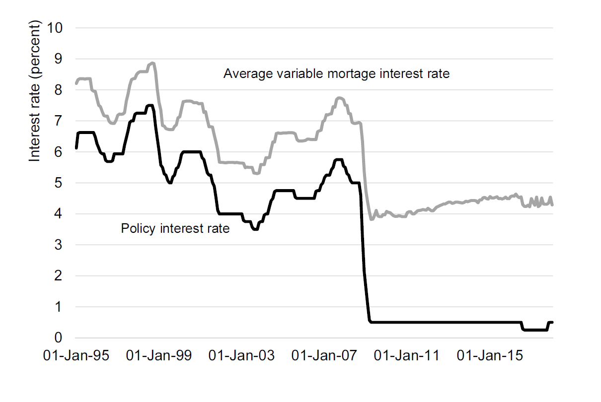
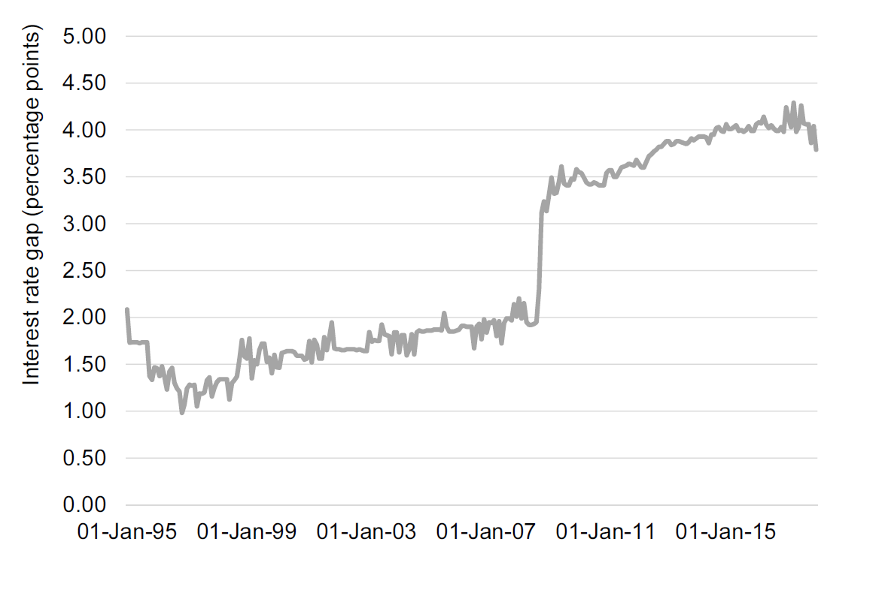
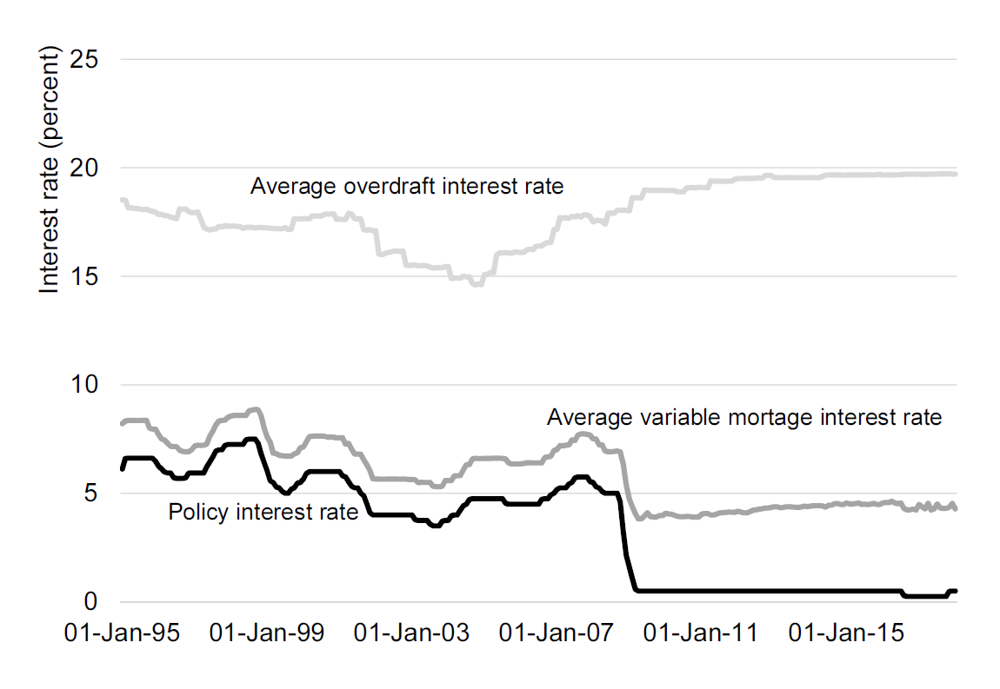

# Money


## About this chapter

If you ask a bank to lend you money, they will probably charge you an interest rate. The interest rate is the price of money. This chapter is about  the different types of interest rates, and the price of money in other currencies, the exchange rates. 

### Intended learning outcomes

After reading this chapter
 
* Distinguish between the policy interest rate, the interbank rate, and the bank lending rate.
* To express the price of currencies in terms of exchange rates and describe movements in exchange rates.


## Interest rates
### The  basics: What is the interest rate?

If you ask a friend whether you can borrow 2 GBP today, it is likely, that you have repaid your debt once you've repaid these 2 GBP. However, if you ask your bank whether you can borrow 10,000 GBP, it is likely that they will require you to repay more than 10,000 GBP. If the bank asks you to repay 10,500 GBP, the bank charged you an interest of 5 percent rate. Or in other words, the interest rate, $i$, on your bank loan is 5 percent:

\begin{align}
    i=\frac{\text{amount to repay}}{\text{amount borrowed}}-1=\frac{10,500}{10,000}-1=0.05
\end{align}

Why did you have to pay more to the bank than you borrowed?  To be able to lend 10,000 GBP to you, the bank has to get 10,000 GBP from somewhere. Banks borrow and lend money on the *money market* where they also pay an interest rate for lending money.  Alternatively the bank could lend the money from another customer, but this other customer would expect to get something in return, an interest.

Why would the other costumer expect an interest? The short answer: Money *today* is costly. Would I rather have 100 GBP today or 100 GBP in two years? If you take 100 GBP today you could just keep the money in a safe place for two years. So money today should be at least as much worth today as in two years (everything else equal). Moreover over two years things might get more expensive. The amount of goods you can buy today for 100 GBP is probably larger than the amount of goods you can buy in two years because of the inflation. Moreover, you could also keep the 100 GBP today and invest them in stocks or bonds, and you might have more than 100 GBP in two years. So in sum, money today is typically more worth than money at a later point in time, and you have to pay a price for for that, the interest rate.

Why are interest rates important in economics? Imagine that you have a business idea, and that you need some funding, say 10,000 GBP. You go to your bank and ask for 10,000 GBP today. They might answer, sure just promise to give us 10,050 GBP in ten years. That is an interest rate of 0.5 percent ($=100*((10,500/10,000)-1)$). Not a bad deal, and you might be inclined to accept it and start your own business. But imagine that the bank says, sure, just promise to give us 20,000 GBP in ten years. That is an interest rate of 100 percent ($=100*((20,000/10,000)-1)$). Unless you have no other (cheaper) options to borrow money and you are very certain of your business idea, you will be probably reject this offer and not initiate your business idea. So the interest rate can affect the activity in the economy. A low interest rate means that it is cheap to borrow money. You can borrow money to start a new business, to buy a new car or to renovate your house. Buying new cars affects the auto mobile industry and renovating the house might affect jobs for carpenters and bricklayers. 

But a low interest rate might also discourage savings, because when interest rates are low, the return on saving money is low. If banks are offering loans for 0.5 percent they probably paid less than 0.5 percent to borrow the money themselves, so saving money is also less attractive. But what determines the interest rates? [chapter 10 in @core] provides a nice introduction to the money and credit market. We will provide a brief and very simplified description of the different interest rates in the next section.

### Three  interest rates

Let us consider an extremely simplified version of the money market:

* The central bank controls the money supply and sets the interest rate. The interest rate set by the central bank is called the \emph{policy interest rate} or the base rate. Commercial banks can borrow money at these rates.
* Commercial banks can also borrow and lend money to each other on the interbank lending market  at the *interbank rate*.
* Commercial banks lend money to households and firms at the \emph{bank lending rate}.


So what happens when you ask your bank for a loan?

* If your bank has sufficient funds it will just provide you a loan at their bank lending rate.
* If the bank does not have sufficient funds it will try to borrow money on the money market, either from the central bank or from other banks.

You will most likely pay a higher interest rate than the bank is paying the central bank or other banks. Even though the interest rate you pay for a bank loan is not the same as the interest rate your bank pays on the interbank market, there is a relationship between these rates. When central banks lower the policy interest rates, it becomes cheaper for banks to borrow money and they can offer you a loan at a lower price. Given that there is competition in the commercial bank market, it is likely that they will lower the interest they charge you, if their costs are reduced. Figure  \@ref(fig:money1) shows a line chart of the policy interest rate and the commercial bank lending rate for the UK. 


```{r money1, echo=FALSE, out.width = '70%',fig.align='center',fig.cap="Policy interest rates and bank interest rates for the UK. Source: Bank of England. Series: IUMABEDR and IUMTLMV."}

```


You clearly see in Figure  \@ref(fig:money1) that the  policy interest rate by the Bank of England and the average interest rate charged by commercial banks (the bank lending rage) follow each other. When the price of money falls, ie. the policy interest rate falls, the price banks charge on mortgages also falls. However, note that after the financial crisis, the gap between these two interest rates has increased. Figure  \@ref(fig:money2) shows the gap (in percentage points) over the same time period. After the financial crisis the gap increased form approximately two percentage points to four percentage points. Why do you think this is the case? 

```{r money2, echo=FALSE, out.width = '70%',fig.align='center',fig.cap="The Gap between the policy interest rate and bank interest rate for the UK. Source: Bank of England. Series: IUMABEDR and IUMTLMV."}

```


However, there is not only one commercial bank lending rate, there are many. The interest rate the bank charges you, not only depends on their direct costs, but also on the risk they are facing. Mortgages are secured in the property, such that if the loan is not repaid, the money lender can use the property as a compensation, for example by selling the property. This means that  mortgages have a relatively high degree of security for the lender. However, some loans have almost no security, for example overdraft loans or credit card loans. 
 Figure  \@ref(fig:money3)  shows the average  overdraft interest rate for the same period. There is no clear relationship between the interest rate on overdrafts and the interest rate and the policy interest rate. Why do you think this is the case?

```{r money3, echo=FALSE, out.width = '70%',fig.align='center',fig.cap="The policy interest rate, the  bank interest rate (mortgages) for the UK and the overdraft interest rates. Source: Bank of England. Series: IUMABEDR, IUMODTL and IUMTLMV.."}

```

In addition to risk, the timespan of the repayment also  affects the interest rate. If you would like to repay your loan over a longer period, the bank is likely to charge a higher price. Some bank loans have a fixed interest rate and some have a flexible interest rate. With a fixed interest rate, you know exactly what price you are paying throughout the repayment period. With a flexible interest rate, the costs of the loan might change. Finally it is important to consider how frequent the interest rate is accumulated. On many overdraft loans, the interest is calculated on a daily basis. Interest rates usually refer to annual rates. 

### Getting data on interest rates

TBD

### Summary: Interest rates

*Definition*
* The price of money.
* The relative difference between what you pay compared to what you borrowed.


*Interest rates*
* The Policy interest rate: Set by the central bank, also known as the base rate, or for the UK: BOEBR (Bank of England base rate).
* Interbank interest rate: The rate banks charge each others for loans. In the UK: LIBOR (London Inter-bank Offered Rate)
* Commercial bank lending rates.


*Factors affecting the interest rate*

* The cost of obtaining money (i.e. the base rate and the interbank interest rate).
* The risk of the loan.
* The time span of the loan.
* Whether the interest rate is fixed or flexible.


## Exchange rates

### Definition of exchange rates

Exchange rates describe the value of one currency relative to another currency. Specifically it says how many units of one currency we can buy from one unit of another currency. This causes a lot of confusion, because the ordering of the units get mixed up. Importantly the currency that comes after the "to the" is always the currency that you consider one unit of. One way to remember this is to always add an "buy one unit of" between the "to" and the "the":

\begin{center}
    "An exchange rate of \emph{Y} \emph{currency a} to (buy one unit of) the \emph{currency b}."
\end{center}

An example: 
\begin{center}
    An exchange rate of 1.39 US Dollar to  the British Pound.\vspace{12pt}\\
    means:\vspace{12pt}\\
    An exchange rate of 1.39 US Dollar to \emph{buy one unit of} the British Pound.\\
\end{center}

As with interest rates, there are several exchange rates. The exchange rate is determined on the foreign exchange market (FOREX). It is mostly large banks and financial institutions that buy and sell on FOREX. When we individuals buy or sell foreign currencies, we typically just go to our local bank or to business that specialize in exchanging currencies. We rarely pay the same exchange rate as on the FOREX, because we also pay some sort of commission to the local bank or currency exchanger. 

### Ups and downs: appreciation and depreciation
When exchange rates go up or down we use the terms appreciation and depreciation. When a currency depreciates it loses value compared to the foreign currency. When a currency appreciates it gains value. Figure  \@ref(fig:money4) shows the price of one USD in EURO increased substantially in the beginning of 2015. In other words 1 EURO became less worth compared to the USD, so it depreciated. Vice versa in 2017, where the price of a USD in EURO went down, so that the EURO depreciated. 


```{r money4, echo=FALSE, out.width = '70%',fig.align='center',fig.cap="Exchange rates: EURO, CHF, GBP to USD. Source: The IMF."}
knitr::include_graphics("_resources/chapter_money/ex5.png")
```


### Summary: Exchange rates

*Definition*
* The value of one currency relative to another currency:  **An exchange rate of Y currency a to (buy one unit of) the currency b**

*Ups and downs*

* Appreciation: A currency's value increases relative to the foreign currency. 
* Depreciation: A currency's value decreases relative to the foreign currency. 


*Interbank and commercial exchange rates*
* Commercial exchange rates: The exchange rate you pay in the bank or the supermarket.
* Interbank exchange rate: The exchange rate your bank pay on the interbank market.


### Getting data on exchange rates

TBD


## Linking interest rates and exchange rates
So we've talked about interest rates and exchange rates. Is there a link between these rates? We know that the interest rates are affected by national banks, that set national policy interest rates. But what determines the exchange rates? If a currency  is free-floating, the exchange rate is determined on the market by supply and demand. If more people want to hold GBP, the price will increase. 

Who invests in currencies? Mostly international investors. And these investors like high returns, so they want to hold assets that pay high returns. When the policy interest rate is lowered, the interest rate on the country's financial assets such as bonds goes down, making them less attractive. This will lower the demand for for assets. And thus also for the currency, and ultimately, the asset will depreciate. 

You can read much more about the link between exchange rates and interest rates in [chapter 15 in @core].


## Summary
In this chapter  we have covered the following topics:

* The three types of interest rates:
    
    * The policy interest rate: the interest rate set by central banks and charges banks.
    * The interbank rate: the interest rate banks charge each other.
    * The bank lending rate: the interest rates banks charge normal household.
  
* Expressing the price of foreign currencies in terms of exchange rates.
* Currency appreciation and depreciation.
* The link between interest rates and exchange rates.

