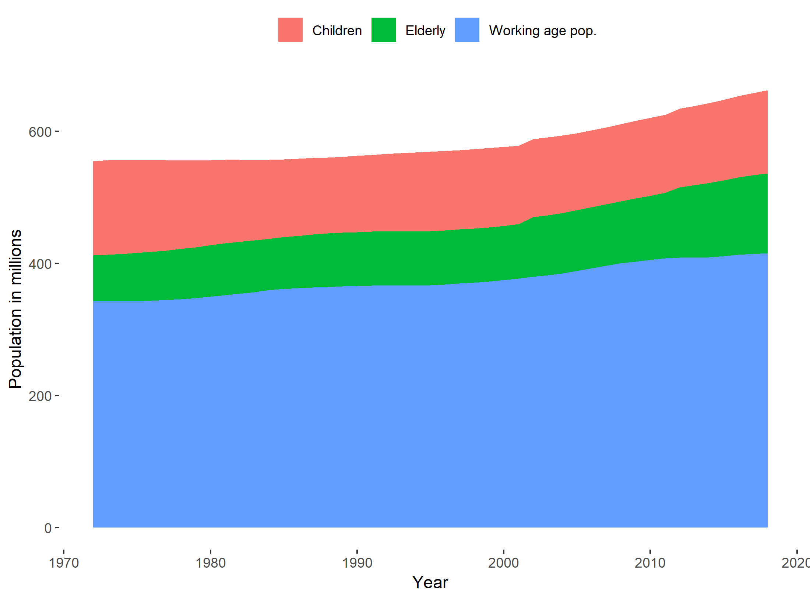

# The labor market

## About this chapter

This chapter is about the labor market. We start with a description of how we can divide the population into groups according to economic activity. We discuss how we define employment and unemployment and two ways of measuring  unemployment rates. We will also  discuss the difference between the intensive and extensive margin of labor supply and briefly describe how we can quantify the demand side of the labor market and create a graphical representation of the matching efficiency in the labor market by means of the Beveridge curve.

### Indend learning outcomes

After reading this chapter you should be able to 

* Explain and apply definitions of unemployment rates:
  * The survey based measure of unemployment.
  * The register based measure of unemployment.
* Explain the difference between the  extensive and intensive margin of labor supply.
* Create data visualizations of labor demand and the Beveridge curve. 


## From  population data to the labor market

### Grouping the population according to economic activity:

We have now described levels and movements in the population numbers. We will now divide the population in groups according to their *economic activity*. For economic analyses it is often useful to split the population in four groups: (1) children, (2) elderly, (3) in the labor force and (4) out of the labor force. This distinction is used in most countries, but the exact definitions of groups vary from country to country. One reason for the variation in group definitions is that they are linked to the institutional setting. The definition of what  ages  are defined as "children" will typically depend on the formal compulsory minimum school leaving age. The definition of what ages to include as the elderly will typically depend on the retirement policies. The box below summarizes this and presents the classification used by the Office for National Statistics in the United Kingdom.


<center>
```{block, type='myblock'}
<center>
**From the population to labor force**
</center>
The full population can be divided into

* Children (ONS definition: Aged below 16)
* Elderly (ONS definition: Aged above 64)
* In the labor force
* Out of the labor force

  The labor force consists of the following two groups:

* People who are unemployed
* People who are employed (including self-employed)

  Out of the labor force consists of the following:

* Students
* Long-term sick
* Looking after family/staying home
* Retired
* Other

```
</center>

Using the data from the last section we can investigate the development of the age groups, as shown in Figure \@ref(fig:labour1)). The area chart is visually appealing , but it is difficult to identify small trends in variables that are not shown at the lowest level. 


```{r labour1, echo=FALSE, out.width = '70%',fig.align='center',fig.cap="Grouping the population of the United Kingdom by age group. Data source: Eurostat. The R script for this Figure is available [here](https://www.hhsievertsen.net/economicdata/notes/lecture12/rmaterial/lecnote_12_script_for_fig7.R)"}

```


We will now take a closer a look at the labor force by defining the categories in the labor force. 

## Unemployment

### What is unemployment?

While most people have an idea about what unemployment is, the exact definition of unemployment is considerably less well known. Who is unemployed? Are retired people defined as  unemployed? Are children defined as unemployed? Most people would probably say no to these questions. But there are more complex groups: Are students defined as  unemployed if they don't work? Are parents on parental leave defined as  unemployed? Am I defined as unemployed if I decide not to work? Actually, the answer in all these cases is no (in most cases), according to the international definition of unemployment specified by the International Labour Organisation (ILO). So who is unemployed then? According to the ILO definition, unemployed is being [@ons]


* without a job, have been actively seeking work in the past four weeks and are available to start work in the next two weeks
* out of work, have found a job and are waiting to start it in the next two weeks

This definition is used by the European Union (Eurostat),  by the Organisation for Economic Cooperation and Development (OECD) and many national statistical offices (including the Office for National Statistics in the United Kingdom). But how do we get data on  the questions above? The solution is survey data. For the United Kingdom we obtain data on unemployment from the Labour Force Survey (LFS). The LFS is conducted by the Office for National Statistics by selecting random households from the   Royal Mail's Postcode Address File. 

#### An internationally coherent definition of unemployment

All European Union member states have are obliged to run labor force surveys on at least an annual basis. For the UK, the survey has been quarterly since 1992. The Office for National Statistics also release monthly data, although this is not included in the official statistics. 

The ILO unemployment definition above is also called the survey measure of unemployment. This is because the most common alternative measure of unemployment is based on register data from administrative records. Registered unemployment is measured by using data on the number of benefit claimants. Instead of asking people about whether they are looking for a job and not working, we assume that people that claim benefits are unemployed. Statistical offices typically release both measures of unemployment. The register and survey based measures of unemployment  typically deviate substantially because: 


* People might be looking for jobs even if they don't claim benefits because they are not eligible for benefits.
* People might be claiming benefits without looking for jobs.


<center>
```{block, type='myblock'}
<center>
**Measuring unemployment: Two definitions**
</center>

*1. The survey based measure of unemployment (also known as the ILO definition).*

* Based on surveys of random subsamples of the population. 
* People are defined as unemployed if they are

    * without a job, have been actively seeking work in the past four weeks and are available to start work in the next two weeks
    * out of work, have found a job and are waiting to start it in the next two weeks


*2. The  register based measure of unemployment.*

* Based on administrative registers of benefit claimants.
    * How many individuals received unemployment benefits.

```
</center>


### Employment

#### An internationally coherent definition of employment

Just like unemployment, measuring employment is not straightforward and the ILO has specified a definition, which the Office for National Statistics applies in the LFS. Following this definition people are employed if they are above 16 and satisfy one of the following conditions:


*  work at least one hour for pay in a week, people who are temporarily away from jobs.
* are on Government-supported training/employment programs.
* do unpaid family work. 
  
 Paid work refers  to both employees and self-employed, and unpaid family work refers to working for family business without receiving a formal wage, but still benefiting from the business. 

 It is important to note that employment is not the same as jobs. Employment measures refers to people, and people with several jobs will only be counted once in the employment statistics. In the job statistics, each job is counted. 

Like with unemployment, we can also compute register based measures of employment by using information from income tax payments, insurance status and other administrative registers.


<center>
```{block, type='myblock'}
<center>
**Measuring employment: Two definitions**
</center>

*1. The survey based measure of employment.*


*  work at least one hour for pay in a week, people who are temporarily away from jobs.
* are on Government-supported training/employment programs.
* do unpaid family work. 

*2. The  register based measure of employment.*

* information from income tax payments, insurance status and other administrative registers.

```
</center>


### The unemployment rate

#### An internationally coherent definition of the labor force

Having defined who is unemployed and who is employed it is straightforward to define the labor force. The labor force is simply the sum of these two groups:

\begin{align}
  \text{Labor force}=Unemployed+Employed
\end{align}

#### An internationally coherent definition of the unemployment rate:

We are now ready to  calculate the unemployment rate. The unemployment rate is the fraction of the labor force that is unemployed:

\begin{align}
  \text{Unemployment rate}&=\frac{Unemployed}{\text{Labor force}}\nonumber\\
  &=\frac{Unemployed}{Unemployed+Employed}
\end{align}

How can the unemployment rate change?  If people move from unemployment to employment, the unemployment rate clearly goes down, as the size of the denominator is unchanged and the size of the numerator is reduced. Vice versa if people move from employment to unemployment.

What happens to the unemployment rate if people move from unemployment to out of the labor force? The unemployment rate will go down, everything else equal, because the numerator is increased by relatively more than the numerator. Vice versa if people go from out of the labor force to unemployment.

#### The unemployment rate. An illustration using data for United Kingdom

Figure \@ref(fig:labour2) shows the unemployment rate for the United Kingdom using both measures. As you can see, for the period considered, the registered unemployment rate is always lower than the survey based measure of unemployment. Why do you think this is the case? And why is the difference not constant over time?


```{r labour2, echo=FALSE, ,fig.show='hold',out.width = '49%',fig.align='center',fig.cap="The unemployment rate in United Kingdom, using two different measures of unemployment. Data source: OECD. Left: in percent. Right: indexed to level in in Q1 2000=100. The R script for this Figure is available [here](https://www.hhsievertsen.net/economicdata/notes/lecture12/rmaterial/lecnote_12_script_for_fig8.R)."}
knitr::include_graphics(c("_resources/chapter_labour/fig14.png","_resources/chapter_labour/fig15.png"))
```


### Out of the labor force
In the United Kingdom, the labor force is about half of the population (33 out of 66 million). What about the rest? First, there are children and individuals aged above 64. Then there are still about 8.9 million people left, where did they go? This group is called (economically) inactive by the Office for National Statistics. The inactivity rate is defined as follows:

\begin{align}
  \text{Inactive rate}=\frac{\text{Number of people aged 16 to 64 not in work/ available for work}}{\text{All people aged 16 to 64}}
\end{align}

So what do the "economically inactive" people do (or people who are not in the labor force, as I prefer to call them)? In the UK, the distribution of economically inactive is approximately as follows:

* 27 percent are studying.
* 24 percent are looking after the family/staying home.
* 23 percent are long-term sick.
* 13  percent are retired.

Now that we have divided the population into groups according to their economic activity, we are ready to create graphs and tables on unemployment rate, employment rates and inactivity rates. However, there are a few useful concepts regarding seasonality and labor supply that are very useful to know before we start working with the data. 

<center>
```{block, type='myblock'}
<center>
**How to  reduce the unemployment rates**
</center>

Imagine that you are working for  a newly elected prime minister, and the prime minister promised to lower unemployment rates, how could you achieve this?

* Abandon the survey based measure of unemployment (the ILO measure), and only use the register based measure, because the latter tends to be lower.

* Tighten the criteria for receiving unemployment benefits, as this will make less people receive benefits, which will lower the register based unemployment measure.

* Introduce "leave" policies that allow unemployed workers to be "on leave" instead of unemployment.  This will move people out of the unemployment category. 

*Are these policies good?*

* There might be normative arguments against and for these policies, but it is importantly: the immediate reduction in unemployment is caused by relabeling (or classification) of people, not by changing their actual situation.
*  (it might be that labeling people as "unemployed" or a leave policy affects the unemployment rate beyond the pure relabeling effect).


```
</center>


### Labor supply: Extensive vs. intensive margin

#### What about the intensive margin?

So far we have only discussed the extensive margin of the labor supply: whether people are working or not. However,  labor supply is both a function of whether people work, and *how much* they work. The former is called the *extensive margin*, and the latter is called the *intensive margin*. This distinction is useful in many cases. The extensive margin is typically a binary variable (to work or not), while the intensive margin is a continuous variable (how many minutes or hours of work). Recall from lecture note 4, how we could decompose changes in live births in changes in the general fertility rates and changes in the number of of women in childbearing ages. We could now use the same approach to decompose changes in labor supply in changes in how many people work, and changes in how many hours people on average work.

#### Policy relevance of the intensive margin

The distinction between extensive and intensive margin is important in many policy discussions. For example if we adjust tax policies, we might be interested in how it affects people's decision to join the labor market (the extensive margin) and people's decision on how much to work (the intensive margin).

#### Measuring labor supply on the intensive  margin?
Measuring variation in intensive labor supply is slightly more challenging than  measuring the extensive margin. I know that I work, but I have now precise idea about how many hours I work.  For the United Kingdom, data on hours worked also comes from the Labour Force Survey. The Office for National Statistics makes the distinction between actual hours worked, average hours worked and the usual hours worked. They key difference is whether the measure is affected by absence (due to sickness or holiday).

#### Measuring labor supply: An illustration using hours worked.

In Figure \@ref(fig:labour3)) we show the average weekly hours in the United Kingdom by gender compared to the European Union. The first observation we can make is that women have lower weekly hours than men. The second observation is that while the  average weekly hours of men in the United Kingdom is  slightly higher than  the European Union 28 average, the average weekly hours of women is lower in the United Kingdom compared to the European Union 28. 

```{r labour3, echo=FALSE, ,fig.show='hold',out.width = '89%',fig.align='center',fig.cap="The intensive margin of labor supply: weekly hours worked in United Kingdom and the European Union 28. Data source: OECD. The R script for this Figure is available [here](https://www.hhsievertsen.net/economicdata/notes/lecture12/rmaterial/lecnote_12_script_for_fig9.R)."}
knitr::include_graphics(c("_resources/chapter_labour/fig17.png"))
```


## The demand side: Vacancies

### Measuring labor demand

So far we only discussed the supply side of the labor market. The size of the labor force captures the potential supply of labor in an economy. But what about the demand side? How much labor is demanded in the economy? Measuring the demand size is challenging and considerably less standardized compared with the supply size. Just like for the labor supply side, there are two different sources of labor demand measures: 


* Register based measures of labor demand: Using data from public employment services we can use the number of announced job vacancies as an indicator for labor demand.
* Survey based measures: we can ask firms about their labor demand needs.


#### Advantages and disadvantages

These measures have advantages and disadvantages. The register based measure is  considerably cheaper and tends to exist for longer periods and more countries. However, not all firms post their vacancies at the public employment service, so the sample of vacancies might not be representative of the actual number of vacancies. Moreover, the use of traditional job vacancy posting has changed over time, so this measure might be less representative today compared to what it used to be. 

The survey based measure of vacancies on the hand is more expensive and suffers from the "usual" survey issues: not every firm responds and maybe the firms that respond are not representative. But compared to the register based measure, the "non-representativeness" might be less of a worry, although empirical evidence on this issue is not clear. As mentioned, the survey-based measure of job vacancies is less standardized than the survey-based measure of unemployment, but international organizations collect data on job vacancies and attempt to unify the definitions of job vacancies. The definition provided by Eurostat is as follows:


<center>
```{block, type='myblock'}
<center>
**The Eurostat definition of a job vacancy**
</center>

According to the Eurostat job vacancy statistics a 'vacancy' is defined as a paid post that is newly created, unoccupied, or about to become vacant:

* (a) for which the employer is taking active steps and is prepared to take further steps to find a suitable candidate from outside the enterprise concerned; and
* (b) which the employer intends to fill either immediately or within a specific period of time.

For more details, see the source: \url{https://ec.europa.eu/eurostat/cache/metadata/en/jvs_esms.htm}

```
</center>


#### The job vacancy rate
We can relate the number of vacancies to the size of the labor force to obtain a measure of the job vacancy rate. While this is the typically textbook measure of the job vacancy rate [p. 512 in @zyb], statistical databases often provide slightly different measures. Eurostat defines the job vacancy rate as follows:

\begin{align}
  \text{JVR}_{\text{Eurostat}}=\frac{\text{number of vacancies}}{\text{number of occupied posts}+\text{number of vacancies}}
\end{align}

If we are willing to  approximate the number of occupied posts by the number of employed people, the main difference between these two definitions of the job vacancy rate is whether we include vacancies or unemployment in the denominator. Both measures are commonly used, but it is of course important to be consist when comparing job vacancy rates across regions and time. A reduction in vacancies will lead to a smaller reduction in the job vacancy rate using the Eurostat definition that the [@zyb] definition, because in the latter it only affects the numerator.

## Supply meets demand

We can combine our measures of labor supply and demand to create the Beveridge Curve, which is named after its "inventor", the English economist William Beveridge. The Beveridge curve shows the job vacancy rate on the vertical axis against the unemployment rate on the horizontal axis.  The Beveridge curve is a simple indicator of the matching efficiency of the labor market. Without any frictions and in the simples economic model, the graph should only "exist" on the axes: We should only have a positive job vacancy rate if unemployment is zero, and we should only have unemployment if we have no vacancies. In practice, this is clearly not the case as Figure x shows. We have unemployment and vacancies at the same time. How can that be and how does that say something about the labor market?


* The unemployed worker and the vacancy haven't "matched" yet: search frictions and other difficulties mean that even if there is a suitable unemployed candidate, the open position might not be filled immediately. There is an application deadline, formal procedures and the unemployed first has to find the job.
* An outward shift in the Beveridge curve (as illustrated) suggests a reduction in the matching efficiency of the labor market: For a given number of vacancies in the economy, we have a higher a unemployment rate. 
* However, there are other reasons for shifts in the labor market than pure search frictions. 

* The assumptions of a homogeneous labor market is very simplified.
* There might be vacancies in Manchester and the unemployed in London (geographical mismatch)
* There might be firms looking for lawyers, but only unemployed economists (skill mis-match).
*  and so on.


```{r labour4, echo=FALSE, ,fig.show='hold',out.width = '89%',fig.align='center',fig.cap="The Beveridge curve for the United Kingdom. Data source: OECD. The R script for this Figure is available here [here](https://www.hhsievertsen.net/economicdata/notes/lecture12/rmaterial/lecnote_12_script_for_fig10.R)."}
knitr::include_graphics(c("_resources/chapter_labour/fig16.png"))
```


## Summary
In this lecture we have covered the following topics:

* Definitions of unemployment rates:
  * The survey based measure of unemployment.
  * The register based measure of unemployment.
* The extensive and intensive margin of labor supply.
* Labor demand and the Beveridge curve. 
