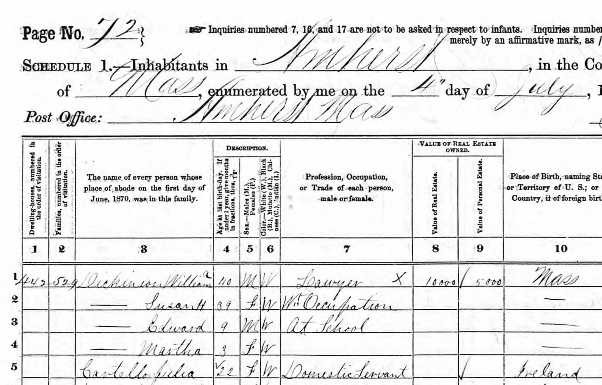

# Part II: Data sources and tools {-}


# Where data comes from

## What this chapter is about.

Data comes from somewhere. The data visualization author should know where the data comes from. The reader should know where the data comes from. Knowing the origin of the data allows us to replicate the visualization, modify the visualization and combine the data with other data. Knowing the origin also tells us something about whether we can trust the data: Does the data really represent what the visualization assumes it represents? Or is there a potential bias? How certain can we be?

In practice, the origin of the data has two levels. Firstly, where did we get the data from. Is that from the website of the Office for National Statistics or from the website of Eurostat, the statistical agency of the European Union? Secondly, where did the Office for National Statistics or Eurostat get the data from?

As the author of data visualizations it is not only our job to know where the data comes from, but it is also our job to clearly communicate to the reader where the data comes from. We typically only communicate  where we got the data from. For example by writing "Data source: Bank of England.
Series: IUMABEDR." The reader can then visit the website of the Bank of England to investigate how the data behind series "IUMABEDR" was collected.

In the next section we describe approaches to get data. These approaches are used by statistical agencies and researchers to obtain data. In the following section we list a number of key data sources for economic data and how to use them.

## Data source types

### Overview
We distinguish between the following four ways to obtain data.

* **Simulated data**: Data that is generated based on a predefined data generating process using computer software or similar approaches. 
* **Survey data**: Information that are collected from a subsample of a population, often by means of questionnaires or interviews.
* **Census data**: A systematic collection of information from the full population.
* **Administrative and automatically generated data**: Data that is collected for administrative purposes or as a byproduct of other activity.


### Simulated data
While many  economist never touch simulated data (for good reasons) it is important to emphasize  that simulated data can be extremely useful. Economists often set up theoretical models and then use computers to simulate how data would look, if the theoretical model  was true. Simulations also play a very important role in many quantitative methods. We will also  conduct our own simulations later in this unit. 

Simulated data are unfortunately also sometimes used in practice for dishonest purposes. A recent example is an academic study "When contact changes minds: An experiment on transmission of support for gay equality" [@lacour2014contact] published in the journal Science in December 2014. The study concluded that both straight and gay messengers had an immediate effect on opinions about same-sex marriage, but only gay messengers caused a lasting effect on the opinions. However,  further investigations showed that the underlying data were made up and the study was retracted [@lacour] . Such cases are (to our knowledge) fortunately quite rare. When working with data it is important to be critical about where data comes from, and -- if possible -- to assess the raw data. 

How do simulations work? We could ask a friend to give us some numbers. But that would not be a very good strategy. Maybe the friend really likes 6 and subconsciously gives us more 6s than all other numbers. That would not be useful. But the idea that each number is equally likely is also just an assumption. Maybe that is not want we want. When we simulate data, we typically first specify what *distribution* each individual observation is drawn from. If each value is equally likely, the underlying assumption is *uniform*. It is difficult for our friend to be loyal to the uniform distribution because she favours 6. We therefore ask the computer instead. Figure  \@ref(fig:source0) shows how we can ask Excel to simulate data from a uniform distribution. In that case Excel draws an integer between 0 and 10. Each number 1, 2, 3 ... 10 is as likely to appear. In practice I would never ask Excel to simulate data. This data is of course not useful to tell anything about unemployment rates.
```{r source0, echo=FALSE, out.width = '60%',fig.align='center',fig.cap="Simulating data in Excel."}

knitr::include_graphics("https://www.dropbox.com/s/wmn3wlccbi3rrd5/simulate.gif?dl=1")
```

### Sample surveys

The term "survey" comes from looking/examining/supervising (like surveillance). We typically mean a sample survey when we say survey, because we only include a "sample" (or subset) of the population.  In a survey, a subset of the population (individuals, firms, institutions) are asked (or observed) questions about opinions (i.e. towards a specific policy) or facts (gender, age, etc.). 

While the design of surveys can almost be considered as an academic discipline in itself, for this course it is sufficient to think of the following two aspects: 

1. who is asked and who responded? 
2. how are questions asked or observed?


When conducting  surveys we are typically interested in inferring aspects for the full population, and we would therefore like the sample to represent the full population, or in other words to be *representative*. We would therefore sample a representative subsample of the population. However, we typically cannot force subjects to respond. Even though we asked a representative sample, the set of subjects that responded to the questions might not constitute a representative subset. There are a number of approaches to tackle the issue of non-representative data, but it is not always perfectly solvable. 

Responses to questions often depend on how questions are asked and in what order. Is it an open ended question like "What do you think about x?", or is restricted to a specific scale: "On a scale from 1 (very good) to 5 (very bad) what do you think about x?" Is the question asked  after some information about x is revealed? Is the question leading to specific answer? 


Survey data can be collected in many ways. For example throguh written questionnaires, telephone interviews or online internet surveys. Figure  \@ref(fig:source1) shows an example of a sample survey where data is connected online using Google Forms. 
```{r source1, echo=FALSE, out.width = '60%',fig.align='center',fig.cap="An example of a sample survey using an online questionnaire"}
knitr::include_graphics("_resources/chapter_sources/fig_survey.png")
```


### Census survey 
A census survey looks a lot like a survey, but instead of asking a subset of the population, we systematically ask everyone in the population. We often typically just call a census survey for a census. The UK Office for National Statistics carries out a Census every tenth year. The first census in the UK was held in 1801 and the last one took place  on March 27, 2011.  Every household in the UK receives a questionnaire that asks a number of questions about the household. 

The use of censuses is quite old. According to the UK office for National Statistics, it dates back to the Babylonians in 4000 BC. They used the data collected to calculate the food needed to feed the population, to measure the size of the labor force and so on. 

Figure  \@ref(fig:source2) shows an example of a Census survey schedule from the United States in 1870. The schedule asks about  household members names, occupation, age, gender, education and more.
```{r source2, echo=FALSE, out.width = '90%',fig.align='center',fig.cap="An example of a household census. The 1870 US Census Schedule. Source: [US Census](https://www.census.gov/history/www/through_the_decades/questionnaires/1870_2.html)"}

```


Censuses are not used in all countries today. One  reason for this is that some countries have administrative data that enables them to obtain the same information. Administrative data is typically cheaper, more frequent and in some cases more precise than census data.


### Administrative data

As mentioned, not all data is collected directly for the purpose. Some data is just created by a system. When a country's inhabitants submit their annual tax statements (often third-party reported by employers), the tax authorities use these values to infer whether the individual paid too much or too little in taxes. These  tax statements might potentially be used as for research and in national statistics. 

While administrative data is popular due to their precision (i.e. not self-reported values and based on human memory), it is important to remember that administrative data might  be biased. To take the example of income, tax evasion will lead to income not included in these statistics, and tax evasion might not be randomly distributed across the population. 

Administrative data in a wider sense also include a lot of data that is called "big data". Data that is collected automatically through systems. An example is Google Trends, where search terms are saved in the system. We can then use all the saved search terms to obtain data on individuals' search behavior. 


### Comparison of data sources
The list below provides a brief comparison of data source types. Simulated data contain no actual information on a subject. We cannot use simulated data to show the unemployment rate in the UK today. But simulated data is very cheap and with simulated data we know exactly how it was created. 


1. **Simulated data**

  * *advantage*: quick and cheap
  * *disadvantage*: based on theory & does not represent an empirical fact.
  
2. **Sample survey**
  * *advantage*: we can measure what we need.
  * *disadvantage*: slow, potentially expensive, & risk of bias and unreprestantive respondents. 
  
3. **Census survey**
  * *advantage*: we can measure what we need.
  * *disadvantage*: very slow \& expensive.
  
4. **Admnistrative**
  * *advantage*: precise, covers actual behavior
  * *disadvantage*: only what is registered or generated automatically.

Survey data can be very cheap (it can also be very expensive, depending on how large it is). another advantage of survey data is that we can decide on the variables (what to ask) and observations (who to ask). A disadvantage of survey data is that not everyone answers (the data might not represent the population we asked) and answers may not represent the truth (due to biased human memory, dishonesty or social desirability bias).

Census data shares many of the advantages and disadvantages of survey data, but it typically includes everyone (it is mandatory to answer). Because we ask everyone it is very expensive. 

Data from systems are typically very cheap, because we do not need to explicitly collect them, but we can simply ask the system to give us the data. We are therefore also limited to variables and observations that are covered by the system. If there are incentives linked to the system, the variables might also be biased. This could for example be tax record on incomes. There is an incentive not to report all income in order to pay less in taxes, but this means that the income variable from the tax system doesn't the true income (this is of course not legal, but it may happen anyway).


## Economic data sources

We will now go through a list of sources for economic data. This list is by means not a complete list of data sources. The list provides an introduction to some of the most prominent publicly available data sources for economists. 

### Data from Statistical Offices 
The national statistical offices collect, clean, and provide data on important economic topics. Moreover they also typically engage in international networks to standardize  measurement and share data through international statistical databases (described below).  The Office for National Statistics (ONS) is the national statistical office for the United Kingdom.  

The statistical offices often publish both raw data and small reports where they describe the data. The data is typically shared via a website. For the ONS, much of the material is accessible on their website [ons.gov.uk](https://www.ons.gov.uk/). The national statistical offices also play an important role in providing international organizations with data. Much of the data accessible through sources such as the OECD and Eurostat comes from the national statistical offices. However, in some cases definitions might be different. For example in terms of population: Eurostat typically provide population estimates for the start or the end of the year. The ONS provides mid-year estimates.

If you are able to understand the language on the website national statistical websites it is often worth to get the data directly from these sources. Some countries also provide English language versions of the website. While most countries organise all their data collection and dissimation through one agency, the  United States has several agencies that cover these tasks. Population data is available at US Census Bureau website [census.gov](https://www.census.gov/). 

If we want to compare data across countries it is typically better to obtain the data from a source that provides data for all countries. This reduces the risk of using different defnitions across the different countries (but we should still check that).

### Downloading data from Statistical Offices

As all statistical agencies organise their websites differently it is not possible to give a general description on how to download the data. However, we can provide some general guidiance and an example for the ONS. First, some general advice

1. *If the website of statistical office provides access to a public "database", then use it.*
    * A database is a structured set of data. The structured approach allows us to download precisely the data we are interested in.
    
2. *Avoid using data from reports and notes*.
    * We should always attempt to get the data from a source that is as raw as possible. 
    
3. *Note the location of the raw data and keep a copy of the raw data*.
    * Keeping a reference to the location of the data and a copy of the raw data makes it possible to replicate the data visualization and make adjustments. 
    

The animiation in Figure \@ref(fig:source3) shows an example of downloading data from the ONS website. The ONS website does not provide access to a "public database". 
```{r source3, echo=FALSE, out.width = '60%',fig.align='center',fig.cap="Downloading data from the website of the UK Office for National Statistics"}
knitr::include_graphics("https://www.dropbox.com/s/hvjgt4foijy8752/ons.gif?dl=1")
```


### Central banks

#### Bank of England

The Bank of England is the Central Bank of the United Kingdom. It was established in 1694, and amazingly, they even provide data on interest back to 1694.  The policy interest rate is decided by the Monetary Policy Committee (MPC). They meet eight times a year and decide on the interest rate. Their main objective is to keep inflation at 2 percent, so they will adjust the interest rate to achieve this target. As monetary and financial stability is a main objective of the bank, they collect a lot of data on these topics  We can obtain  access to  their data on their website  [bankofengland.co.uk](https://www.bankofengland.co.uk). Most country's central banks provide similar data. 

Figure \@ref(fig:source4) shows an example of downloading data from the Bank of England website. This website includes a nice database that allows us to select exctacly the series we want.

```{r source4, echo=FALSE, out.width = '60%',fig.align='center',fig.cap="Downloading data from the website of the Bank of Enland"}
knitr::include_graphics("https://www.dropbox.com/s/cn390qbw6sdcepk/bankofengland.gif?dl=1")
```

#### The US FED
Just like national statistical offices, most countries also provide data through their central banks. For example from the US, the FRED Economic data is a very good source of economic data. The data is available on the site [fred.stlouisfed.org/](https://fred.stlouisfed.org/) 

### International organizations

#### The IMF
The International Monetary Fund (IMF) is the bank of the central banks. They have a very rich database on financial statistics and key economic indicators that covers many countries. Their database is very useful for obtaining comparable financial data across countries. We can download their data from [imf.org/en/Data](https://www.imf.org/en/Data). This is 

#### The OECD 

The Organisation for Economic Co-operation and Development (OECD) is an international organization based in Paris, France. The OECD has a very rich database on economic variables for the member countries. The advantage of data from the OECD is that it is typically made comparable across countries. For example for unemployment rates, the OECD will typically ensure that they are harmonized. That means, that the OECD data on unemployment might not give you the exact same number as the national statistical offices, because they use different definitions. However, by using data from the OECD (or similar international organizations), we can ensure that definitions are comparable across countries. 
  The OECD data is accessible on the website  [stats.oecd.org](https://stats.oecd.org). Figure \@ref(fig:source5) shows an example of downloading data from the OECD. This website includes a nice database that allows us to select exctacly the series we want.

```{r source5, echo=FALSE, out.width = '60%',fig.align='center',fig.cap="Downloading data from the website of the Bank of Enland"}
knitr::include_graphics("https://www.dropbox.com/s/in3whqys2yvlr48/oecd.gif?dl=1")
```


#### Eurostat

The statistical office of the European Union provides a rich database of statistics on economic, environmental and social topics. Just like data from the OECD, most of these measures are standardized and we almost don't have to worry about consistent measures across countries. Their data is available here: [ec.europa.eu/eurostat](https://ec.europa.eu/eurostat/web/main/home).  Figure \@ref(fig:source6) shows an animation of downloading data from Eurostat. This website includes a nice database that allows us to select exctacly the series we want.

```{r source6, echo=FALSE, out.width = '60%',fig.align='center',fig.cap="Downloading data from the website of the Bank of Enland"}
knitr::include_graphics("https://www.dropbox.com/s/ajp6exh2vuxk18u/eurostat.gif?dl=1")
```

#### The UN

The United Nations collects and hosts a wide range of data. Many of their datasets are available from partner organisations, regional offices and sub-organsiations, such as the United Nations Development Programme (UNDP), the UNESCO Institute for Statistics and the World Health Organization (WHO). The United Nations provides a common platform to these sources here: [data.un.org](http://data.un.org/Default.aspx).

####  The World Bank 

The World Bank is  a partner organisation of the United Nations, but their database deserves an explicit presentation. The World Bank actually hosts several databases. They host more than 18 thousand time series covering a wide range of topics. Many of their time series cover the period back to the 1960ies for a lot of countries around the world. You can access their databank here:  [worldbank.org](http://worldbank.org).  Figure \@ref(fig:source7) shows an example of downloading data from the World Bank Website This website includes a nice database that allows us to select exctacly the series we want.

```{r source7, echo=FALSE, out.width = '60%',fig.align='center',fig.cap="Downloading data from the website of the Bank of Enland"}
knitr::include_graphics("https://www.dropbox.com/s/tjvpuxfx0j6to5p/wb.gif?dl=1")
```


### Topic specific  databases

#### Our World in Data

 Our World in Data, accessible here  [ourworldindata.org](http://www.ourworldindata.org), is a digital publication on global development. The website includes articles dedicated to specific topics with in-depth descriptions of methods and sources. Most of their data is taken from other sources, but it is a good starting point for economic data on global development. Especially because they also include some more specific datasets, that are not from the international organizations. 
 
#### Gapminder

Gapminder is also a web publication on Global Development. They  collect various international datasets on global development, but just like the Our World In Data, they also collect data from more specialized sources, such as academic publications. Their data is available here: 
 [www.gapminder.org](https://www.gapminder.org/data/).

#### The World Inequality Database

The WOrld Inequality database contains unique data on income and wealth inequality for countries around the world. The data is available here:  [https://wid.world/data/](https://wid.world/data).

### Publicly available data: An overview

#### Downloading datasets

All the links listed in this document provide access to website with rich datasets. Unfortunately, each website is different, and there is not one single rule for how to find and access the data we need, but here are some suggestions:

* Search for "databases" instead of ready made tables. Databases enables you to select exactly the series you need.
* Download the dataset in a flexible format. I personally prefer ".csv" files because we can open them both in Excel and R. 
* Save a copy of the raw file, and edit the data in a different file.
* Expect delays. Some websites are slow.


#### Selecting the appropriate source
* Need to compare countries $\rightarrow$ data from an internal organization.
* Data for EU countries only $\rightarrow$ consider using Eurostat. Eurostat often provide very good metadata (especially compared to the OECD).
* Data for countries outside the EU 

  * On labor market topics $\rightarrow$  consider using OECD data.
  * On development topics $\rightarrow$  consider using data from The World Bank or the United Nations.
  * On financial topics $\rightarrow$  consider using data from the IMF.


* Data on a regional level (subnational) $\rightarrow$  consider using Eurostat data or national statistical offices.
* Historical data $\rightarrow$  consider using national statistical offices.


### Using APIs

We can actually also standardize the updating of the raw data. Instead of downloading the data manually from the website, we can ask the software to directly download the data using an application programming interface (API). An API is a fairly advanced concept, but what we need to know for this unit,  is that many websites and services has an API that is able to receive a request and return a response. A very common analogue to an API is a waiter in a restaurant. You tell the waiter what you would like to eat. The waiter goes to the kitchen and delivers the request, and the waiter returns with the food. 

Many statistical offices have an API that you can use. You can use  R to send a request to the UK Office for National Statistics, and you will get a data series in return. In Excel, this is slightly complicated, but in R this is fairly straightforward. 


## Summary

We have discussed the following topics

**Data source types**
  1. Simulated data
  2. Sample survey data
  3. Census survey data
  4. Administrative and automatically generated data
  
**Public data sources**

* The Office for National Statistics for the United Kingdom (ONS)
* The United States Census Bureau.
* The Bank of England.
* Federal Reserve Economic Data (FRED).
* The International Monetary Fund.
* The OECD
* Eurostat.
* The United Nations.
* The World Bank.
* Our World in Data.
* Gapminder.
* The World Inequality Database.


