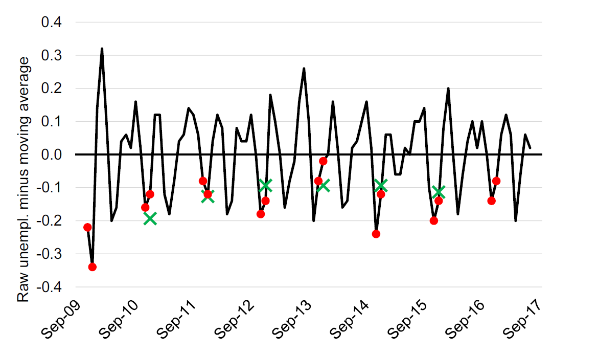

# Decribing changes


## About this chapter
Now that we have shown the data, we also need to be able to be able to describe data. In this lecture we will discuss a number of tools and concepts that useful when describing changes.  We will first go through concepts to describe changes. We will then go through a method for decomposing changes, and finally we will address the issue of removing noise from time series.
 
### Intended learning outcomes 

After this lecture you should be able to. 

1. describe differences across time and groups using indexes, relative changes, and average growth rates.
2. decompose changes in variables in changes in their underlying variables. 
3. apply moving averages and understand the intuition behind seasonal adjustments.

## The objective: Guide the reader

#### Support charts and tables  {-}

Charts  and tables should always be supported by a guide for the reader.  Nevertheless, it is not uncommon that newspaper articles include a graph without any reference to the message the reader should take away from this graph. In many cases, the title of the graph or table (also called the caption) can be sufficient to guide the reader. For the author of the article or the policy report it often seems obvious why a specific graph or table is included. But in practices, only a few (very good) charts and tables tell the story without support.  

Consider as an example Figure \@ref(fig:desc1). Without any further guidance, there are many takeaways the reader could get from this graph. Let us consider a few

* The unemployment rate continues to fall.
* The unemployment rate was highest in the mid 1980ies.
* The unemployment rate is at the lowest level 1970ies.
* The unemployment rate is below the pre Great Recession Levels. 
* The decline in the unemployment rate is starting to flatten out.

All of these conclusions are perfectly right, but without any further guidance, the reader will have to guess what the main message of the graph should be. This could be in terms of a title, but it is can often be much more. 


```{r desc1, echo=FALSE, out.width = '80%',fig.align='center',fig.cap="Unemployment in the UK. Source: The UK Office for National Statistics"}
knitr::include_graphics("_resources/chapter_describe/ex1.png")
```

### How to guide the reader

When guiding the reader, we should help the reader. Helping the reader means that our description should make it easier for the reader to identify and remember the main takeaways from the visualization.  This means that we should leave out unimportant details and focus on the main point. Let us consider two examples of descriptions of Figure \@ref(fig:desc1).

#### Example 1{-}

> Figure \@ref(fig:desc1) shows the unemployment rate for the UK for the period 1971 to 2018. In 1971 the unemployment rate was about 4 percent. It then increased slightly, before it dropped again around 1975. Around 1976 it started to increase again to above five percent. It maintained the level of about five percent until 1981, where the unemployment started to increase a lot and peaked at about 12 percent around 1985. A few years later it dropped again to about seven percent in 1991. The unemployment rate the started to increase again to above 10 percent, before a long period of decline started. The decline lasted until around 2006, where the unemployment rate was about five percent. The unemployment rate then increased to above eight percent again and maintained this level until around 2014, where it started to decline. It has been declining since 2014 and in 2018 it was around four percent.


#### Example 2:{-}

> Figure  \@ref(fig:desc1)  shows the unemployment rate for the UK for the period 1971 to 2018 based on data from the ONS. The unemployment rate was lowest in the early 1970ies at about four percent, and highest in the mid 1980ies at about 12 percent.  We can divide the period into three periods with high unemployment and two periods with low unemployment. High unemployment periods were the mid 1980ies, the early 1990ies, and around 2010. Low unemployment periods were the 1970ies as well as the end 1990s to early 2000s. The last part of the graph, since about 2014, also show a sharply declining unemployment rate, suggesting that the current period will establish itself as another low unemployment period. 


#### Explaining graphs: Don't take the reader on a roller coaster ride!{-} 

So which description was best? Example 1 takes the reader through the graph from left to right. Example 2 summarizes some general patterns for the reader. Recall that we use graphs to communicate patterns. It is not important that the unemployment rate declined slightly from 1972 to 1973. If that was the key point, we would provide the numbers for these two years in a Table. The goal with the graph is to show overall patterns. Moreover: it is much easier for the reader to remember the overall pattern. 

When we guide the reader through a graph we should remember that we would like to communicate the patterns in the data, and not every up and down. A reader, who read example 1 above will feel like an elevator: it goes up and down all the time, but it is hard to get the big picture. 

Here are some tricks to explaining patterns:

* Explain patterns, not details.
* Don't take the reader on an elevator-tour and explain every up and down from left to right.
* Focus on the end points. Has the value of interest been increasing or decreasing?
* Group observations: For example group countries together with similar patterns. 
* Divide  the graph in smaller parts: For example in periods of up and down turns. 

#### Explaining tables{-}

We use tables to communicate precise values and often to compare values across groups. When guiding the reader through a table, we should have this in mind: Which values should the reader have in mind, and which comparisons should the reader make?

* What are the relevant values?
* What are the relevant comparisons?


In the rest of this chapter  we discuss various tools that we can use to guide the reader through visualizations and also provide them with information that is difficult to grasp from only graph. These tools should complement the visualization of data and not substitute the data visualizations. Some of these tools also involve transforming the data. In other words, to change the data in a way to better communicate the main takeaways. 

## Describing differences

In this section we will go through various methods to describe differences. These differences could be differences across groups, for example the difference in the unemployment rate among men and women. Or it could be differences in terms of changes over time, for example the change in unemployment in the UK from October 2008 (6.2 percent) to October 2011 8.2 percent. 

### Differences in absolute terms

When we talk about "in absolute terms" we mean by itself without comparison to values or units. Examples are: changes in the UK Gross Domestic Product in pounds, increase in average age in years, changes in migration in number of people, and changes in unemployment rate in percentage points.

So when we talk about differences in absolute terms we should in principle always include the unit of measurement to avoid confusion: is the change in GDP in  Pounds or Euros?, is difference in the average age in years or months? 

It is straightforward to compute the absolute change. We are simply subtracting one number from the other:

\begin{align}
  difference_{abs}=Value_2-Value_1
\end{align}

How would we use absolute changes? Consider Figure \ref{fig:example2}, which uses the same data as Figure \@ref(fig:desc2), but only shows the last 12 years. We might want to focus on the great recession and provide statements such as "the unemployment rate increased by 3.3 percentage points from pre-recession level to the peak level of 8.5 percent." or the unemployment rate in October 2018 was 4.5 percentage point lower than at the peak of the great recession at a level of 4 percent. 

```{r desc2, echo=FALSE, out.width = '80%',fig.align='center',fig.cap="Unemployment in the UK 2006 to 2018. Source: The ONS with value labels. Source: The UK Office for National Statistics"}

```

### Relative differences 

The contrast to absolute changes is relative changes. With relative changes we are always \emph{relating} the difference to something else. The most natural value to relate a change to is the point of departure of the difference. So if we are interested in the relative difference from year 1 to year 2, we would relate the size of the absolute difference from year 1 to year 2 to the value in year 2. 

The relative change is typically measured in percent and calculated as follows:

\begin{align}
  difference_{rel}*=100\times \frac{Value_2-Value_1}{Reference \text{ } Value}\nonumber\\
  difference_{rel}&=100\times \frac{Value_2-Value_1}{Value_1}\nonumber
\end{align}

So let us consider the increase in unemployment rate from 5.2 to 8.5 percent:

\begin{align}
    difference_{rel}=100\times \frac{8.5-5.2}{5.2}=63\%\nonumber
\end{align}

So the unemployment increased by 63 percent from pre crisis level to the crisis peak. What does that mean? It means that if we took the original level and considered 63 percent of that level and added that that to the level, we would get to the peak level. In these terms, an increase of 100 percent corresponds to doubling the number.

### Percentage point vs percent

Note that in the examples above, we mentioned "percentage point" and "percent". So when we talk about absolute changes we are more explicit about the unit of measurement when the unit of measurement is percent. We say percentage points and not percent. 

When unemployment increases from 4.2 to 6.2 percent, the change is 2 percentage points or 48 percent (100 $\times$ (6.2-4.2)/4.2). These are two very different numbers, but nevertheless you will often hear someone saying that unemployment has increased by 2 percent, when they mean 2 percentage points. A 2 percent increase would be an increase from 4.2 percent to 4.284 percent. In other words an increase of 0.084 percentage points.

* Percentage point change: Refers to the *absolute* change  stated in the unit used, just like pounds, miles, or kilograms.

* Percent change: Refers to the *relative* change stated in percent (out of 100).


## Calculating compound growth rates

Another common mistake is ignoring compound growth rate. Let's illustrate the mistake by an extreme example. The price of a Bitcoin increased from 781 USD to 19,343 USD from December 16 2016 to December 16 2017. This is an increase of about 2,400 percent. What is the daily increase then? Let us take a very wrong approach: we just divide the total relative change by the number of days: 2,400percent/365days$\approx$6.5 percent/day? So the first day the price is 781 USD, the next day the price would then be 781$\times$1.067=831 USD, the following day the price would be 831$\times$1.067=885 and so on. If we continue like that, the price of Bitcoins would be above 20,000 USD by the end of February, and by end of December the price would be 78,38,759,397,922 USD.  This is clearly wrong. Figure \@ref(fig:desc3) illustrates how wrong.

What went wrong is that we've ignored that the third day the growth rate is applied to the initial value plus the increase in value from day one one to day two (the compound growth). If we instead applied the initial increase in absolute terms 365 times we would actually end up with the right value: (831-781)$\times$ 365 $\approx$18,562 which exactly corresponds to the increase (18,562+781=19,434 USD).

```{r desc3, echo=FALSE, out.width = '90%',fig.align='center',fig.cap="The development of the Bitcoin price, and imputed price using average daily price increases. Data source: [coindesk.com](https://www.coindesk.com/price/)"}
knitr::include_graphics("_resources/chapter_describe/bitcoin.png")
```


How do we get the right average growth rate? If the price on December 16, 2016 was $P_{t0}$ then the price on December 17 2016 will be $P_{t1}=P_{t0}\times (1+r)$ where $r$ is average daily increase in the price. On December 18 2016, the price will be $P_{t2}=P_{t1}\times (1+r)$ and so on. What happens after a year?

\begin{align}
  P_{t365}&=P_{t364}\times (1+r)\nonumber\\
  \Rightarrow P_{t365}&=P_{t363}\times (1+r)\times (1+r)\nonumber\\
  \Rightarrow P_{t365}&=P_{t362}\times (1+r)\times (1+r)\times (1+r)\nonumber\\
  \vdots\nonumber\\
  \Rightarrow P_{t365}&=P_{t0}\overbrace{\times(1+r)\times(1+r)\times\dots\times(1+r)}^{\text{number of periods, }n}\nonumber\\
  \Rightarrow P_{t365}&=P_{t0}\times(1+r)^n\nonumber
\end{align}

We can now isolate $r$ to get an expression for the average daily growth:

\begin{align}
   P_{t365}&=P_{t0}\times(1+r)^{365}\nonumber\\
   \Rightarrow
   (1+r)^365&=\frac{P_{t365}}{P_{t0}}\nonumber\\
   (1+r)&=\left(\frac{P_{t365}}{P_{t0}}\right)^{(1/365)}\nonumber\\
   r&=\left(\frac{P_{t365}}{P_{t0}}\right)^{(1/365)}-1
\end{align}

or in more general terms:

\begin{align}
   r&=\left(\frac{P_{N}}{P_{0}}\right)^{(1/N)}-1
\end{align}

where $N$ is the number of periods, e.g. seconds, minutes, hours, days or years.

We can use this formula whenever we want to obtain average growth rates from a total growth rate.  The difference between the correct and the wrong way to calculate average growth is larger, the larger to the total growth. Note that $r$ is the rate, which we have to multiply by 100 to get the average percentage growth. 

### Using indexes
When we are interested in the relative development of a value over time, we can index the series to a reference point. For  annual time series, we typically select a base year, where the value is set to 100. All other values are set relative to this base year.

Imagine that we want to show the development of the population of a country over ten years. The first year, the population is measured to be 5 million. We plot this as 100 in the graph. The next year, the index value should be calculated relative to the base year. If the population  is 5.5 million the index value will be $(5.5/5.0)\times 100=110$, and so on. In general, we can use the following formula to calculate the index vale.

\begin{align}
  \text{Index\_value}=100\times \frac{\text{Value}}{\text{Base Year Value}}
\end{align}

An index is very helpful if we want to compare the development of several variables, that have very different scales. For example if we want to compare the development of the population of Wales with the development of the population of England. The index will tell us how the variable has developed *relative* to the reference point. Therefore, even though the population of England is much greater than the population of Wales, we can show the development in the same graph, because we are looking at the development relative to the reference point, and *not the levels*.


## Decomposing changes

Describing in terms of their relative size or average relative size  can provide a good guidance for the reader. There are, however, several ways to dig one level deeper and provider more insights not only on the size of the change, but also on the mechanisms behind observed growth. One useful approach to improve our understanding of a change in a variable is to decompose the change keeping one aspect of change constant. This approach is actually very simple. Let us start with an example. 

 Imagine that we observe, that the number of children born in the UK is decreasing (that is our $X$). The number of children born is a function of the number of children born per women, also known as the General Fertility Rate (GFR). We denote the  number of women (that is $Y$), such that the general fertility rate is $X/Y$, the number of children born per woman. Let now write down the change in the number of children born from period 0 to period 1:

 \begin{align}
   X_1-X_0=Y_1\frac{X_1}{Y_1}-Y_0\frac{X_0}{Y_0}
 \end{align}

 Now let's do some trivial and silly adding and subtraction. First, add and subtract the term $Y_0\frac{X_1}{Y_1}$ and rearrange:

 \begin{align}
   X_1-X_0=&Y_1\frac{X_1}{Y_1}-Y_0\frac{X_0}{Y_0}+Y_0\frac{X_1}{Y_1}-Y_0\frac{X_1}{Y_1}\nonumber\\
        =&Y_1\frac{X_1}{Y_1}-Y_0\frac{X_0}{Y_0}+Y_0\frac{X_1}{Y_1}-Y_0\frac{X_1}{Y_1}\nonumber\\
        =&\overbrace{Y_0\left(\frac{X_1}{Y_1}-\frac{X_0}{Y_0}\right)}^{\text{A}}+\overbrace{(Y_1-Y_0)\frac{X_1}{Y_1}}^{\text{B}}\nonumber
\end{align}

 The first term of this expression (A) is the change in $X$ if $Y$ stayed constant at the initial level, but the rate $X/Y$ changed. In terms of our births example above, this expression gives us the change in births if the number of women stays constant, but the fertility rate changes. The second term above gives us the opposite. What would the change in births be if we kept the fertility rate constant, but changed the number of women in the population. So with this simple exercise we can decompose a change in $X$ into the changes in two underlying factors. However, there is one problem with this equation. We are keeping $Y$ constant at the initial level and the ratio $X/Y$ constant at the new level. Could we somehow keep both constant at the initial level? Yes. Let us add and subtract $(Y_1-Y_0)\frac{X_0}{Y_0}$:

  \begin{align}
   X_1-X_0=&Y_0\left(\frac{X_1}{Y_1}-\frac{X_0}{Y_0}\right)+(Y_1-Y_0)\frac{X_1}{Y_1}+(Y_1-Y_0)\frac{X_0}{Y_0}-(Y_1-Y_0)\frac{X_0}{Y_0}\nonumber\\
&=\overbrace{Y_0\left(\frac{X_1}{Y_1}-\frac{X_0}{Y_0}\right)}^{A}+\overbrace{\left(Y_1-Y_0\right)\frac{X_0}{Y_0}}^{B}+
  \overbrace{\left(\frac{X_1}{Y_1}-\frac{X_0}{Y_0}\right)\left(Y_1-Y_0\right)}^{C}
 \end{align}

By adding and subtracting terms, we now have an expression for the change in $X$ based on three terms.

*  Term A is as before: The change in X as a result of keeping $Y$ constant at the initial level, but changing the ratio $X/Y$
*  Term B is as new: The change in X as a result of keeping the ratio $X/Y$ constant at the initial level, but changing $Y$.
* The term C is new: A composite effect. This term captures the effect that a different level of $Y$ is exposed to a different level $X/Y$.


Why is this helpful? By decomposing changes  we can make statements such as: "The number of live births did not only increase because fertility increased, but also because the number of women in childbearing ages increased."  Another area where decompositions are often used is in labor supply. The total labor supply in number of hours is a function of the number of people working, and how many hours these people work. We could for example imagine, that we observe a drop in labor supply, without observing any changes in the number of people working, simply because people start working less. [@csr] provides more details on how to decompose changes, including how to recompose changes of variables with more than two underlying factors. 

## Removing noise

Figure \@ref(fig:desc4) shows the monthly unemployment for the UK, just like Figures \@ref(fig:desc1) and \@ref(fig:desc2). But the chart in Figure \@ref(fig:desc4) looks different, it fluctuates much more. The key difference is that while Figures \@ref(fig:desc1) and \@ref(fig:desc2)  were seasonally adjusted, Figure \@ref(fig:desc4) shows the "raw" unadjusted unemployment rate. 

```{r desc4, echo=FALSE, out.width = '90%',fig.align='center',fig.cap="Monthly unemployment in the United Kingdom. Source: OECD, Short-Term Labour Market Statistics, Harmonised Unemployment rate. Not seasonally adjusted. Y-Axis truncated at 4 percent."}
knitr::include_graphics("_resources/chapter_describe/ex2_1.png")
```

What does seasonally adjusted mean? Many aspects of the economy have seasons. Private consumption is for example often very high December, there are relatively few people starting new jobs in the summer months, and so on. When looking at changes in unemployment from month to month we are often not interested in the changes that are caused by changes in seasons. 

 Statistical agencies have developed very sophisticated methods for identifying and removing seasonal effects. It is typically possible to directly obtain the seasonally adjusted series directly from the statistical offices. So often, we won't have to seasonally adjust our series manually. Nevertheless, it is important to understand the intuition behind the seasonal adjustment. We will therefore go through a simplified version the seasonal adjustment procedure, which we can apply to our own data. 

### Moving averages

Before we turn to the seasonal adjustment algorithm, let us consider the simple, but powerful concept of a moving average. Moving averages can be useful in itself, but they are also useful on their own. In Figure \@ref(fig:desc4) we use data from the Organisation for Economic Cooperation and Development (OECD). As you can see from this graph, the unemployment rate fluctuates a lot from month to month. However, often we want to ignore these fluctuations that are caused by seasonality. What can we do? If you took a pen, you could draw a smooth line over Figure \@ref(fig:desc4) and you would have a line that would be much more readable. How can we obtain the same in a more formal approach?

In Figure \@ref(fig:desc5) we added the *moving average* of the series shown in Figure \@ref(fig:desc4). With a moving average  we compute averages of unemployment rates across five months and then move one month ahead and do the same and so on. In other words the shown unemployment rate in May is the average of the unemployment rate for March, April, May (center), June, and July. In that way we obtain a much more smooth unemployment rate, as the blue line. The moving average of variable \emph{x} is then defined as:

\begin{align}
    ma_{5}(x)=\frac{x_{-2}+x_{-1}+x_{0}+x_{+1}+x_{+2}}{5}
  \end{align}
\begin{figure}[!ht]

```{r desc5, echo=FALSE, out.width = '90%',fig.align='center',fig.cap="Monthly unemployment in the United Kingdom. Source: OECD, Short-Term Labour Market Statistics, Harmonised Unemployment rate.  Y-Axis truncated at 4 percent."}
knitr::include_graphics("_resources/chapter_describe/ex2_2.png")
```

It will often be "sufficient" just to apply the moving average to a time-series. The moving average removes a lot of short-run fluctuations. However, we might actually have removed too much. That is why we need a more formal approach to cleaning the series. 

### Seasonally adjustment

#### Decomposing a series {-}

Let us now consider the idea of identifying and removing seasonal effects. Let us assume that we can write the data series in additive terms, as follows:

\begin{align}
  Y_t=S_t+T_t+E_t
\end{align}

* The seasonal component $S$
* The trend component $T$
* The error component $E$

where $Y_t$ is the aggregate raw series, $S_t$ is the seasonal component, $T_t$ is the trend component and $E_t$ is the irregular (or error) component.^[Note that it is common to also include $C_t$, a cyclical component.] We want to remove $S_t$ from the series. Before we move on, we should note that we assumed that an *additive* decomposition was reasonable. It could also be the case that the terms should be included *multiplicatively*. If for example the size of the seasonal component depends on the trend level, a multiplicative specification would be more appropriate. 

Our goal is now to identify the seasonal effect and remove the seasonal effect from the original series. Most statistical offices apply advanced algorithms called X11ARIMA or X12ARIMA to identify the seasonal term. For this unit there is no need to understand the details behind these algorithms, but you should understand the intuition behind the  X11 algorithm, which is the backbone of many advanced algorithms. The point of departure for the X11-algorithm is the moving average. Let us now go through a simplified explanation of the X11-algorithm.

#### Step 1: Identify the trend level{-}
The first step of the X11-algorithm is to identify the trend level. We do that by removing the seasonal term and the error term (and the cyclical term) from the original series by means of a moving average, this leaves us with the trend level. So the blue series in Figure \@ref(fig:desc5) correspond to $T_t$ in the decomposition equation above.

#### Step 2: Subtract the trend level from the raw series to obtain a series containing the seasonal and irregular components.{-}

We now have two series. We have the original series $Y_t$ and the trend series $T_t$. If we subtract $T_t$ from $Y_t$ we get a series that contains the seasonal term and the error term. Applying this to the unemployment series from Figure \@ref{fig:desc4} leads to the series shown in Figure \@ref(fig:desc6).


```{r desc6, echo=FALSE, out.width = '90%',fig.align='center',fig.cap="The residual series: The raw unemployment rate minus the five month moving average. November and December are marked with red. Green crosses show the three period moving average of the December residual. Source: OECD, Short-Term Labour Market Statistics, Harmonised Unemployment rate."}

```


#### Step 3: Apply the moving for each reoccurring period to obtain estimates of the seasonal component of that period.{-}

The residual series shown in Figure \ref{oecd4} includes both the seasonal effect and the error component. How can we remove the seasonal effect? Seasonal effects are effects that occur because of the specific season. So it as effect that happens every December or every July. In other words, we would like to identify the effect that is common across the December's and July's in our series. As each December or July also include the error components, we apply a new average but this time only across the specific months.  The green crosses in Figure \@ref(fig:desc4) show the three period moving average of the residual. The moving averages are our estimates of the seasonal component for December. We can do this for all months to obtain a series of estimates of the monthly seasonal component.

#### Step 4: Subtract the seasonal components from the raw data to obtain a first estimate of seasonally adjusted series.{-}

We are now ready to obtain a first estimate of the seasonally adjusted unemployment rate by taking the raw series and subtracting our series of estimated monthly seasonal components. 

#### Step 5: Repeat!{-}

We are not done yet, in fact we will apply same procedure again, at least once. Moreover it is also very common to use weighted moving averages (Such as the Henderson Filter) to obtain estimates of the moving averages. In the example above we used a five period moving averages for the first step, and 3 period moving averages for second step. Most statistical agencies apply moving averages of the length corresponding to the frequency of the seasonal component, that is, for a quarterly series we will apply a four period moving average and for a monthly series we will apply a twelve period moving average.

#### The resulting seasonally adjusted series{-}

Figure \@ref(fig:desc7) adds the seasonally adjusted unemployment rate from the OECD data to the graph. Note that the seasonally adjusted line is more smooth than the raw data, but less smooth than the moving average.

```{r desc7, echo=FALSE, out.width = '90%',fig.align='center',fig.cap="Monthly unemployment in the United Kingdom. Source: OECD, Short-Term Labour Market Statistics, Harmonised Unemployment rate.  Y-Axis truncated at 4 percent."}
knitr::include_graphics("_resources/chapter_describe/ex2_3.png")
```

The X11 algorithm was introduced by the US Bureau of the Census. It is still used by many statistical offices, although newer and more advanced methods are also in use today. One extension is the X11 ARIMA, which uses an Auto Regressive Moving Average to predict beyond the start and end of the time series, which is necessary to compute moving averages. 

## Data processing

When we talking about working with data we often talk about processing data, cleaning data, tidying data. A recommended work-flow is as follows:


1. Obtain the raw file and save it (in a separate document, worksheet etc).

2. Process the data (clean the data).
    
    * Check whether all variables have titles, labels. etc.
    * Check for obviously erroneous values.
    * Make sure the data follows the tidy data principle.
    * Create new variables based on the existing variables (sometimes also done in step 3).
    
  
3. Analyze and visualize the data.


## Summary

In this chapter we covered the following topics

* How to describe graphs and tables. 
* Describing differences in terms of absolute and relative changes. 
* Computing average growth rates.

\begin{align}
   r&=\left(\frac{P_{tN}}{P_{t0}}\right)^{(1/N)}-1\nonumber
\end{align}

* Decomposing changes
  
  \begin{align}
  \Delta X=Y_0\left(\frac{X_1}{Y_1}-\frac{X_0}{Y_0}\right)+\left(Y_1-Y_0\right)\frac{X_0}{Y_0}+
  \left(\frac{X_1}{Y_1}-\frac{X_0}{Y_0}\right)\left(Y_1-Y_0\right)\nonumber
  \end{align}

* Creating and using an index.
* Removing noise.

