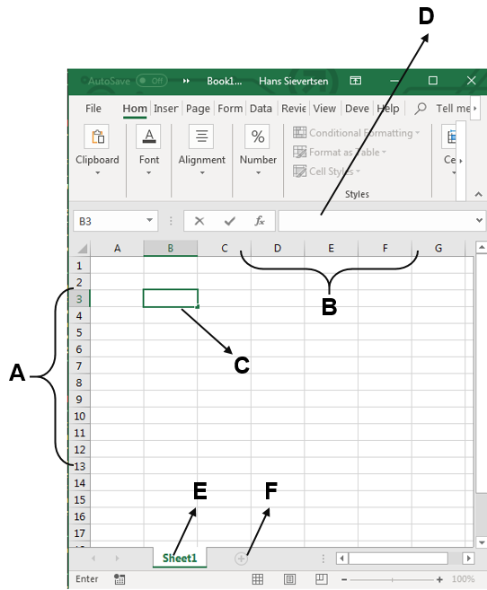
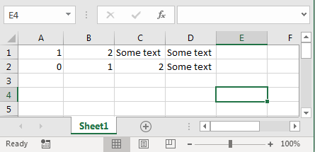
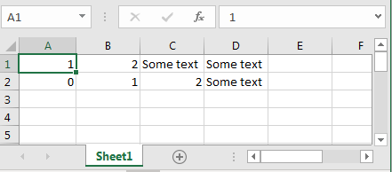
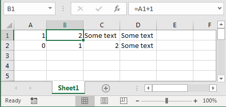
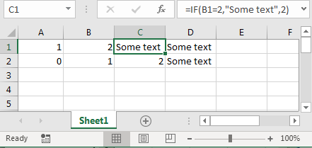
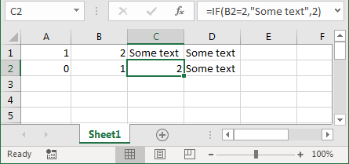
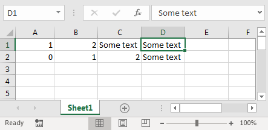

# Excel basics

## About this chapter

This chapter is about working with spreadsheet software tools such as MS. Excel or OpenOfficeCalc. After this chapter you should be able to

* Conduct basic cell operations in spreadsheet software such as Excel.
* Using cell cross-references, functions etc. in Excel.
* Create charts in Excel.
* Edit cells to create tables in Excel. 


## Advantages and disadvantages of spreadsheet software

#### Advantage 1: We directly observe the data{-}

Are there any advantages or disadvantages of the different organizational approaches explained in the last section? Yes. With spreadsheet software we always have the full attention on the table. We immediately observe the data and the consequences of the operations we are conducting on the data. That is one reason for why spreadsheet software is so popular for small everyday tasks like organizing small schedule or the family expenses and income. We do not observe long and tedious formulas on how to create a variable, instead we see the actual outcome of the variable. 

#### (Dis)advantage (1)2: Variables are updated real-time{-}

Another advantage of spreadsheet software is that the "instructions" are *real-time*. If you create a variable with reference to another variable, this new variable is automatically updated, if the first variable was changed. This is very different to most programming software approaches. Let us explain this advantage using an example: 

* Imagine that you have a dataset consisting of two variables. 
* You would like to create a weighted average of these two variables. 
* First you create a new variable with the relative weight of  the first variable. 
* You then create a fourth variable which is a weighted average of the first two variables using the third variable as a weight. 
* You then realize that there was a mistake in the weight variable and you correct this. 
* The fourth variable will automatically be updated, because it refers to the third variable.

* We directly observe the data.
* Variables are dynamically updated.
* It is widely used.
* Formatting tools.

The above would not happen in most programming approaches because you provide instructions sequentially in programming software. You would have to rerun all instructions explicitly. 

#### Advantage 3: It is widely used{-}

Another advantage of spreadsheet software is that it is widely used. You can conduct your work on almost every computer or mobile device and share your work with everyone. This is clearly not the case with more specialized programming software. 

#### Advantage 4: We can format the table{-}

The table of data in spreadsheet software can be formatted and adjusted. We can change font type, font size, cell colors, border colors, text alignment and basically all aspects that we would consider in a normal text document. We can use these approaches to organize the table and make it more readable. We can also use conditional formating, to identify patterns in data. In programming software, a table is just an object with information. There is no formatting aspect to it. 

#### Disadvantages{-}

The listed advantages above are all closely linked to the disadvantages of spreadsheet software. Because we give instructions on how to create and modify data in cells, and we do not observe these formulas explicitly, it is prone to typing errors. Having instructions on how to process and clean the data in a separate script file makes it easier to discover mistakes and keep track on what we are doing. We also have no clear way of tracking the changes we are doing to the document. With programming software every step and change is recorded. 

* We do not observe the operations we apply to the data. 
* We cannot record the changes we make to the data.
* It is prone to typing mistakes.
* It can be "heavy" to work with, because we save operations and visualizations together with the data. 

Finally, because we  merge instructions, raw data and visualization in one document. Spreadsheet software can be very "heavy". Working with large datasets can be difficult, because we save all instructions to the data and the resulting visualizations along with all the data. 

## The structure of spreadsheet software

###  The organization of Excel

Spreadsheet software are basically advanced versions of paper spreadsheets. They are organized in workbooks and worksheets. A workbook corresponds to a file. A worksheet is a sheet within the workbook. When we open an empty document in Excel it looks like shown in Figure \@ref(fig:ex1). The basic grid is a table that is organized in rows with numbers, indicated with the letter A in the Figure \@ref(fig:ex1) and columns with numbers, indicated with the letter B in the Figre.


```{r ex1, echo=FALSE, out.width = '90%',fig.align='center',fig.cap="The organisation of Excel"}

```


* *A* The row numbers
* *B* The column numbers
* *C* The active cell
* *D* The formula bar
* *E* The current worksheet
* *F* Add a new worksheet


In the provided example the active cell, indicated with the letter C, is the cell with row number 3 and column letter B. We refer to a specific cell by first naming the column and then the row. So the active cell in that case would be cell *B3*.  What does active cell mean? A cell becomes active when we click on it using the mouse, a touchscreen or use the keyboard to navigate to it. When a cell is activated content and formating of it will change if give instructions. Moreover, when a cell is active, we can see the content of the cell in the formula bar indicated with the letter D in Figure \@ref(fig:ex1).


As mentioned, the workbook is organized in to worksheets. In the presented example we are working in a worksheet with the name "Sheet1", as indicated with the letter E. We can add new worksheets by clicking on the plus indicated with letter F.  There are many other functions and aspects of spreadsheet software, but these are the most basic ones, that you should know how to find. 

### The organization of Google Sheets and OpenOffice Calc

The mentioned  elements of the Excel organization are also elements that are fairly generic, in the sense that most spreadsheet software will have similar structures.  MS Excel is a very popular software solution, but there are freely available alternatives. Figure \@ref(fig:ex2) shows the corresponding organization for Google Sheets and for Apache OpenOffice Calc. In this chapter we will use MS Excel for the illustrations, but we will focus on elements that are available in all spreadsheet software tools. 


While the basic structure is almost identical across these software packages, there are some differences. For example in OpenOffice Calc, we have have to right-click next to the active sheet list and click "Insert sheet" to add a new sheet instead of simply clicking on a plus. But all software tools use numbers to denote rows and letters to denote columns. 


```{r ex2, echo=FALSE, out.width = '50%',fig.show='hold',fig.align='center',fig.cap="The organisation of Google sheets (left) and OpenOffice (right)."}
knitr::include_graphics(c("_resources/chapter_excelbasic/sheetsstructure.png","_resources/chapter_excelbasic/openofficestructure.png"))
```


## Basic operations in Excel

### A cell can contain characters,  numbers and formulas

Now that we know how the spreadsheet workbook is organized into worksheets with rows and columns, we can focus on how it actually works. The point of departure is the cell. A cell can contain characters, numbers and formulas. It is not always visible what a cell actually contains. 

Figure \@ref(fig:ex3) it looks like the cells *A1*, *A2*, *B1*}*, *B2*}* and *C2*}* all contain numbers, and cells *C1*, *D1* and *D2* all strings of characters. 


```{r ex3, echo=FALSE, out.width = '75%',fig.align='center',fig.cap="An Excel sheet with different content types, numbers, formulas and text strings."}

```


In Figure \@ref(fig:ex4) we highlight cell *A1*. This can be seen by the emphasized green rectangle around cell *A1*, or from the the name box in the upper left corner, which gives us the name of the highlighted cell. The formula bar always shows the content of the active cell, and in this case the content is simply "1", a number. 

```{r ex4, echo=FALSE, out.width = '75%',fig.align='center',fig.cap="Looking at the content of cell A1."}

```


We now turn to cell *B1*, which is the active cell in Figure \@ref(fig:ex5). On a first glance it simply looks like it contains a number, just like cell *A1*. But the formula bar tells us that it is actually a formula. The formula in cell *B1* is *=A1+1*, so the content shown in cell *B1* is the result of  adding the value of one to the content in cell *A1*. 


```{r ex5, echo=FALSE, out.width = '75%',fig.align='center',fig.cap="Looking at the content of cell B1."}

```

Let us now move to cell *C1* in Figure \@ref(fig:ex6). The content of cell *C1* looks like a string of text characters. But actually it is also a formula. It is a slightly more complicated formula using a control statement.^[Control statements are used extensively in programming. We will return to this later.] The formula says that if the content of cell *B1* is 2, then cell *C1* should show "Some text". As this condition is true, the content shown in cell *C1* is actually "Some text".


```{r ex6, echo=FALSE, out.width = '75%',fig.align='center',fig.cap="Looking at the content of cell C1."}

```

In Figure \@ref(fig:ex7) we move one step down and evaluate the content of cell *C2*. On a first glance the content looks very different to the cell above in *C1*, it shows "2", while the content above was "Some text", which turned out to be the result of a formula. Looking at the formula bar in Figure (d) we see that the content of cell *C2* is almost identical to the content of cell *C1*. The only difference is that it refers to cell *B2* and not *B1*. As the value of *B2* is not 2, but 1, the outcome "2" is shown instead.


```{r ex7, echo=FALSE, out.width = '75%',fig.align='center',fig.cap="Looking at the content of cell C2."}

```

Figure \@ref(fig:ex8) shows the actual content of cell *D1*. At a first glance it looks like it is identical to cell *C1*, but in this case it actually just text string, which corresponds to what is displayed in cell *C1* if  the conditional statement in the cell is evaluated as true.


```{r ex8, echo=FALSE, out.width = '75%',fig.align='center',fig.cap="Looking at the content of cell D1."}

```


To summarize:

* Cells can contain characters, numbers and formulas.
* What we observe from looking at the cell might be different to what is actually entered in the cell.
* To observe the actual cell content we have to evaluate the contents of the formula bar, when the cell is active. 


### Using spreadsheet software as a calculator

We can use spreadsheet software as a big calculator. Cell *B1* in Figure \@ref(fig:ex5) was an example of using Excel as a calculator. It was a very simple calculation of asking it to calculate the  content of cell *A1* plus one.

We can also  conduct more traditional calculator operations in Excel. In Figure  \@ref{fig:ex9} we simply add two and three to get five. 

```{r ex9, echo=FALSE, out.width = '60%',fig.align='center',fig.cap="Using Excel as a calculator: addition."}
knitr::include_graphics(c("_resources/chapter_excelbasic/c1.png"))
```


In Figure \@ref(fig:ex10) we add six and three and divide that sum by two to get 4.5. 


```{r ex10, echo=FALSE, out.width = '60%',fig.align='center',fig.cap="Using Excel as a calculator: division."}
knitr::include_graphics(c("_resources/chapter_excelbasic/c2.png"))
```


```{r ex11, echo=FALSE, out.width = '60%',fig.align='center',fig.cap="Using Excel as a calculator: calculating the average using built-in functions."}
knitr::include_graphics(c("_resources/chapter_excelbasic/c3.png"))
```

In Figure \@ref(fig:ex11) we use the built-in function *average} to calculate the average of two numbers. We can use the built in functions by simply writing their name, or by clicking on the small $f_x$ symbol in the formula bar. The latter opens a  box, where we can search for functions and the numbers using an Excel dialog box, as shown in figure \@ref(fig:ex12). When selecting a function, we can enter the numbers we would like the function to use, and Excel will generate the formula for us.

```{r ex12, echo=FALSE, out.width = '60%',fig.align='center',fig.cap="Using Excel as a calculator:  using built-in functions."}
knitr::include_graphics(c("_resources/chapter_excelbasic/c4.png"))
```


### Cell referencing

The power of spreadsheet software is not to conduct simple calculator operations within one cell. The formulas are first and foremost useful when combining various cells as  shown in Figure \@ref(fig:ex13). We simply refer to another cell by entering the name of that cell. So if we  enter *A1* in a cell, *A1* is a placeholder for the content of the cell *A1*. Excel will then go and look for the content in cell *A1* and replace *A1* in the formula with that content as illustrated in Figure  \@ref(fig:ex13).


```{r ex13, echo=FALSE, out.width = '60%',fig.align='center',fig.cap="Referring to individual cell."}
knitr::include_graphics(c("_resources/chapter_excelbasic/ref1.png"))
```

We can combine cell referencing with functions and use the content of other cells as input in the function as shown above. However, the example is a bit tedious. We can  refer to a range of cell using shortcuts as shown in  \@ref(fig:ex14), where *A1:A4* means that we are referring to all cells from *A1* to *A3*. As *A1* to *A3* spans a column or vector, it will just be these three values. 

```{r ex14, echo=FALSE, out.width = '60%',fig.align='center',fig.cap="Referring to a range of cells spanning a  vector."}
knitr::include_graphics(c("_resources/chapter_excelbasic/ref2.png"))
```

However we can also refer to a larger area than just vectors. For example by using the notation *A1:B3* we are referring to a rectangle and actually including all cells *A1*, *A2*, *A3*, *B1*, *B2* and *B3*. We can thus refer to a large range of data using this simple notation, as shown in Figure \@ref(fig:ex15).

```{r ex15, echo=FALSE, out.width = '60%',fig.align='center',fig.cap="Referring to a range of cells spanning several vectors."}
knitr::include_graphics(c("_resources/chapter_excelbasic/ref3.png"))
```


To summarize:

* *=A1* refers to the content of cell *A1*.
* *=A1:A4* refers to the content of cells *A1*, *A2* and *A3*.
* *A1:B3*  refers to the content of cells *A1*, *A2*, *A3*, *B1*, *B2* and *B3*.


### Excel loves tidy data

Now let us consider the case where we have three variables saved in columns. We would like to create a fourth variable that is simply the average across these three variables. We can do that my using the formula *average()* and adding the range of cells we would like to take the average over. The first observation of the new variable should take the average across the first observations of all other variables. We simply write *=average(A1:C1)* in cell *D1*. Now this is not enough, because we also need the second observation of the new variable to take the average across the second observation of all other observations. In cell *D2* we therefore enter *=average(A2:C2)*. This all good, but what if we have thousands of observations. Do we want to enter the new formula thousand times? Surely not. We can simply ask Excel to extend the formula to the other cells for us. There are various ways to achieve that:

* Copy and paste the content of the cell. Excel will automatically update the cell referencing. 
* Extend the formula to other cells as shown in Figure \@ref(fig:ex16) (left) along rows and (right) along columns. 
* Double-click on the square at the corner of the cell: This will automatically fill the content to all cells in rows below the active cell, as long as there is a corresponding neighboring cell. Try it out!


```{r ex16, echo=FALSE, out.width = '50%',fig.show='hold',fig.align='center',fig.cap="Extending a formula along rows (left) and columns (right)."}
knitr::include_graphics(c("_resources/chapter_excelbasic/exta.png","_resources/chapter_excelbasic/extb.png"))
```

The last bullet point above is an example of the advantage of tidy data. When observations are organized in rows, we can simply fill the cells  by double-clicking on the little square. If observations are saved in columns we cannot do it. Even worse, if your data is a mix of both, we cannot extend any formulas, as explained in the next paragraph.

### How formula copying works


How can we make sure that Excel does the right thing when extend our formulas to other cells? We just need to understand what Excel does. If we copy a formula from one cell to a new cell, Excel will check the location of the new cell compared to the old cell and adjust all references to other cells accordingly. So if the new cell is two rows further down and three columns further to the right, all cell references will be moved two rows down and three columns to the right. Here is an example

* We enter the formula *=A2+C3* in cell *D6*.
* We copy the content of  cell *D6* to cell   *G5*.
* The new cell is one row up (means subtracting one to the row indicator) and three columns to the right (means adding three to the column indicator).
* So the *2* and *3* in the original formula will be changed to respectively  *1* and *2*.
* So the *A* and *C* in the original formula will be changed to respectively  *D* and *F*. 
* The formula in cell *G5* will therefore be *=D1+F2*

What would happen if we copied the content to cell *G4*? Excel would return an error, because when it subtracts one from *D1* it gets *D0* which is not a valid cell name.

### Extending non-formula content

Excel can also recognize patterns in non-formula cell content. If we copy the content (by using copy and paste, dragging the cell highlighter, or double-clicking on the square) Excel will guess the pattern you are looking for and fill-out the cells. To get the pattern we want it is a good idea to fill out at least two cells, and use these two cells as the point of departure. For example if we enter the number 1 in a cell and extend the cell to other cells, Excel will enter 1 in all cells. If we instead enter 1 in the first cell and 2 in the second cell, highlight these two cells and extend them to the other cells, Excel will continue the counting 1, 2, 3, 4. This is very useful when working with dates. 

### Keep your data tidy

Sometimes you will see a dataset where some of the observations are organized on columns and some in rows. This is a mess for several reasons. But one reason is simply for using the extending formulas approach. Consider the case where we would like to create a new variable that is based on an observation from the data which is organized with observations in rows and an observation from the data that is organized in columns. This works well for the first value, but as soon as you start extending the formula, the mess starts. Figure \@ref(fig:ex17) shows an example, where the second observation of the new variable gives a wrong result because it was extended downwards for both Variable 1 and Variable 2, while it should extend Variable 1 along rows and Variable 2 along columns. 


```{r ex17, echo=FALSE, out.width = '65%',fig.show='hold',fig.align='center',fig.cap="Excel mess where Variable 1 follows the tidy data principle with observations in rows, but Variable 2 does not. Creating a new variable based on these two observations is not straightforward as we cannot extend formulas. Note how Excel highlights the cells references by using different colors."}
knitr::include_graphics(c("_resources/chapter_excelbasic/excelmess.png"))
```


What can we do in cases like example \@ref(fig:ex17)? We can enter all formulas manually. Or, which is highly recommended, first tidy the data, before we start working with it. 

### Locking references

What if we do not want to Excel to update  all cell references in our formula? Can we somehow lock a cell reference? Yes, by using the \$ sign. If we enter \$A\$1 it means that this reference is locked to the cell *A1*. No matter how we copy  the cell across rows or columns it will stay the same.  We can also decide to just lock the row or the column. The dollar sign simply locks the the next element, so \$A\$1 locks the reference to both column A and to row 1. \$A1  only locks the reference to the column A. If we copy this formula to another column, it will not change, because that the columns are locked, but if we extend it along the rows, it will change, because the 1 is not locked. 

### Referencing across worksheets and workbooks

We can also use data from other worksheets and even other workbooks in our formulas. While are reference to cell *A1* within the same worksheet is simply *A1*, a reference to cell *A1* in the worksheet called *Sheet2* can be included by using the expression *=Sheet2!A1*. If we would like to reference to that same sell from another workbook (i.e. from another file) we would have to write *=[FILENAME]Sheet1!A1*.

Referencing across worksheets can be a good way to separate the data process in steps. We could for example organize the data as follows:

* Sheet 1: Raw data
* Sheet 2: Tidying data 
* Sheet 3: Data processing (moving averages etc.).
* Sheet 4: Output tables
* Sheet 5: Output charts

In that case we could reference from sheet 4 and 5 to sheet 3, and from sheet 3 to sheet 2 and so on. 

### Copy and paste special
We already talked about how we could extend formulas by simply copying them to other cells. We can do this by 

* Right-clicking on the cell that currently contains the formula and click copy. 
* Right-clicking on the cell(s) where we want the cells to inserted, and click paste. 
* Use the keyboard shortcuts for copy: *ctrl/cmd*+*c*
* Use the keyboard shortcut for paste:  *ctrl/cmd*+*v* 


But with Excel we can also "paste special". To do that, copy the content of a cell or several cells (either by the right-click approach or by *ctrl/cmd*+*c*) and then right-click on the cells where we would like to insert the content and instead of selecting "paste" we select "Paste special". This will open up a menu with several options. To name a few:

* Formulas: Only the formulas will be copied, and not the formating of the cell. 
* Values: Only the value we see will be copied, and not the formulas behind the cell or the formating of the cell.
* Add: The value of the original cell will be added to the new cell (select multiply to multiply the values, etc.)
* Transpose: The data will be rotated. 
 
The transpose function is very practical for tidying data. If we have a dataset where columns contain observations and rows contain variables we can use the rotate function to switch the organization. It is also possible to do this directly through a formula. 

 Paste special only works if we copied Excel data. If we used cut instead of copy, it will not work. If we copied data from a different program it will not work. 

### (Identifying) errors and referencing issues 
Finding mistakes and typing errors in Excel can be a nightmare. However, sometimes Excel gives us a hint and sometimes the mistake is such that Excel cannot calculate the formula. Here are some of the most common issues:


1. We accidentally change the formula of one cell. If the cell formula deviates from the neighboring cells Excel will warn us through a little triangle in the upper left corner, as shown in Figure \@ref(fig:ex18). In this case cells *C1* and *C3* refer to corresponding value in column *A*, but the cell *C2* refers to the content of corresponding cell in column *B*. We can right-click on the cell to read this warning. 


```{r ex18, echo=FALSE, out.width = '75%',fig.show='hold',fig.align='center',fig.cap="Excel warning: a cell formula is not consistent with neighboring formulas."}
knitr::include_graphics(c("_resources/chapter_excelbasic/w1.png"))
```

2. We accidentally leave out a cell in a range in Figure \@ref(fig:ex19). Excel recognizes that the range *B2:B3* included in the formula in  cell *E2*  should probably also have included the cell *B1* and gives us a warning. Again, we can right-click on the cell to read the warning. 

```{r ex19, echo=FALSE, out.width = '75%',fig.show='hold',fig.align='center',fig.cap="Excel warning: formula omits cells."}
knitr::include_graphics(c("_resources/chapter_excelbasic/w2.png"))
```

3. We create a circular reference as shown in Figure \@ref(fig:ex20). Cell *A1* refers to cell *B1* which refers to cell *C1* which again refers to cell *A1* which is circular and cannot be calculated.  


```{r ex20, echo=FALSE, out.width = '75%',fig.show='hold',fig.align='center',fig.cap="Excel warning: a circular reference."}
knitr::include_graphics(c("_resources/chapter_excelbasic/w3.png"))
```


4. We delete the content of a cell that was used  in another cell. This can be problematic depending on the formula it was used in. 
	
      * A reference to a cell with no content will result in the value zero. If the value zero is a valid input in the cell formula, we will not receive an error message. 
      
      * If the value zero is an invalid value for the formula, we will get an error message depending on how it is invalid. For example *\#DIV/0!* is the message shown if we try to divide a number by zero.
      
      * If we delete the entire cell and not just the cell content, Excel will not know where to look for the value anymore, and we will receive the error message *\#REF*.
	
5. Many mistakes and errors are not easily discovered in Excel, as it requires us to go through all cells and check for the error in the formula bar.

## Creating charts in Excel

### Insert a chart

There are basically two ways to start a chart in Excel. We can highlight the data we would like to use in the chart and ask Excel to automatically recognize the variable that should be on the horizontal axis and the variables on the vertical axis. Or we can insert an empty chart and manually select the data we would like to use. We will discuss the former approach in the next section and the latter approach in the next section, but let us first find the charts.

We create a chart in Excel by selecting "Insert" in the upper menu as shown in Figure \@ref(fig:ex21). 


```{r ex21, echo=FALSE, out.width = '60%',fig.show='hold',fig.align='center',fig.cap="Inserting a chart in Excel. Step 1:  select 'insert'."}
knitr::include_graphics(c("_resources/chapter_excelbasic/i1.png"))
```

```{r ex22, echo=FALSE, out.width = '60%',fig.show='hold',fig.align='center',fig.cap="Inserting a chart in Excel. Step 2: 'select a chart type or click on the icon in the lower right corner."}
knitr::include_graphics(c("_resources/chapter_excelbasic/i2.png"))
```

We can then select one of the chart types shown under "charts" as shown in Figure Figure \@ref(fig:ex22) or we can click on Figure the icon in the lower right corner and get a menu with the recommended and all chart types as shown in Figure  \@ref(fig:ex23).

```{r ex23, echo=FALSE, out.width = '60%',fig.show='hold',fig.align='center',fig.cap="Inserting a chart in Excel. Step 2 (alternative): ' select a chart among the recommended or full list."}
knitr::include_graphics(c("_resources/chapter_excelbasic/i3.png"))
```

### Select the data for the chart

#### The required structure of the data{-}

If we highlight a range of data before we select the desired chart type, Excel will attempt to identify the variables to be used in the charts based on the highlighted data.How will Excel know which variable to show on the vertical axis and which variable to show on the horizontal axis? The rule of thumb is the following:


* Excel will look for variables to show on the vertical axis (y-axis) in terms of variables with a title (a column or row header).
* Excel will look for variables to show on the horizontal axis (x-axis) in terms of variables with no title.

Figure \@ref(fig:ex24llustrates this. The data in the cells *A1:C6* contain two variables with a title (Variable 1 and Variable 2), and one variable with no title. The resulting line chart to the right shows the variable with not title (cells *A2:A6*) on the horizontal axis and the values in the cells *B2:C6* on the vertical axis. 


```{r ex24, echo=FALSE, out.width = '75%',fig.show='hold',fig.align='center',fig.cap="Inserting a chart letting  Excel recognize the data structure. Columns of data with no titles are assumed to be values to be shown on the horizontal axis. Columns with titles are shown on the vertical axis."}
knitr::include_graphics(c("_resources/chapter_excelbasic/g1.png"))
```


The data in the cells *A8:C13* have the same content, but this time we added a title to the first variable (Year). In the corresponding chart Excel will now also plot year on the vertical axis. If there is no variable without a title, Excel will just show 1,2,3,4 etc. on the horizontal axis.


### Manually adjust charts 

If we insert a Figure without highlighting a range of data first, the chart will be empty as shown in Figure \@ref(fig:ex25). 


```{r ex25, echo=FALSE, out.width = '60%',fig.show='hold',fig.align='center',fig.cap="Manually selecting the data for chart in Excel: an empty chart without any data."}
knitr::include_graphics(c("_resources/chapter_excelbasic/g2.png"))
```

We  need to explicitly tell Excel where to get the data from. We can do that by right-clicking on the chart area and click on "Select data" which opens a menu as shown in Figure \@ref(fig:ex26). We can then either enter the entire data in the data range (which then uses the same approach as explained to above to determine the values to show on respectively the horizontal and vertical axis.) or we can add a series individually by clicking "Add" which opens the menu shown in Figure \@ref(fig:ex27). The specific menu depends on the selected chart type, but in most cases we will be asked to enter a name and also enter the series values. Clicking on the small up-arrow in the menu allows us to select the data in our worksheet to use. 


```{r ex26, echo=FALSE, out.width = '60%',fig.show='hold',fig.align='center',fig.cap="Manually selecting the data for chart in Excel: the selecting data menu."}
knitr::include_graphics(c("_resources/chapter_excelbasic/g3.png"))
```


```{r ex27, echo=FALSE, out.width = '60%',fig.show='hold',fig.align='center',fig.cap="Manually selecting the data for chart in Excel: adding a data series."}
knitr::include_graphics(c("_resources/chapter_excelbasic/g4.png"))
```

Most chart types use a common variable on the horizontal axis. These values are therefore only selected once, by selecting "Edit" in the menu shown in Figure \@ref(fig:ex26). One exception is a scatter plot. With scatter plots we add x and y values for each series individually as shown in Figure \@ref(fig:ex28).


```{r ex28, echo=FALSE, out.width = '60%',fig.show='hold',fig.align='center',fig.cap="Manually selecting the data for chart in Excel: adding data for x-y scatter plot."}
knitr::include_graphics(c("_resources/chapter_excelbasic/g5.png"))
```

### Adjusting charts
####If the data structure is not right{-}

We can use the "select data option" to modify existing charts. For example if we let Excel select the variables to show on the axes, but discover that something went wrong. We can also add new series to an existing chart through the "select data" menu. The data series are ranked, and the series shown on the top in the select data menu will also be on the top in chart. 

#### Combing chart types{-}
In some situations we would like to combine chart types. Again, there are several ways to to do this. One approach is as shown in Figure \@ref(fig:ex29), where we right-click on an existing series and select "Change series chart type".


```{r ex29, echo=FALSE, out.width = '60%',fig.show='hold',fig.align='center',fig.cap="Modifying a chart by changing the chart type."}
knitr::include_graphics(c("_resources/chapter_excelbasic/change1.png"))
```


\paragraph{Adding elements to charts}
We can add elements such as axes titles, a legend and a chart title. This can be done through the "Add Chart Element" menu, as shown in Figure \ref{fig:ex30}


```{r ex30, echo=FALSE, out.width = '60%',fig.show='hold',fig.align='center',fig.cap="Modifying a chart by adding a chart element."}
knitr::include_graphics(c("_resources/chapter_excelbasic/change2.png"))
```

#### Formatting elements in charts{-}

Almost all elements of a chart can be edited. We can right-click on a series, an axis, or any other chart element and select "Format ..." to change the color, the pattern, the width etc. 

## Formatting cells to create tables

#### Spreadsheets for raw data and tables to communicate data}{-}

So far we have considered Excel as a tool to store raw data and process data. We can also use Excel to create the tables we would like to use to represent our data for an audience. We can use all the aspects discussed in \citet{few2012show} such as white space, line colors and text alignment. We will briefly discus show to get started with these elements. 

#### Cell content type{-}
A very important and sometimes annoying part of working with Excel is the cell variable type. As discussed in earlier lectures, variables can be stored as various types such as character strings, integers an floating point numbers. Excel has many more variable types, and Excel attempts to recognize these types automatically. If we for example to enter the content "2-1" in a cell. Excel is programmed in such a way, that "2-1" is treated as date, and the cell type is changed to a date. Excel will then print "02-Jan". To convert this back to actually show "2-1" we have to right-click on the cell and select "Format cell", where we can change the content to be text. If we do this on the cell containing "02-Jan" we will get a larger number. This is because Excel translated "2-1" into a date, and dates correspond to integers where the integer is the number of days since January 1 1900. So when we convert the cell to text we will get a cell showing the number of days between "02-Jan" 2019 and January 1st 1990. However, now that we have explicitly instructed Excel on the format of the cell we can safely enter "2-1" and it will show 2-1.

#### Formatting cells {-}

When we right-clicked on a cell to change the variable type we could also select "Alignment", "Font", "Border", and "Fill" which all refer to formatting the layout of the cell. We can use this to include  lines in our table, align the text etc. 

## Inserting charts and tables in text documents

#### Inserting charts and tables in Word type document (or similar document types){-}

Once we have created our table or chart in Excel. We can simply copy and paste them into a Word-document (or Google docs document). For charts this works quite well in most cases. For tables, we can distinguish between two types: First, if we simply copy and paste a table it will be inserted as a text document table. This limits the option to the options we have for such a table. Second, we can also select "Insert table" $\rightarrow$ "Excel spreadsheet" to insert a table with all the functionality we had in Excel.

## Summary
In this chapter we covered the following topics

* Describing software by their abstraction level.
* The basic organization of spreadsheet software.
* Basic operations using spreadsheet software.
* Creating charts using spreadsheet software.
* Creating tables using spreadsheet software.

See [@bible] if you want to learn more about Excel.. 
